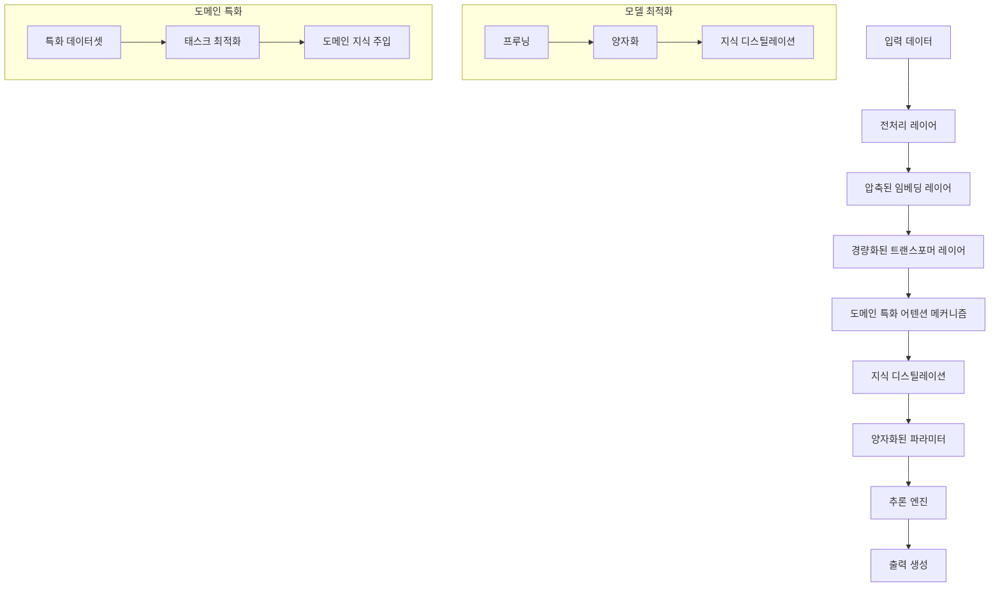

# 스몰 LLM: 도메인 특화 경량 모델의 효율적 활용

<!-- mtoc-start -->

- [정의 및 개념](#정의-및-개념)
- [주요 특징](#주요-특징)
- [아키텍처 구성도](#아키텍처-구성도)
- [활용 사례](#활용-사례)
- [기대 효과 및 필요성](#기대-효과-및-필요성)
- [마무리](#마무리)
- [Keywords](#keywords)

<!-- mtoc-end -->

스몰 LLM(Small Large Language Model)은 거대 언어 모델의 한계를 극복하기 위해 등장한 도메인 특화 경량 모델입니다. 마이크로소프트의 Phi-3와 애플의 모바일 디바이스용 소형 모델 등이 개발되어 더 적은 데이터와 컴퓨팅 자원으로도 효율적인 성능을 제공하는 새로운 패러다임을 형성하고 있습니다.

## 정의 및 개념

- 스몰 LLM(Small Large Language Model): 특정 도메인에 특화되어 설계된 경량화된 언어 모델.
- 적은 데이터와 컴퓨팅 자원으로 효율적인 성능을 제공하는 모델 구조.

- 목적: 거대 언어 모델의 한계 극복 및 특화된 도메인에서 최적화된 성능 제공
- 필요성: 에지 컴퓨팅, 모바일 환경 등 제한된 리소스 환경에서 AI 모델 활용 확대

## 주요 특징

- **경량화 설계**: 모델 크기와 매개변수 수를 줄여 메모리 사용량 최소화
- **도메인 특화**: 특정 분야나 작업에 집중하여 학습함으로써 전문성 강화
- **자원 효율성**: 제한된 컴퓨팅 환경에서도 운영 가능한 최적화 구조
- **빠른 추론 속도**: 적은 연산으로 신속한 응답 제공
- **온디바이스 실행**: 클라우드 연결 없이 로컬 환경에서 모델 구동 가능

## 아키텍처 구성도

스몰 LLM은 경량화된 트랜스포머 구조와 도메인 특화 어텐션 메커니즘을 기반으로 최적화되며, 프루닝, 양자화, 지식 디스틸레이션 등 다양한 기법을 통해 모델 크기를 축소하면서도 성능을 유지합니다. 도메인 특화 학습과 태스크 최적화를 통해 특정 영역에서의 전문성을 강화합니다.

## 활용 사례

- **모바일 디바이스**: 애플의 소형 LLM 모델 8종을 활용한 iOS 기기 내 AI 기능 구현
- **엣지 컴퓨팅**: 산업 현장의 센서 데이터 실시간 분석 및 이상 감지
- **특화 산업 분야**: 의료, 법률, 금융 등 전문 도메인에 최적화된 AI 보조 시스템
- **IoT 환경**: 제한된 하드웨어에서 운영 가능한 지능형 장치
- **임베디드 시스템**: 오프라인 환경에서도 작동 가능한 음성 인식 및 자연어 처리

## 기대 효과 및 필요성

- **비용 효율성**: 대규모 컴퓨팅 자원 없이 AI 기능 구현으로 운영 비용 절감
- **에너지 효율**: 적은 전력 소비로 친환경적 AI 시스템 구축 가능
- **개인정보 보호**: 데이터가 클라우드로 전송되지 않고 로컬에서 처리되어 보안 강화
- **응답 지연 최소화**: 네트워크 지연 없이 즉각적인 응답 제공
- **시스템 자원 최적화**: 제한된 메모리와 CPU 환경에서도 안정적 성능 발휘
- **특화 도메인 정확도**: 범용 모델보다 특정 분야에서 더 높은 정확도 제공

## 마무리

스몰 LLM은 자원 효율성과 도메인 특화 성능을 통해 범용 거대 모델의 한계를 보완하는 새로운 AI 패러다임으로 자리잡고 있습니다. 특히 에지 컴퓨팅, 모바일 환경, 특화 산업 영역에서 그 가치가 더욱 부각될 것으로 기대됩니다. IT 관리자와 개발자들은 이러한 경량 모델의 특성을 이해하고 적절한 도메인과 환경에 맞게 도입함으로써 효율적인 AI 시스템을 구축할 수 있을 것입니다.

## Keywords

Small LLM, 경량 언어 모델, Domain-Specific AI, 도메인 특화 인공지능, Model Compression, 모델 압축, Edge Computing, 엣지 컴퓨팅, Knowledge Distillation, 지식 증류, On-Device AI, 온디바이스 AI, Efficient Inference, 효율적 추론
