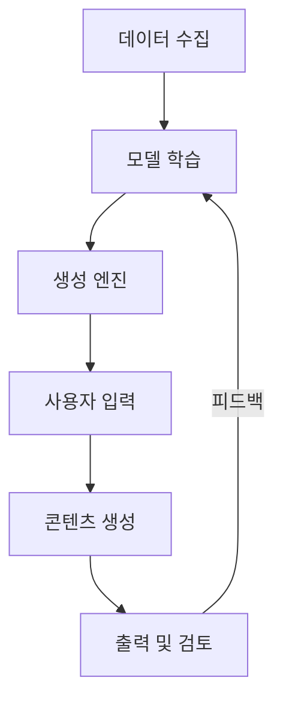

# 생성형 AI (Generative AI): 혁신적인 콘텐츠 생성 기술

<!-- mtoc-start -->

- [정의 및 개념](#정의-및-개념)
- [주요 특징](#주요-특징)
  - [1. 다양한 콘텐츠 생성](#1-다양한-콘텐츠-생성)
  - [2. 자연어 이해 및 생성](#2-자연어-이해-및-생성)
  - [3. 지속적 학습 및 최적화](#3-지속적-학습-및-최적화)
  - [4. 맞춤형 생성 가능](#4-맞춤형-생성-가능)
  - [5. 창의성과 생산성 향상](#5-창의성과-생산성-향상)
- [구성도](#구성도)
- [활용 사례](#활용-사례)
  - [1. 마케팅 및 광고](#1-마케팅-및-광고)
  - [2. 고객 서비스](#2-고객-서비스)
  - [3. 디자인 및 예술](#3-디자인-및-예술)
  - [4. 소프트웨어 개발](#4-소프트웨어-개발)
  - [5. 교육 및 학습](#5-교육-및-학습)
- [기대 효과 및 필요성](#기대-효과-및-필요성)
- [마무리](#마무리)
- [Keywords](#keywords)

<!-- mtoc-end -->

생성형 AI(Generative AI)는 인공지능이 텍스트, 이미지, 오디오, 코드 등 다양한 형태의 콘텐츠를 자동으로 생성하는 기술이다. 최근 ChatGPT, DALL·E, Midjourney 등의 발전으로 인해 AI 기반 창작 활동이 활발해지면서 비즈니스와 산업 전반에서 혁신을 주도하고 있다.

## 정의 및 개념

- 생성형 AI: 인공지능을 활용하여 새로운 데이터를 생성하는 기술
- 특징: 데이터 학습을 기반으로 창의적인 콘텐츠 생성, 인간과 유사한 표현 가능, 지속적인 학습 및 개선
- 필요성: 자동화된 콘텐츠 제작, 비용 절감, 창의적 아이디어 확장

## 주요 특징

### 1. 다양한 콘텐츠 생성

텍스트, 이미지, 영상, 음성, 음악, 코드 등 다양한 유형의 데이터를 생성할 수 있다.

### 2. 자연어 이해 및 생성

대규모 언어 모델(LLM)을 활용하여 자연스럽고 문맥에 맞는 텍스트를 생성할 수 있다.

### 3. 지속적 학습 및 최적화

피드백과 데이터 학습을 통해 성능이 향상되며, 새로운 패턴을 반영할 수 있다.

### 4. 맞춤형 생성 가능

사용자의 입력 데이터에 따라 개별 맞춤형 콘텐츠를 제작할 수 있다.

### 5. 창의성과 생산성 향상

기존의 콘텐츠 제작보다 빠르고 창의적인 결과물을 생성할 수 있어 다양한 산업에 적용 가능하다.

## 구성도

생성형 AI는 데이터 수집부터 학습, 사용자 입력을 반영한 콘텐츠 생성, 피드백을 통한 개선의 순환 구조를 따른다.

## 활용 사례

### 1. 마케팅 및 광고

광고 카피, 블로그 포스트, SNS 콘텐츠 자동 생성으로 마케팅 효율성 증대

### 2. 고객 서비스

챗봇 및 가상 비서(AI Assistant)를 활용한 24/7 고객 응대 자동화

### 3. 디자인 및 예술

AI 기반 이미지 및 영상 생성으로 그래픽 디자인, 일러스트, 3D 모델링 등에 적용

### 4. 소프트웨어 개발

코드 자동 완성 및 버그 수정 지원을 통한 개발 생산성 향상

### 5. 교육 및 학습

학생 맞춤형 학습 자료 및 자동 요약 기능 제공으로 교육 효과 극대화

## 기대 효과 및 필요성

- **비용 절감**: 인건비 및 콘텐츠 제작 비용 절감 가능
- **생산성 향상**: 콘텐츠 제작 속도 증가 및 창작 업무 자동화
- **맞춤형 서비스 제공**: 고객 및 사용자 요구에 맞춘 개인화된 콘텐츠 생성
- **창의적 작업 지원**: 디자이너, 작가, 개발자 등의 창의적인 활동 보조
- **비즈니스 혁신**: AI 기반 자동화 시스템을 통해 새로운 비즈니스 모델 창출

## 마무리

생성형 AI는 텍스트, 이미지, 오디오, 코드 등 다양한 영역에서 혁신을 주도하며, 콘텐츠 제작과 업무 자동화에 중요한 역할을 하고 있다. 기업과 개인이 이를 효과적으로 활용하면 창의성과 생산성을 동시에 높일 수 있으며, 미래 산업 경쟁력을 강화하는 핵심 기술로 자리 잡을 것이다.

## Keywords

Generative AI, 생성형 AI, 인공지능 콘텐츠, ChatGPT, DALL·E, AI 기반 창작, 자연어 처리, AI 아트, 자동화 콘텐츠, AI 혁신
