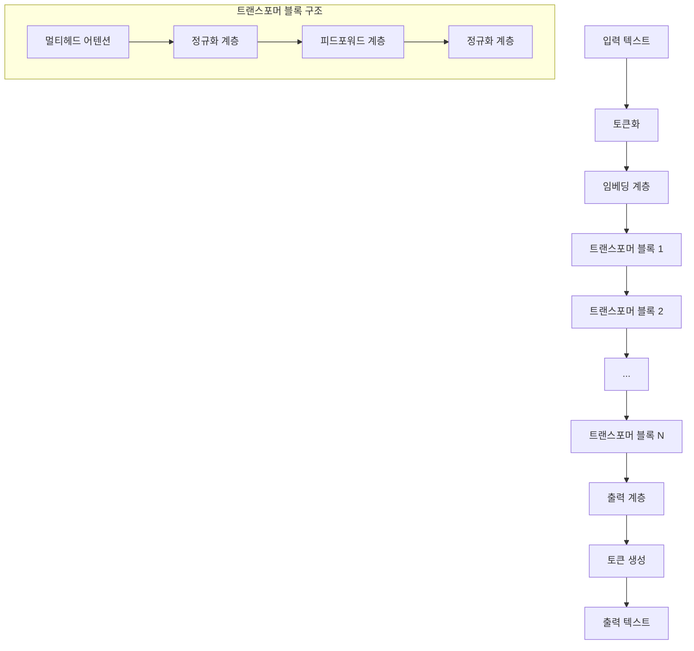

# 대형 언어 모델(LLM): 인공지능 언어 처리 기술의 혁명

<!-- mtoc-start -->

- [정의 및 개념](#정의-및-개념)
- [주요 특징](#주요-특징)
- [아키텍처](#아키텍처)
- [활용 사례](#활용-사례)
- [기대 효과 및 필요성](#기대-효과-및-필요성)
- [마무리](#마무리)
- [Keywords](#keywords)

<!-- mtoc-end -->

대형 언어 모델(Large Language Model)은 현대 인공지능 기술의 중심에 있는 혁신적인 기술로, 방대한 양의 텍스트 데이터를 학습하여 인간과 유사한 언어 이해 및 생성 능력을 갖춘 AI 시스템입니다. GPT(Generative Pre-trained Transformer), BERT, LLaMA와 같은 대표적인 모델들은 자연어 처리(NLP) 분야에서 놀라운 성능을 보이며 다양한 산업 분야에 혁명적인 변화를 가져오고 있습니다. 이러한 대형 언어 모델(Large Language Model)은 수십억 개의 매개변수를 통해 텍스트 데이터의 복잡한 패턴과 맥락을 학습하고, 이를 기반으로 고품질의 텍스트를 생성하거나 다양한 언어 관련 작업을 수행할 수 있습니다.

## 정의 및 개념

- 대형 언어 모델(LLM): 수십억 개 이상의 매개변수를 가진 인공 신경망 기반 모델로, 방대한 텍스트 데이터를 학습하여 인간 수준의 언어 이해 및 생성 능력을 갖춘 시스템.
- 학습 방식: 자기지도학습(Self-supervised learning) 방식을 통해 레이블이 없는 대규모 텍스트 데이터에서 패턴과 규칙을 자동으로 학습하는 구조.

- 목적: 자연어의 맥락과 의미를 이해하고, 다양한 언어 관련 작업(번역, 요약, 질의응답, 텍스트 생성 등)을 수행하는 범용 AI 시스템 구현.
- 필요성: 복잡한 언어 처리 작업의 자동화, 대규모 텍스트 데이터 분석, 인간-기계 상호작용 개선 등 다양한 비즈니스 및 연구 분야에서의 활용.

## 주요 특징

1. **거대한 모델 규모**: 최신 LLM은 수천억 개 이상의 매개변수를 가지며, 모델 크기가 커질수록 언어 이해 및 생성 능력이 향상되는 경향을 보임. GPT-4의 경우 약 1조 개의 매개변수를 보유한 것으로 추정되며, 이는 인간 뇌의 시냅스 수와 비교될 만한 규모.

2. **트랜스포머 아키텍처 기반**: 대부분의 LLM은 자기주의(Self-attention) 메커니즘을 활용한 트랜스포머 구조를 기반으로 함. 이 구조는 텍스트의 긴 맥락을 효과적으로 처리하며, 병렬 처리가 가능해 학습 효율성이 높음.

3. **맥락 이해 능력**: 문장 간의 관계, 중의성 해소, 개념 간 연결 등 깊은 맥락 이해가 가능함. 최신 모델의 경우 수만 단어에 달하는 맥락 창(context window)을 통해 장문의 텍스트도 일관되게 처리 가능.

4. **Few-shot/Zero-shot 학습 능력**: 적은 수의 예시만으로도 새로운 작업을 수행하거나(Few-shot), 심지어 예시 없이도(Zero-shot) 다양한 작업을 수행할 수 있는 일반화 능력을 보유.

5. **지속적인 발전과 한계**: 환각(Hallucination), 편향성, 설명 가능성 부족 등의 한계가 존재하지만, 지속적인 연구를 통해 성능과 안전성이 빠르게 개선되고 있음.

## 아키텍처

대형 언어 모델의 기본 아키텍처는 트랜스포머(Transformer) 구조를 기반으로 하며, 입력 텍스트가 토큰화 과정을 거쳐 임베딩되고 여러 트랜스포머 블록을 통과하며 처리됩니다. 각 트랜스포머 블록은 멀티헤드 어텐션 메커니즘과 피드포워드 네트워크로 구성되어 텍스트의 맥락 정보를 효과적으로 학습합니다.

## 활용 사례

1. **기업 내 지식 관리 및 검색 시스템**: 방대한 기업 문서, 이메일, 보고서 등을 분석하고 필요한 정보를 빠르게 검색하거나 요약할 수 있는 시스템 구축. 특히 IT 서비스 관리(ITSM) 영역에서 지식베이스 자동화에 활용.

2. **고객 서비스 자동화**: 챗봇과 가상 비서 시스템을 통해 고객 문의 응대, SLA 관리, 티켓 분류 등을 자동화하여 서비스 효율성 향상. 24시간 고품질 응대 서비스 제공 가능.

3. **소프트웨어 개발 지원**: 코드 생성, 디버깅, 문서화, 테스트 케이스 작성 등 소프트웨어 개발 과정 전반에 걸친 지원. 개발자 생산성 및 코드 품질 향상에 기여.

4. **비즈니스 인텔리전스**: 시장 보고서, 뉴스, 소셜 미디어 등의 비정형 데이터 분석을 통한 시장 동향 파악 및 의사결정 지원. 전통적인 BI 도구의 한계를 넘어 통찰력 제공.

5. **콘텐츠 생성 및 최적화**: 마케팅 콘텐츠, 기술 문서, 보고서 등 다양한 형태의 콘텐츠 생성 및 최적화. 다국어 지원을 통한 글로벌 비즈니스 지원.

## 기대 효과 및 필요성

1. **비용 및 시간 효율성**: 반복적이고 시간 소모적인 언어 관련 작업을 자동화하여 인력 비용 절감 및 업무 처리 시간 단축. 기업 내 IT 부서의 운영 효율성 증대.

2. **지식 접근성 향상**: 방대한 기업 데이터에서 필요한 정보를 즉시 추출하고 활용할 수 있는 환경 조성. 암묵지를 형식지로 전환하는 지식 관리 체계 구축 지원.

3. **의사결정 품질 개선**: 데이터 기반 인사이트 제공을 통한 더 나은 비즈니스 의사결정 지원. 복잡한 문제에 대한 다각적 분석 제공.

4. **경쟁 우위 확보**: AI 기술 도입을 통한 비즈니스 프로세스 혁신 및 신규 서비스 개발로 시장에서의 경쟁력 강화. 디지털 트랜스포메이션 가속화.

5. **인적 자원의 가치 있는 업무 집중**: 창의성과 전략적 사고가 필요한 고부가가치 업무에 인적 자원을 집중할 수 있는 환경 조성. 구성원 만족도 및 생산성 향상.

## 마무리

대형 언어 모델(LLM)은 자연어 처리 기술의 패러다임을 바꾸며 기업의 디지털 혁신을 가속화하는 핵심 기술로 자리매김하고 있습니다. 특히 IT 서비스 관리, 지식 관리, 고객 서비스 등 정보관리 분야에서 LLM의 활용은 업무 효율성 향상과 비용 절감을 넘어 새로운 비즈니스 가치 창출로 이어질 수 있습니다. 기업은 LLM의 도입과 활용에 대한 전략적 접근을 통해 AI 시대의 경쟁 우위를 확보하고, 지속적인 혁신을 이끌어낼 수 있을 것입니다. 다만, 데이터 보안, 모델 편향성, 환각 현상 등의 한계와 위험성을 인식하고, 이를 관리하기 위한 적절한 거버넌스와 윤리 체계를 함께 구축해 나가는 것이 중요합니다.

## Keywords

Large Language Model, Transformer Architecture, 자기주의 메커니즘, 인공지능 언어 처리, 자기지도학습, Few-shot 학습, 맥락 이해, 환각 현상, 대규모 매개변수, 지식 관리 자동화
