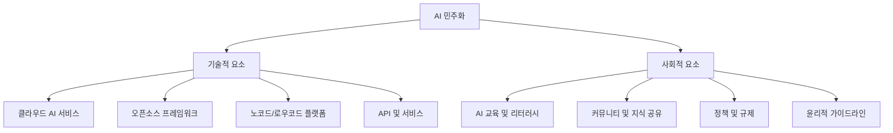

# AI 민주화(AI Democratization): 인공지능 기술의 대중적 접근성 확대

<!-- mtoc-start -->

- [정의 및 개념](#정의-및-개념)
- [주요 특징](#주요-특징)
- [구성 요소 및 메커니즘](#구성-요소-및-메커니즘)
- [활용 사례](#활용-사례)
- [기대 효과 및 필요성](#기대-효과-및-필요성)
- [마무리](#마무리)
- [Keywords](#keywords)

<!-- mtoc-end -->

인공지능 민주화(AI Democratization)는 복잡한 AI 기술과 도구를 전문가뿐 아니라 일반 사용자도 쉽게 접근하고 활용할 수 있도록 하는 기술적, 사회적 움직임입니다. 과거 소수의 대기업과 연구기관만이 보유했던 AI 역량을 보다 넓은 사용자층에게 개방함으로써, 혁신의 기회를 확대하고 AI 기술의 사회적 영향력을 높이는 패러다임 전환이 이루어지고 있습니다.

## 정의 및 개념

- AI 민주화: 인공지능 기술, 도구, 리소스에 대한 접근성을 확대하여 전문 지식이 없는 일반 사용자도 AI를 활용할 수 있도록 하는 개념.
- 저코드/노코드 AI 플랫폼, 오픈소스 AI 프레임워크, 클라우드 기반 AI 서비스 등을 통해 구현.

- 목적: 인공지능 기술의 활용 장벽을 낮추고 다양한 산업과 분야에서의 AI 혁신 촉진.
- 특징: 사용자 친화적 인터페이스, 사전 훈련된 모델 제공, 클라우드 기반 인프라 활용.

## 주요 특징

- **기술적 접근성 향상**: API, SDK, 노코드/로우코드 도구를 통해 프로그래밍 지식이 제한적인 사용자도 AI 기능 구현 가능
- **비용 장벽 감소**: 오픈소스 프레임워크, 클라우드 기반 종량제 서비스를 통해 대규모 투자 없이도 AI 기술 도입 가능
- **지식 공유 활성화**: 온라인 커뮤니티, 교육 자료, 튜토리얼을 통한 AI 관련 지식과 경험의 공유 확대
- **사전 훈련된 모델 제공**: 특정 도메인에 최적화된 사전 훈련 모델을 통해 개발 시간 단축 및 전문성 장벽 해소
- **사용자 맞춤형 솔루션**: 산업별, 업무별 특화된 AI 솔루션으로 도메인 전문가들의 AI 활용 촉진

## 구성 요소 및 메커니즘

AI 민주화는 기술적 요소와 사회적 요소가 상호 보완적으로 작용하는 구조를 가지며, 클라우드 서비스, 오픈소스, 노코드 도구 등의 기술적 발전과 교육, 커뮤니티, 정책 등의 사회적 인프라가 함께 발전해야 진정한 민주화가 실현됩니다.

## 활용 사례

- **의료 분야**: 임상의가 AI 진단 보조 도구를 직접 조정하여 특정 질환 진단 정확도 향상
- **중소기업**: 마케팅 담당자가 노코드 AI 도구로 고객 세분화 및 개인화된 마케팅 캠페인 구현
- **교육 분야**: 교사가 학생 맞춤형 학습 자료를 AI로 생성하고 학습 진도를 분석하여 개별화 교육 제공
- **공공 서비스**: 정부 기관이 시민 피드백을 AI로 분석하여 서비스 개선 우선순위 결정
- **콘텐츠 제작**: 디자이너와 마케터가 AI 도구를 활용해 고품질 이미지 및 텍스트 콘텐츠 생성

## 기대 효과 및 필요성

- **혁신의 다양화**: 다양한 배경과 관점을 가진 사람들의 AI 활용으로 창의적 솔루션 증가
- **디지털 격차 해소**: AI 기술의 광범위한 접근성 확대로 기술 격차 및 정보 불평등 감소
- **산업 경쟁력 강화**: 기업 규모와 무관하게 AI 도입을 통한 생산성 및 효율성 향상
- **사회 문제 해결 가속화**: 다양한 분야의 전문가들이 AI를 활용해 복잡한 사회 문제에 접근
- **경제적 가치 창출**: 새로운 비즈니스 모델과 일자리 창출 촉진

## 마무리

AI 민주화는 인공지능 기술의 혜택을 소수의 기술 기업이나 연구기관을 넘어 사회 전반으로 확산시키는 중요한 패러다임입니다. 기술적 접근성 향상과 더불어 교육, 윤리적 가이드라인, 정책적 지원이 함께 이루어질 때 AI 기술은 진정한 사회적 가치를 창출할 수 있습니다. 조직과 개인은 AI 민주화의 흐름에 적극적으로 동참하여 혁신의 기회를 포착하고, 기술 발전의 혜택을 공유하는 미래를 함께 만들어가야 할 것입니다.

## Keywords

AI Democratization, 인공지능 민주화, No-code AI, 노코드 인공지능, Accessible AI, 접근 가능한 AI, Open Source AI, 오픈소스 인공지능, AI Literacy, 인공지능 리터러시, Pre-trained Models, 사전 훈련 모델, AI as a Service, 서비스형 인공지능
