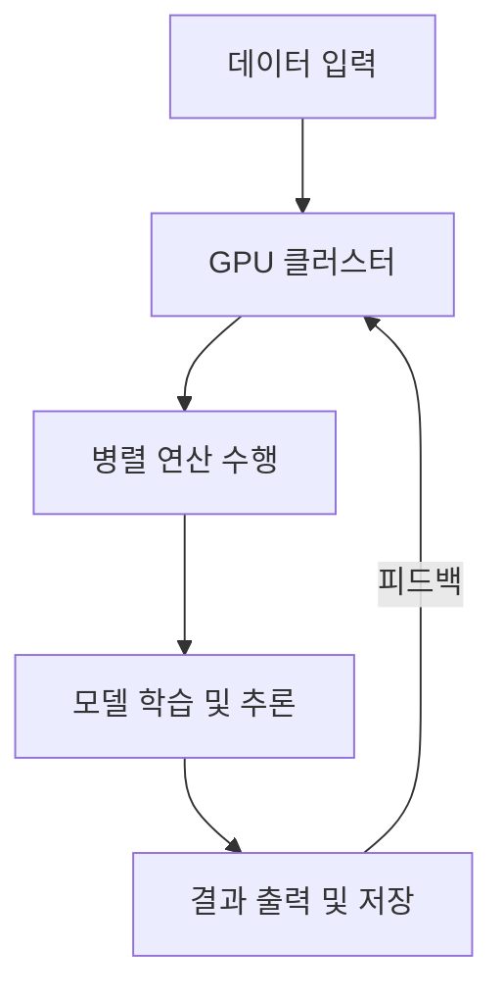

# GPU 클러스터: 대규모 AI 워크로드를 위한 고성능 컴퓨팅 인프라

<!-- mtoc-start -->

- [정의 및 개념](#정의-및-개념)
- [주요 특징](#주요-특징)
  - [1. 병렬 연산 성능 극대화](#1-병렬-연산-성능-극대화)
  - [2. 고성능 컴퓨팅 지원](#2-고성능-컴퓨팅-지원)
  - [3. 클라우드 기반 확장성](#3-클라우드-기반-확장성)
  - [4. 초거대 AI 모델 학습 지원](#4-초거대-ai-모델-학습-지원)
  - [5. 효율적인 자원 관리](#5-효율적인-자원-관리)
- [구성도](#구성도)
- [활용 사례](#활용-사례)
  - [1. AI 모델 학습](#1-ai-모델-학습)
  - [2. 자율 주행 기술](#2-자율-주행-기술)
  - [3. 과학 및 의료 연구](#3-과학-및-의료-연구)
  - [4. 클라우드 기반 AI 서비스](#4-클라우드-기반-ai-서비스)
  - [5. 금융 및 리스크 분석](#5-금융-및-리스크-분석)
- [기대 효과 및 필요성](#기대-효과-및-필요성)
- [마무리](#마무리)
- [Keywords](#keywords)

<!-- mtoc-end -->

AI와 머신러닝의 발전으로 초거대 AI 모델 학습이 증가하면서, 이를 지원하기 위한 GPU 클러스터의 중요성이 부각되고 있다. 클라우드 서비스 기업들은 대규모 AI 연산을 효율적으로 수행할 수 있는 고성능 GPU 기반 인프라를 강화하고 있으며, 이를 통해 연구 및 비즈니스 혁신을 촉진하고 있다.

## 정의 및 개념

- **GPU 클러스터**: 여러 개의 GPU(Graphics Processing Unit)를 네트워크로 연결하여 대규모 병렬 연산을 수행하는 고성능 컴퓨팅 환경
- **특징**: 대규모 데이터 처리, 병렬 연산 최적화, AI 및 HPC(High Performance Computing) 워크로드 지원
- **필요성**: AI 모델 학습 시간 단축, 대규모 데이터 연산 성능 향상, 클라우드 기반 AI 서비스 확장

## 주요 특징

### 1. 병렬 연산 성능 극대화

GPU는 수천 개의 코어를 활용하여 연산을 병렬로 수행함으로써 AI 모델 학습 및 데이터 분석 속도를 대폭 향상시킨다.

### 2. 고성능 컴퓨팅 지원

딥러닝, 머신러닝, 과학 연산, 데이터 분석 등 다양한 고성능 컴퓨팅(HPC) 작업을 효율적으로 처리할 수 있다.

### 3. 클라우드 기반 확장성

GPU 클러스터는 클라우드 환경에서 확장 가능하며, 필요에 따라 동적으로 리소스를 추가하거나 조정할 수 있다.

### 4. 초거대 AI 모델 학습 지원

GPT-4, DALL·E, BERT 등의 초거대 AI 모델을 학습하는 데 최적화된 연산 환경을 제공하여, 모델 훈련 시간을 단축한다.

### 5. 효율적인 자원 관리

컨테이너 기술(Kubernetes, Docker)과 오케스트레이션 도구를 활용하여 GPU 자원을 효율적으로 할당하고 관리할 수 있다.

## 구성도

GPU 클러스터는 데이터 입력을 받아 병렬 연산을 수행하고, AI 모델 학습 및 추론을 통해 결과를 출력하는 구조를 가진다.

## 활용 사례

### 1. AI 모델 학습

대규모 신경망 모델 학습을 위한 최적화된 연산 환경 제공

### 2. 자율 주행 기술

실시간 센서 데이터 처리 및 고도화된 AI 기반 자율주행 시스템 개발

### 3. 과학 및 의료 연구

유전체 분석, 신약 개발, 기후 모델링 등 대규모 데이터 연산 필요 분야에서 활용

### 4. 클라우드 기반 AI 서비스

ChatGPT, 이미지 생성 AI, 추천 시스템 등의 AI 서비스를 고성능으로 운영

### 5. 금융 및 리스크 분석

금융 데이터 분석 및 리스크 모델링을 위한 고속 연산 수행

## 기대 효과 및 필요성

- **연산 속도 향상**: 대규모 AI 학습 및 데이터 분석 시간 단축
- **비용 효율성**: 클라우드 기반 GPU 활용을 통해 온디맨드 방식으로 자원 최적화
- **AI 연구 및 개발 촉진**: 복잡한 AI 모델을 빠르게 학습하고 실험 가능
- **비즈니스 확장 가능성**: AI 기반 서비스의 고도화 및 확장 용이
- **고성능 연산 지원**: 머신러닝, HPC, 데이터 과학 분야의 핵심 인프라

## 마무리

GPU 클러스터는 AI와 고성능 컴퓨팅의 핵심 인프라로 자리 잡으며, 클라우드 서비스와 결합하여 더욱 강력한 연산 환경을 제공하고 있다. 기업과 연구기관은 이를 통해 초거대 AI 모델을 효과적으로 학습하고, 다양한 산업에서 혁신을 이끌어갈 수 있을 것이다.

## Keywords

GPU Cluster, AI 연산, 병렬 컴퓨팅, 클라우드 GPU, 딥러닝 인프라, HPC, NVIDIA GPU, AI 모델 학습, 클라우드 컴퓨팅, 고성능 연산
