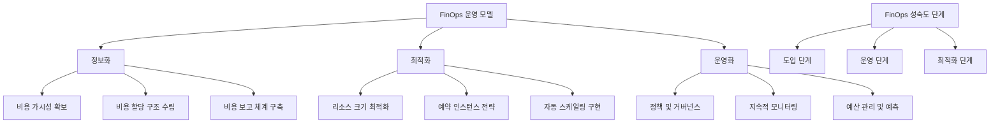

# FinOps: 클라우드 비용 최적화 전략의 핵심

멀티 클라우드 환경에서 비용 관리의 중요성이 점점 커지고 있습니다. 특정 업체 종속을 피하려는 기업들이 멀티 클라우드 전략을 채택하는 추세가 늘어나면서, 거시경제 환경과 비용 압박으로 인해 클라우드 비용 최적화(FinOps, Financial Operations)가 IT 조직의 핵심 과제로 부상하고 있습니다. FinOps는 클라우드 환경에서 재정적 책임과 기술적 혁신 사이의 균형을 맞추는 운영 모델로, 효율적인 클라우드 자원 활용을 통해 비즈니스 가치를 극대화하는 방법론입니다.

## 정의 및 개념

- FinOps: 클라우드 리소스 사용에 대한 재무적 관리 및 최적화를 위한 운영 프레임워크.
- 클라우드 컴퓨팅의 가변적 지출 모델에서 비용과 성능의 균형을 유지하기 위한 조직 문화 및 실천 방법론.

- 특징: 비용 가시성, 비용 최적화, 비용 책임, 비용 예측, 지속적 개선
- 목적: 클라우드 지출 효율화, 비즈니스 가치 극대화, 관련 부서 간 협업 강화
- 필요성: 클라우드 비용 증가 통제, 낭비 요소 제거, 투자 수익률(ROI) 개선

## 주요 특징

1. **비용 가시성 확보**: 실시간 클라우드 비용 모니터링 및 분석 도구를 통한 지출 투명성 제공. 부서, 프로젝트, 리소스별 비용 추적으로 책임 소재 명확화.

2. **최적화 자동화**: 자동 스케일링, 예약 인스턴스, 스팟 인스턴스 활용을 통한 비용 절감. 미사용 리소스 식별 및 제거를 위한 자동화 도구 구현.

3. **문화적 변화 유도**: 재무, 개발, 운영팀 간 협업을 강화하는 문화 조성. 모든 이해관계자가 비용 인식을 가지고 의사결정에 참여하는 환경 구축.

4. **지속적 최적화 프로세스**: 비용과 성능의 균형을 지속적으로 평가하고 개선하는 순환 구조. 정기적인 비용 검토 및 최적화 기회 식별.

5. **데이터 기반 의사결정**: 비용 데이터와 비즈니스 성과 지표를 연계한 의사결정 지원. 투자 대비 수익(ROI) 분석을 통한 전략적 리소스 할당.

## 프레임워크

FinOps 프레임워크는 정보화, 최적화, 운영화의 세 가지 핵심 영역으로 구성되며, 각 조직은 도입, 운영, 최적화 단계를 거쳐 FinOps 성숙도를 발전시킵니다. 이 순환적 프로세스를 통해 지속적인 비용 최적화가 가능합니다.

## 활용 사례

1. **글로벌 전자상거래 기업**: 계절적 수요 변동이 큰 전자상거래 기업에서 FinOps를 도입하여 피크 시즌에는 자동 스케일업, 비수기에는 자동 스케일다운 정책을 구현해 연간 클라우드 비용 30% 절감 달성.

2. **핀테크 스타트업**: 개발, 테스트, 프로덕션 환경별 태깅 전략과 비용 할당 정책을 수립하여 부서별 책임성을 강화하고, 예산 예측 정확도를 85%까지 향상.

3. **의료정보 서비스 제공업체**: 컴플라이언스 요구사항을 충족하면서도 스팟 인스턴스와 예약 인스턴스의 최적 조합을 통해 클라우드 인프라 비용 40% 절감과 동시에 서비스 안정성 유지.

4. **미디어 스트리밍 서비스**: 사용량 기반 비용 분석을 통해 고비용 마이크로서비스를 식별하고 재설계하여 운영 비용 절감과 성능 향상 동시 달성.

## 기대 효과 및 필요성

1. **비용 투명성 확보**: 클라우드 비용의 상세 내역과 발생 원인을 명확히 파악하여 낭비 요소 제거 및 책임 소재 명확화.

2. **예산 예측 정확도 향상**: 클라우드 사용 패턴 분석을 통한, 더 정확한 예산 수립 및 예측 가능.

3. **리소스 활용도 개선**: 최적의 리소스 프로비저닝으로 과잉/과소 할당 문제 해결 및 성능과 비용의 균형점 확보.

4. **조직 내 협업 강화**: 개발, 운영, 재무팀 간 공통 언어와 목표 설정으로 효과적인 의사소통 및 의사결정 프로세스 구축.

5. **비즈니스 민첩성 향상**: 효율적인 비용 관리를 통해 확보된 자원을 혁신과 성장 기회에 재투자 가능.

6. **컴플라이언스 및 거버넌스 강화**: 체계적인 비용 관리 정책 수립으로 규제 준수 및 내부 통제 개선.

## 마무리

FinOps는 단순한 비용 절감 이니셔티브가 아닌, 클라우드 환경에서의 지속 가능한 성장을 위한 전략적 접근법입니다. 클라우드 비용과 가치를 균형 있게 관리함으로써, 조직은 혁신을 위한 투자를 유지하면서도 재정적 책임을 다할 수 있습니다. 특히 멀티 클라우드 전략을 채택한 기업에게 FinOps는 복잡한 클라우드 환경에서의 비용 최적화와 투명성 확보를 위한 필수적인 프레임워크입니다. 조직 문화와 운영 프로세스 전반에 FinOps 원칙을 도입함으로써, 클라우드의 진정한 가치를 실현할 수 있습니다.

## Keywords

FinOps, Cloud Financial Management, 클라우드 비용 최적화, 비용 가시성, 리소스 최적화, 멀티 클라우드 전략, 클라우드 거버넌스, 비용 할당 태그, 예산 예측, 클라우드 ROI
