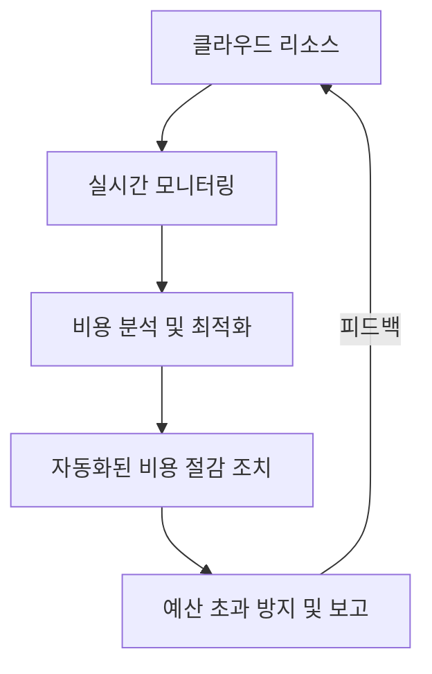

# 클라우드 비용 관리: 최적화된 인프라 운영을 위한 전략

<!-- mtoc-start -->

- [정의 및 개념](#정의-및-개념)
- [주요 특징](#주요-특징)
  - [1. 자동화된 비용 최적화](#1-자동화된-비용-최적화)
  - [2. 실시간 리소스 모니터링](#2-실시간-리소스-모니터링)
  - [3. 종량제 요금제 최적화](#3-종량제-요금제-최적화)
  - [4. 멀티 클라우드 비용 관리](#4-멀티-클라우드-비용-관리)
  - [5. 정책 기반 비용 제어](#5-정책-기반-비용-제어)
- [구성도](#구성도)
- [활용 사례](#활용-사례)
  - [1. 기업 IT 인프라 최적화](#1-기업-it-인프라-최적화)
  - [2. 스타트업의 비용 절감 전략](#2-스타트업의-비용-절감-전략)
  - [3. AI 및 데이터 분석 워크로드 최적화](#3-ai-및-데이터-분석-워크로드-최적화)
  - [4. 멀티 클라우드 전략 실행](#4-멀티-클라우드-전략-실행)
  - [5. SaaS 기업의 운영 비용 절감](#5-saas-기업의-운영-비용-절감)
- [기대 효과 및 필요성](#기대-효과-및-필요성)
- [마무리](#마무리)
- [Keywords](#keywords)

<!-- mtoc-end -->

클라우드 컴퓨팅이 기업 IT 환경의 핵심으로 자리 잡으면서, 비용 최적화에 대한 관심이 더욱 커지고 있다. 클라우드 비용 관리(Cost Management)는 기업이 사용량을 최적화하고, 예산을 효과적으로 운영할 수 있도록 돕는 중요한 요소다. 최근에는 자동화된 비용 관리 도구와 리소스 모니터링을 활용하여 운영 효율성을 극대화하는 전략이 주목받고 있다.

## 정의 및 개념

- **클라우드 비용 관리**: 클라우드 리소스 사용량을 분석하고 최적화하여 비용을 절감하는 프로세스
- **특징**: 자동화된 비용 최적화, 실시간 리소스 모니터링, 예산 초과 방지, 종량제(Pay-as-you-go) 비용 절감
- **필요성**: 클라우드 사용 증가에 따른 비용 부담 완화, 효율적인 인프라 운영, 예산 낭비 방지

## 주요 특징

### 1. 자동화된 비용 최적화

AI 및 머신러닝 기반 비용 최적화 솔루션을 활용하여 비효율적인 리소스를 자동 감지하고 조정한다.

### 2. 실시간 리소스 모니터링

대시보드 및 알림 시스템을 통해 클라우드 사용량을 실시간으로 추적하고 비용 초과를 방지한다.

### 3. 종량제 요금제 최적화

사용량 기반(Pay-as-you-go) 요금제를 분석하여 예약 인스턴스(RI) 및 절감 플랜(Savings Plan) 활용을 극대화한다.

### 4. 멀티 클라우드 비용 관리

AWS, Azure, GCP 등 다양한 클라우드 플랫폼의 비용을 통합적으로 모니터링하고 비교 분석한다.

### 5. 정책 기반 비용 제어

비용 관리 정책을 설정하여 특정 리소스 사용을 제한하거나, 초과 사용 시 자동 조치를 시행한다.

## 구성도

클라우드 비용 관리는 실시간 모니터링을 통해 비용을 분석하고, 자동화된 절감 조치를 시행하여 예산 초과를 방지하는 프로세스로 운영된다.

## 활용 사례

### 1. 기업 IT 인프라 최적화

대규모 IT 인프라를 운영하는 기업에서 클라우드 비용을 모니터링하고 최적화하여 예산을 절감

### 2. 스타트업의 비용 절감 전략

초기 스타트업이 클라우드 비용을 효율적으로 관리하여 운영 비용을 최소화하고 성장 가능성 확대

### 3. AI 및 데이터 분석 워크로드 최적화

GPU 및 고성능 연산 자원이 필요한 AI 및 데이터 분석 기업이 불필요한 리소스를 감축하고 효율적으로 운영

### 4. 멀티 클라우드 전략 실행

여러 클라우드 플랫폼을 사용하는 기업이 비용을 중앙에서 관리하고 최적화하여 리소스 활용도를 극대화

### 5. SaaS 기업의 운영 비용 절감

클라우드 기반 SaaS 서비스 제공 업체가 자동화된 비용 관리 도구를 활용하여 인프라 운영 비용을 절감

## 기대 효과 및 필요성

- **비용 절감**: 비효율적인 리소스를 제거하고 최적화하여 불필요한 비용 절감
- **운영 효율성 향상**: 실시간 모니터링을 통해 예산 초과를 방지하고, 리소스 활용도를 극대화
- **예산 관리 강화**: 기업의 IT 비용을 체계적으로 관리하여 재무 안정성 확보
- **자동화된 비용 통제**: AI 기반 비용 관리 솔루션을 활용하여 수동 개입 없이 최적화 가능
- **멀티 클라우드 운영 최적화**: 다양한 클라우드 환경을 통합 관리하여 비용과 성능을 동시에 개선

## 마무리

클라우드 비용 관리는 단순한 절감 전략을 넘어, 기업의 IT 운영을 최적화하고 지속 가능한 성장을 가능하게 하는 핵심 요소다. 자동화된 비용 최적화 도구와 실시간 모니터링을 통해 비용을 효과적으로 제어하고, 보다 전략적인 클라우드 운영이 필요한 시점이다.

## Keywords

Cloud Cost Management, 클라우드 비용 최적화, 비용 모니터링, 자동화 비용 관리, 멀티 클라우드, AWS 비용 절감, 종량제 최적화, 클라우드 예산 관리, AI 기반 비용 절감, 리소스 최적화
