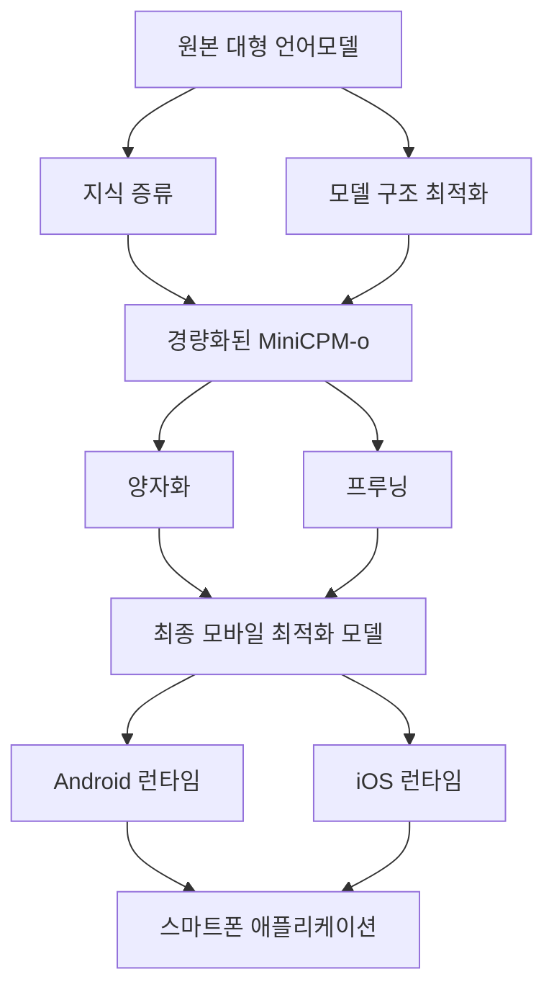

# MiniCPM-o 프로젝트: 스마트폰에서 구동 가능한 경량 거대 언어모델의 혁신

<!-- mtoc-start -->

- [정의 및 개념](#정의-및-개념)
- [주요 특징](#주요-특징)
- [아키텍처](#아키텍처)
- [활용 사례](#활용-사례)
- [기대 효과 및 필요성](#기대-효과-및-필요성)
- [마무리](#마무리)
- [Keywords](#keywords)

<!-- mtoc-end -->

MiniCPM-o(Mini Compact Pre-trained Model-optimization)는 GPT-4 수준의 성능을 유지하면서도 스마트폰과 같은 제한된 자원을 가진 기기에서 실행 가능하도록 경량화된 혁신적인 거대 언어모델입니다. 이 프로젝트는 인공지능 기술의 접근성을 높이고 모바일 환경에서의 고성능 AI 활용을 가능하게 함으로써 엣지 컴퓨팅 분야에 중요한 진전을 가져왔습니다.

## 정의 및 개념

- MiniCPM-o: GPT-4 수준의 성능을 유지하면서 모바일 기기에서 실행 가능하도록 최적화된 경량 거대 언어모델.
- 목적: 고성능 AI 모델의 접근성 확대와 제한된 컴퓨팅 자원 환경에서의 효율적 AI 활용 실현.
- 특징: 모델 크기 축소, 추론 속도 개선, 메모리 사용량 최적화, 모바일 환경 호환성 강화.

## 주요 특징

- **모델 경량화**: 기존 대형 언어모델 대비 크게 감소된 파라미터 수로 스마트폰의 제한된 메모리에서도 작동 가능
- **추론 최적화**: 양자화(Quantization)와 지식 증류(Knowledge Distillation) 기법을 통해 추론 속도 향상 및 연산 요구사항 감소
- **오프라인 실행 지원**: 클라우드 연결 없이 기기 내에서 직접 모델을 실행하여 개인정보 보호 및 네트워크 독립성 확보
- **배터리 효율성**: 저전력 설계로 모바일 기기의 배터리 소모를 최소화하면서도 고품질 응답 생성
- **다국어 지원**: 한국어를 포함한 다양한 언어에 대한 이해 및 생성 능력 보유

## 아키텍처

MiniCPM-o의 아키텍처는 원본 대형 언어모델로부터 지식 증류와 모델 구조 최적화를 통해 경량화된 모델을 생성하고, 양자화와 프루닝 기법을 적용하여 모바일 환경에 최적화됩니다. 이 최적화된 모델은 Android와 iOS 런타임 환경에서 효율적으로 구동되어 스마트폰 애플리케이션에서 활용됩니다.

## 활용 사례

- **개인 비서 애플리케이션**: 오프라인 환경에서도 고성능 자연어 처리 기능을 제공하는 개인화된 AI 비서
- **실시간 번역 서비스**: 네트워크 연결 없이도 고품질 다국어 번역 기능 제공
- **교육용 튜터링**: 제한된 자원의 교육 환경에서도 개인화된 학습 지원 서비스 구현
- **콘텐츠 생성 도구**: 모바일 환경에서 글쓰기, 요약, 창작 지원 도구로 활용
- **의료 정보 접근성 향상**: 오지나 네트워크 접근이 제한된 지역에서 의료 정보 제공 및 상담 지원

## 기대 효과 및 필요성

- **AI 민주화**: 고성능 AI 기술에 대한 접근성을 높여 더 많은 사용자와 개발자가 AI 혜택을 누릴 수 있음
- **개인정보 보호 강화**: 데이터가 클라우드로 전송되지 않고 기기 내에서 처리되어 프라이버시 보호
- **에너지 효율성**: 클라우드 기반 모델 대비 전체 에너지 소비 감소로 환경 친화적 AI 구현
- **네트워크 독립성**: 인터넷 연결이 불안정하거나 제한된 환경에서도 AI 서비스 제공 가능
- **개발 생태계 확장**: 모바일 앱 개발자들이 고급 AI 기능을 앱에 통합할 수 있는 기회 창출

## 마무리

MiniCPM-o 프로젝트는 고성능 AI 모델을 일상에서 더 널리, 더 쉽게 활용할 수 있게 하는 중요한 진전을 이루었습니다. 모바일 기기에서의 AI 경량화 기술은 앞으로 더욱 발전하여 다양한 산업 분야와 일상생활에서 혁신적인 응용 사례를 창출할 것으로 기대됩니다. 기업과 개발자들은 이러한 기술 발전에 주목하고, 모바일 환경에 최적화된 AI 솔루션 개발에 참여함으로써 새로운 비즈니스 기회를 발굴할 수 있을 것입니다.

## Keywords

MiniCPM-o, 경량 언어모델, Knowledge Distillation, 양자화(Quantization), 모델 프루닝(Model Pruning), 엣지 컴퓨팅, 온디바이스 AI, 모바일 최적화, 지식 증류, 추론 효율성
