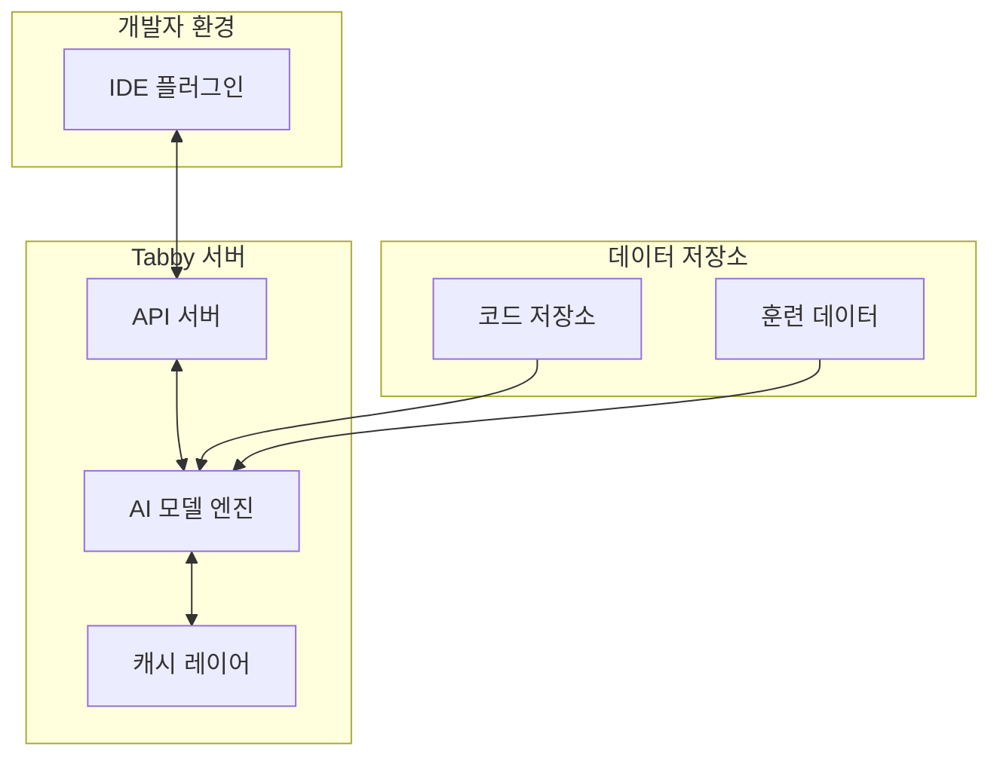

# Tabby 프로젝트: 자체 호스팅 가능한 AI 코딩 비서

<!-- mtoc-start -->

- [정의 및 개념](#정의-및-개념)
- [주요 특징](#주요-특징)
- [아키텍처](#아키텍처)
- [활용 사례](#활용-사례)
- [기대 효과 및 필요성](#기대-효과-및-필요성)
- [마무리](#마무리)
- [Keywords](#keywords)

<!-- mtoc-end -->

Tabby 프로젝트(Tabby Project)는 개발자의 코딩 생산성을 높이기 위해 설계된 자체 호스팅이 가능한 AI 코딩 비서입니다. 오픈소스로 제공되어 기업 내부에서도 안전하게 구축하여 사용할 수 있으며, 개발자가 코드를 더욱 효율적으로 작성할 수 있도록 지원합니다.

## 정의 및 개념

- 정의: 자체 호스팅이 가능한 오픈소스 AI 코딩 비서 도구.
- 목적: 개발자 코딩 생산성 향상과 내부 코드베이스 보안 유지.
- 특징: 로컬 배포 환경 지원, 코드 제안 기능 제공, 기업 내부 코드베이스 학습 가능.

## 주요 특징

- **자체 호스팅 가능**: 클라우드 의존성 없이 조직 내부에 설치하여 코드 데이터의 보안을 유지하면서 AI 코딩 지원 활용 가능
- **코드 자동 완성**: 개발자가 작성 중인 코드를 분석하여 다음 라인이나 블록에 대한 제안을 실시간으로 제공
- **다양한 프로그래밍 언어 지원**: JavaScript, TypeScript, Python, Java, Go 등 주요 프로그래밍 언어에 대한 지원 제공
- **IDE 통합**: VSCode, JetBrains IDE 등 주요 개발 환경과의 플러그인 통합을 통해 개발 워크플로우에 원활하게 결합
- **맞춤형 모델 훈련**: 기업 내부 코드베이스를 기반으로 모델을 추가 학습시켜 조직 특화된 코드 제안 가능

## 아키텍처

Tabby 프로젝트의 아키텍처는 개발자 IDE 플러그인, API 서버, AI 모델 엔진으로 구성되어 있으며, 내부 코드 저장소와 연결하여 맞춤형 코드 제안을 생성합니다. 개발자의 코딩 컨텍스트가 API 서버를 통해 AI 모델에 전달되어 실시간 코드 제안을 제공합니다.

## 활용 사례

- **엔터프라이즈 개발 환경**: 보안이 중요한 기업 환경에서 내부 코드베이스를 외부로 유출하지 않고 AI 코딩 지원 활용
- **팀 코딩 일관성 향상**: 팀 내 코딩 스타일과 패턴을 학습하여 일관된 코드베이스 유지 지원
- **신규 개발자 온보딩**: 기존 코드베이스 패턴을 기반으로 제안하여 신규 입사자의 학습 곡선 단축
- **코드 품질 향상**: 최적화된 코드 패턴과 모범 사례를 제안하여 전반적인 코드 품질 개선
- **레거시 코드 유지보수**: 기존 레거시 시스템의 코딩 패턴을 학습하여 유지보수 작업 시 적합한 코드 제안

## 기대 효과 및 필요성

- **개발 생산성 향상**: 반복적인 코딩 작업 감소로 개발 시간 단축 및 효율성 증대
- **코드 품질 개선**: 일관된 코드 스타일과 모범 사례 적용으로 버그 감소 및 유지보수성 향상
- **보안 강화**: 민감한 코드 데이터를 외부 서비스에 노출하지 않고 AI 코딩 지원 활용 가능
- **비용 절감**: 외부 서비스 구독 비용 감소 및 장기적인 라이선스 비용 절약
- **커스터마이징 유연성**: 조직 특화된 코딩 규칙과 패턴에 맞춘 AI 모델 조정 가능

## 마무리

Tabby 프로젝트는 AI 코딩 비서의 장점을 유지하면서 기업 내부에 안전하게 구축할 수 있는 대안을 제공합니다. 코드 보안이 중요한 조직에서도 AI 코딩 지원을 활용할 수 있으며, 개발 생산성 향상과 코드 품질 개선을 동시에 달성할 수 있습니다. 점점 더 중요해지는 소프트웨어 개발의 효율성과 보안을 동시에 충족시킬 수 있는 Tabby 프로젝트의 도입을 고려해보시기 바랍니다.

## Keywords

Tabby Project, AI Coding Assistant, Self-hosted, 자체 호스팅, 코드 자동완성, 개발 생산성, 코드 보안, 오픈소스, 기업 내부 배포, 맞춤형 코드 제안
