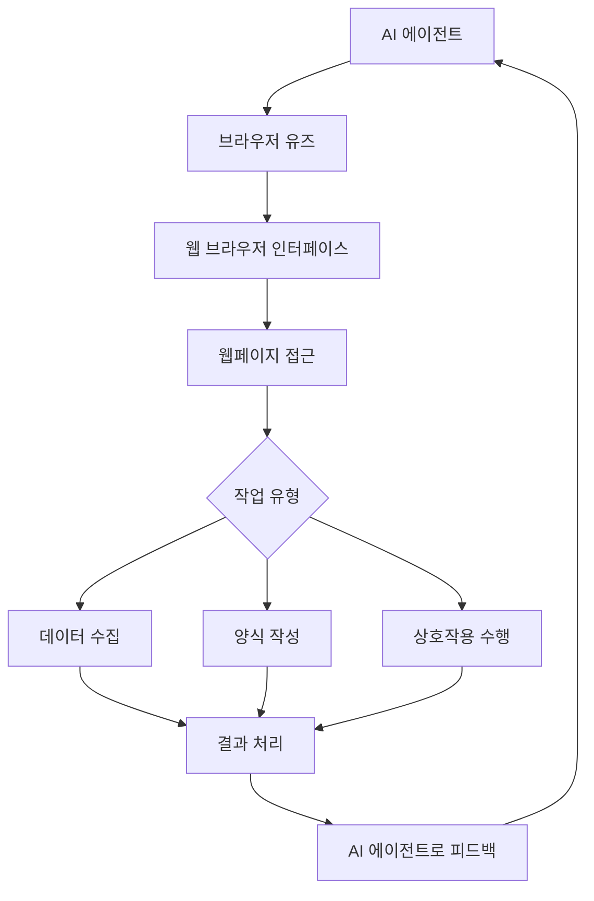
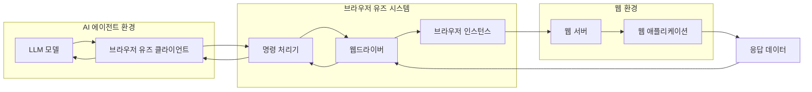

# 브라우저 유즈(Browser Use): AI 에이전트 웹 접근성 향상 도구

<!-- mtoc-start -->

- [정의 및 개념](#정의-및-개념)
- [주요 특징](#주요-특징)
- [작동 메커니즘](#작동-메커니즘)
- [구현 아키텍처](#구현-아키텍처)
- [활용 사례](#활용-사례)
- [기술적 고려사항](#기술적-고려사항)
- [기대 효과 및 필요성](#기대-효과-및-필요성)
- [마무리](#마무리)
- [Keywords](#keywords)

<!-- mtoc-end -->

브라우저 유즈(Browser Use)는 AI 에이전트가 웹사이트에 원활하게 접근하고 상호작용할 수 있도록 지원하는 혁신적인 오픈소스 프로젝트입니다. 매그너스 뮐러와 그레고르 주니치가 개발한 이 도구는 2025년 1월 기준 2만 1,000개 이상의 깃허브 스타와 51명의 기여자를 보유하고 있어, AI 자동화 분야에서 높은 인기를 얻고 있습니다. AI와 웹 브라우징 간의 기술적 단절을 해소함으로써, 데이터 수집부터 복잡한 다단계 워크플로우까지 다양한 작업을 수행할 수 있는 지능형 웹 네이티브 에이전트 개발을 가능하게 합니다.

## 정의 및 개념

- 브라우저 유즈(Browser Use): AI 에이전트가 웹사이트에 접근하여 자율적으로 탐색, 상호작용, 정보 추출을 수행할 수 있도록 지원하는 오픈소스 프로젝트.
- 목적: API 통합이 불가능하거나 비효율적인 상황에서 AI 에이전트와 웹 애플리케이션 간의 직접적인 상호작용 실현.
- 필요성: 점점 복잡해지는 디지털 환경에서 AI의 웹 콘텐츠 접근성 향상 및 자동화된 웹 작업 수행.

## 주요 특징

- **브라우저 자동화**: 웹 브라우저를 통해 AI 에이전트가 웹사이트를 자율적으로 탐색하고 조작할 수 있는 기능 제공.
- **API 대체 솔루션**: 공식 API가 없거나 제한적인 웹서비스와의 통합을 가능하게 하는 대안적 접근 방식.
- **자율적 웹 상호작용**: 정보 검색, 양식 작성, 데이터 추출 등 복잡한 웹 기반 작업을 AI가 독립적으로 수행.
- **오픈소스 생태계**: 활발한 개발자 커뮤니티 지원으로 지속적인 기능 개선 및 확장성 확보.
- **다양한 웹 환경 지원**: 다양한 웹사이트 구조와 기술에 적응하여 광범위한 활용 가능성 제공.

## 작동 메커니즘

브라우저 유즈는 AI 에이전트와 웹 브라우저 사이의 인터페이스 역할을 하며, 에이전트가 웹페이지에 접근하여 다양한 작업을 수행할 수 있도록 합니다. 작업 결과는 다시 AI 에이전트로 전달되어 후속 작업이나 의사결정에 활용됩니다.

## 구현 아키텍처

브라우저 유즈 아키텍처는 AI 에이전트 환경, 브라우저 유즈 시스템, 웹 환경의 세 계층으로 구성됩니다. LLM 모델의 명령이 브라우저 유즈 클라이언트를 통해 웹드라이버로 전달되어 브라우저를 제어하고, 웹 애플리케이션과의 상호작용 결과가 다시 AI 에이전트에게 반환됩니다.

## 활용 사례

- **데이터 수집 자동화**: 웹 스크래핑 작업을 자동화하여 다양한 웹사이트에서 구조화된 데이터를 효율적으로 수집.
- **복잡한 웹 워크플로우 자동화**: 예약 시스템, 회원가입, 주문 처리 등 여러 단계로 구성된 웹 기반 프로세스 자동화.
- **콘텐츠 모니터링**: 특정 웹사이트의 변경사항이나 새로운 정보를 지속적으로 감시하고 보고.
- **테스트 자동화**: 웹 애플리케이션의 기능 및 사용성 테스트를 자동화하여 품질 보증 프로세스 강화.
- **맞춤형 웹 보조**: 사용자 요구에 맞춰 정보를 검색하고 처리하는 개인화된 웹 어시스턴트 개발.

## 기술적 고려사항

- **보안 및 권한 관리**: 브라우저 통합에 따른 보안 위험 관리 및 적절한 접근 권한 설정.
- **요청 제한 준수**: 대상 웹사이트의 요청 제한(rate limits)이나 이용 약관을 준수하여 책임 있는 사용 보장.
- **DOM 구조 변화 대응**: 웹사이트 구조 변경에 탄력적으로 대응할 수 있는 로버스트한 선택자 및 전략 구현.
- **성능 최적화**: 브라우저 자동화의 자원 집약적 특성을 고려한 효율적인 리소스 관리 및 성능 최적화.
- **에러 처리 메커니즘**: 다양한 예외 상황에 대응할 수 있는 견고한 오류 처리 및 복구 메커니즘 설계.

## 기대 효과 및 필요성

- **업무 효율성 향상**: 반복적인 웹 기반 작업을 자동화하여 인력 및 시간 자원의 효율적 활용 가능.
- **확장성 증대**: API 없이도 다양한 웹서비스와 통합하여 AI 애플리케이션의 기능 범위 확장.
- **사용자 경험 개선**: 복잡한 웹 작업을 단순화하여 최종 사용자의 편의성 증대.
- **데이터 접근성 강화**: 웹에 분산된 정보에 대한 AI 에이전트의 접근성 향상으로 더 풍부한 데이터 기반 의사결정 지원.
- **혁신 촉진**: 새로운 형태의 AI 기반 웹 애플리케이션 및 서비스 개발 가능성 확대.

## 마무리

브라우저 유즈는 AI 에이전트와 웹 브라우저 간의 간극을 효과적으로 메우는 혁신적인 도구로, API 통합이 어려운 환경에서도 AI의 웹 접근성을 크게 향상시킵니다. 오픈소스 생태계의 지속적인 발전과 함께, 이 프로젝트는 앞으로 더 많은 기업과 개발자들이 지능형 웹 에이전트를 개발하고 배포하는 데 중요한 역할을 할 것으로 기대됩니다. 디지털 전환이 가속화되는 현 시점에서, 브라우저 유즈의 도입은 조직이 웹 기반 프로세스를 효율적으로 자동화하고 혁신적인 AI 애플리케이션을 구축하는 데 있어 중요한 경쟁 우위를 제공할 것입니다.

## Keywords

Browser Use, AI Agent, 웹 자동화, 브라우저 자동화, Web Scraping, 웹 접근성, Autonomous Agent, 에이전트 통합, 오픈소스 프로젝트, 웹 인터랙션
