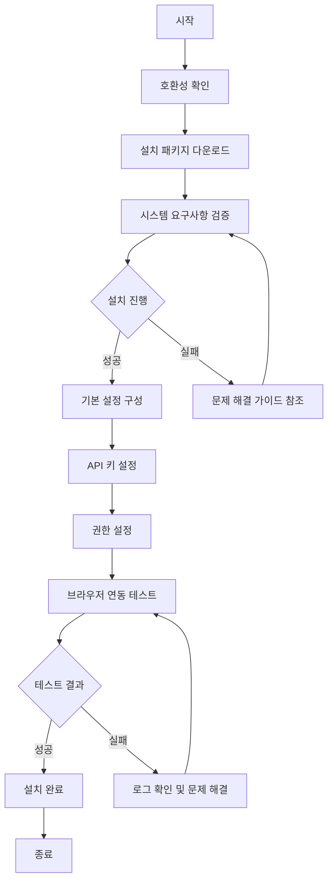

# Browser Use Guide: AI 에이전트 웹 접근성 향상 도구

<!-- mtoc-start -->

- [정의 및 개념](#정의-및-개념)
- [주요 특징](#주요-특징)
- [설치 및 구성 프로세스](#설치-및-구성-프로세스)
- [설치 가이드](#설치-가이드)
  - [1. 사전 요구사항 확인](#1-사전-요구사항-확인)
  - [2. 설치 예제 (CLI 방식)](#2-설치-예제-cli-방식)
  - [3. 설정 파일 구성 예제](#3-설정-파일-구성-예제)
- [기본 사용법](#기본-사용법)
  - [웹 검색 및 정보 추출](#웹-검색-및-정보-추출)
  - [웹 양식 작성 및 제출](#웹-양식-작성-및-제출)
- [고급 활용 사례](#고급-활용-사례)
  - [1. 데이터 수집 및 분석 자동화](#1-데이터-수집-및-분석-자동화)
  - [2. 멀티 페이지 워크플로우 자동화](#2-멀티-페이지-워크플로우-자동화)
  - [3. 웹 모니터링 및 알림 시스템](#3-웹-모니터링-및-알림-시스템)
- [보안 및 프라이버시 설정](#보안-및-프라이버시-설정)
  - [브라우저 유즈 보안 구성](#브라우저-유즈-보안-구성)
  - [개인정보 보호 설정 예제](#개인정보-보호-설정-예제)
- [문제 해결 가이드](#문제-해결-가이드)
  - [일반적인 오류 및 해결책](#일반적인-오류-및-해결책)
  - [로깅 및 디버깅](#로깅-및-디버깅)
- [기대 효과 및 필요성](#기대-효과-및-필요성)
- [마무리](#마무리)
- [Keywords](#keywords)

<!-- mtoc-end -->

브라우저 유즈(Browser Use)는 AI 에이전트가 웹 환경에서 더욱 효과적으로 작업할 수 있도록 지원하는 혁신적인 도구입니다. 이 기술은 AI가 웹 브라우저를 통해 실시간으로 정보를 검색하고, 웹 기반 작업을 수행하며, 사용자에게 더 정확하고 최신 정보를 제공할 수 있게 해줍니다. 본 글에서는 브라우저 유즈의 설치부터 활용까지 전 과정을 예제 중심으로 상세히 알아보겠습니다.

## 정의 및 개념

- 브라우저 유즈: AI 에이전트가 웹 브라우저를 활용하여 실시간 정보 접근 및 웹 기반 작업을 수행할 수 있게 하는 기술적 프레임워크.
- 목적: AI의 정보 접근성과 작업 수행 능력 향상을 통한 사용자 경험 개선 및 AI 응용 범위 확장.
- 필요성: 시간에 따라 변하는 최신 정보 접근, 웹 서비스 활용, 복잡한 작업 자동화를 위한 AI 기능 확장.

## 주요 특징

1. **실시간 웹 접근성**: AI 에이전트가 최신 웹 콘텐츠에 접근하여 시의성 있는 정보 제공

   - 뉴스, 주가, 날씨 등 실시간 데이터 검색 및 분석 가능
   - 사용자 질문에 대한 최신 정보 기반 응답 생성

2. **웹 인터랙션 자동화**: 로그인, 양식 작성, 검색, 탐색 등 다양한 웹 작업 수행

   - 복잡한 웹사이트 탐색 및 특정 정보 추출 기능
   - 사용자 대신 반복적인 웹 기반 작업 처리

3. **멀티모달 정보 처리**: 텍스트, 이미지, 차트 등 다양한 형식의 웹 콘텐츠 인식 및 분석

   - 웹페이지의 시각적 요소 해석 및 관련 정보 추출
   - 다양한 데이터 형식을 통합적으로 분석하여 인사이트 제공

4. **사용자 맞춤 설정**: 사용자 요구에 맞는 브라우저 동작 및 정보 접근 방식 커스터마이징
   - 프라이버시 설정, 접근 권한, 작업 범위 등 세부 조정 가능
   - 개인화된 웹 경험 제공을 위한 사용자 선호도 학습

## 설치 및 구성 프로세스



위 다이어그램은 브라우저 유즈의 설치부터 구성까지의 전체 프로세스를 보여줍니다. 사용자는 호환성 확인부터 시작하여 테스트를 통한 설치 완료까지 단계별로 진행하며, 문제 발생 시 적절한 해결책을 찾아 진행할 수 있습니다.

## 설치 가이드

### 1. 사전 요구사항 확인

- **지원 환경**:

  - 운영체제: Windows 10/11, macOS 11 이상, Linux (Ubuntu 20.04 이상)
  - 브라우저: Chrome 90+, Firefox 88+, Edge 90+
  - RAM: 최소 8GB 이상 (16GB 권장)
  - 디스크 공간: 2GB 이상의 여유 공간

- **필수 구성요소**:
  - Node.js v14 이상
  - Python 3.8 이상
  - API 키 (서비스 제공업체에서 발급)

### 2. 설치 예제 (CLI 방식)

```bash
# 패키지 설치
npm install -g browser-use-agent

# 또는 Python 패키지로 설치
pip install browser-use-agent

# 설치 확인
browser-use --version

# 초기 설정
browser-use init --api-key YOUR_API_KEY
```

### 3. 설정 파일 구성 예제

```json
{
  "apiKey": "your-api-key-here",
  "browserPath": "/path/to/browser/executable",
  "defaultTimeout": 30000,
  "maxConcurrentTabs": 5,
  "userAgent": "Mozilla/5.0 (compatible; BrowserUseAgent/1.0)",
  "permissions": [
    "navigation",
    "screenshots",
    "formInteraction",
    "fileDownload"
  ],
  "blockedDomains": ["example-tracking-site.com", "ad-network.com"],
  "proxy": {
    "enabled": false,
    "server": "http://proxy-server:8080",
    "auth": {
      "username": "",
      "password": ""
    }
  }
}
```

## 기본 사용법

### 웹 검색 및 정보 추출

```javascript
// 검색 수행 예제
const browser = require("browser-use-agent");

async function performSearch() {
  // 브라우저 세션 초기화
  const session = await browser.createSession();

  try {
    // 검색 엔진으로 이동
    await session.navigate("https://www.google.com");

    // 검색어 입력 및 검색 실행
    await session.type('input[name="q"]', "정보관리기술사 시험 일정");
    await session.click('input[name="btnK"]');

    // 결과 로딩 대기
    await session.waitForSelector(".g");

    // 검색 결과 추출
    const results = await session.evaluate(() => {
      const items = Array.from(document.querySelectorAll(".g"));
      return items.map((item) => {
        const titleEl = item.querySelector("h3");
        const linkEl = item.querySelector("a");
        const snippetEl = item.querySelector(".VwiC3b");

        return {
          title: titleEl ? titleEl.textContent : "",
          link: linkEl ? linkEl.href : "",
          snippet: snippetEl ? snippetEl.textContent : "",
        };
      });
    });

    console.log("검색 결과:", results);
    return results;
  } finally {
    // 세션 종료
    await session.close();
  }
}

// 함수 실행
performSearch().catch(console.error);
```

### 웹 양식 작성 및 제출

```python
# Python 예제: 웹 양식 작성
from browser_use_agent import BrowserSession

async def fill_and_submit_form():
    # 브라우저 세션 생성
    session = await BrowserSession.create()

    try:
        # 웹사이트 이동
        await session.navigate("https://example.com/contact")

        # 양식 필드 채우기
        await session.type("#name", "홍길동")
        await session.type("#email", "hong@example.com")
        await session.type("#message", "브라우저 유즈 사용 문의입니다.")

        # 드롭다운 선택
        await session.select("#category", "technical-support")

        # 체크박스 선택
        await session.click("#agreement")

        # 양식 제출
        await session.click("#submit-button")

        # 제출 확인 메시지 대기
        await session.wait_for_selector(".success-message")

        # 결과 확인
        success_message = await session.get_text(".success-message")
        print(f"제출 결과: {success_message}")

        return success_message
    finally:
        # 세션 종료
        await session.close()

# 비동기 함수 실행
import asyncio
asyncio.run(fill_and_submit_form())
```

## 고급 활용 사례

### 1. 데이터 수집 및 분석 자동화

```python
const { BrowserUse } = require('browser-use-agent');
const fs = require('fs').promises;

async function collectStockData(tickers) {
  const browser = new BrowserUse();
  const results = [];

  try {
    await browser.initialize();

    for (const ticker of tickers) {
      console.log(`수집 중: ${ticker}`);
      const page = await browser.newPage();

      // 주식 정보 사이트로 이동
      await page.navigate(`https://finance.example.com/quote/${ticker}`);

      // 데이터 로딩 대기
      await page.waitForSelector('.stock-data', { timeout: 10000 });

      // 주식 데이터 추출
      const stockData = await page.evaluate(() => {
        return {
          price: document.querySelector('.current-price').textContent.trim(),
          change: document.querySelector('.price-change').textContent.trim(),
          volume: document.querySelector('.volume').textContent.trim(),
          peRatio: document.querySelector('.pe-ratio').textContent.trim(),
          marketCap: document.querySelector('.market-cap').textContent.trim(),
          dividend: document.querySelector('.dividend-yield').textContent.trim(),
        };
      });

      // 시간별 차트 데이터 추출
      await page.click('.intraday-tab');
      await page.waitForSelector('.chart-data-loaded');

      const chartData = await page.evaluate(() => {
        const dataPoints = Array.from(document.querySelectorAll('.chart-point'));
        return dataPoints.map(point => ({
          time: point.getAttribute('data-time'),
          price: point.getAttribute('data-price')
        }));
      });

      // 데이터 결합
      results.push({
        ticker,
        timestamp: new Date().toISOString(),
        ...stockData,
        intradayData: chartData
      });

      await page.close();
    }

    // 수집된 데이터 저장
    await fs.writeFile(
      `stock_data_${new Date().toISOString().slice(0,10)}.json`,
      JSON.stringify(results, null, 2)
    );

    console.log(`${results.length}개 종목의 데이터가 성공적으로 수집되었습니다.`);
    return results;
  } catch (error) {
    console.error('데이터 수집 중 오류 발생:', error);
    throw error;
  } finally {
    await browser.close();
  }
}

// 실행 예제
const tickersToCollect = ['AAPL', 'MSFT', 'GOOGL', 'AMZN', 'FB'];
collectStockData(tickersToCollect).catch(console.error);
```

### 2. 멀티 페이지 워크플로우 자동화

비즈니스 프로세스가 여러 웹 애플리케이션에 걸쳐 있는 경우, 브라우저 유즈를 사용하여 전체 워크플로우를 자동화할 수 있습니다.

```python
# 다중 시스템 로그인 및 데이터 통합 예제
async def integrate_multiple_systems():
    browser = await BrowserUse.create()

    try:
        # 시스템 1: CRM 시스템 접근
        await browser.navigate("https://crm.company.com")
        await browser.login("#username", "#password", "crm_user", "crm_pass")

        # 고객 데이터 추출
        customer_data = await browser.extract_table(".customers-table")

        # 시스템 2: ERP 시스템 접근
        erp_tab = await browser.new_tab("https://erp.company.com")
        await browser.switch_to_tab(erp_tab)
        await browser.login("#user", "#pass", "erp_user", "erp_pass")

        # 주문 데이터 추출
        order_data = await browser.extract_table(".orders-table")

        # 시스템 3: 물류 시스템 접근
        logistics_tab = await browser.new_tab("https://logistics.company.com")
        await browser.switch_to_tab(logistics_tab)
        await browser.login("input[name='user']", "input[name='pass']", "log_user", "log_pass")

        # 배송 데이터 추출
        shipping_data = await browser.extract_table(".shipping-table")

        # 데이터 통합 및 분석
        integrated_data = integrate_data(customer_data, order_data, shipping_data)

        # 통합 보고서 생성
        await generate_report(integrated_data, "integrated_business_report.xlsx")

        return integrated_data
    finally:
        await browser.close_all()
```

### 3. 웹 모니터링 및 알림 시스템

```javascript
// 웹사이트 변경 감지 및 알림 시스템
const { BrowserUse, Monitor } = require("browser-use-agent");
const nodemailer = require("nodemailer");

// 이메일 전송 설정
const transporter = nodemailer.createTransport({
  service: "gmail",
  auth: {
    user: "your-email@gmail.com",
    pass: "your-app-password",
  },
});

// 모니터링 설정
const monitorConfig = [
  {
    name: "기술사 시험 공지",
    url: "https://www.example.gov/exam-announcements",
    selector: ".announcement-list",
    checkInterval: 60 * 60 * 1000, // 1시간마다
    recipients: ["admin@company.com", "team@company.com"],
  },
  {
    name: "경쟁사 제품 가격",
    url: "https://competitor.com/products",
    selector: "#product-table",
    checkInterval: 12 * 60 * 60 * 1000, // 12시간마다
    recipients: ["product-team@company.com"],
  },
];

// 모니터링 시작
async function startMonitoring() {
  const monitor = new Monitor();

  // 변경 감지 이벤트 핸들러
  monitor.on("change", async (site, newContent, oldContent) => {
    console.log(`변경 감지: ${site.name}`);

    // 변경 내용 분석
    const changes = analyzeChanges(newContent, oldContent);

    // 이메일 알림 전송
    await sendAlertEmail(site, changes);
  });

  // 모니터링 구성 등록
  for (const site of monitorConfig) {
    await monitor.add(site);
  }

  // 모니터링 시작
  await monitor.start();
  console.log("모니터링 시스템이 시작되었습니다.");
}

// 변경 내용 분석
function analyzeChanges(newContent, oldContent) {
  // 텍스트 비교 로직 구현
  // 여기서는 간단한 예시만 표시
  return {
    added: findAddedItems(newContent, oldContent),
    removed: findRemovedItems(newContent, oldContent),
    modified: findModifiedItems(newContent, oldContent),
  };
}

// 알림 이메일 전송
async function sendAlertEmail(site, changes) {
  const mailOptions = {
    from: "monitoring@company.com",
    to: site.recipients.join(","),
    subject: `[웹 모니터링 알림] ${site.name}에 변경사항이 감지되었습니다`,
    html: `
      <h2>${site.name} 변경 알림</h2>
      <p>모니터링 중인 웹사이트에 다음과 같은 변경사항이 감지되었습니다:</p>
      
      <h3>추가된 항목 (${changes.added.length})</h3>
      <ul>
        ${changes.added.map((item) => `<li>${item}</li>`).join("")}
      </ul>
      
      <h3>제거된 항목 (${changes.removed.length})</h3>
      <ul>
        ${changes.removed.map((item) => `<li>${item}</li>`).join("")}
      </ul>
      
      <h3>수정된 항목 (${changes.modified.length})</h3>
      <ul>
        ${changes.modified.map((item) => `<li>${item.description}</li>`).join("")}
      </ul>
      
      <p><a href="${site.url}" target="_blank">웹사이트 직접 확인하기</a></p>
      
      <p>이 메일은 자동으로 생성되었습니다. 회신하지 마세요.</p>
    `,
  };

  return new Promise((resolve, reject) => {
    transporter.sendMail(mailOptions, (error, info) => {
      if (error) {
        console.error("이메일 전송 실패:", error);
        reject(error);
      } else {
        console.log("이메일 전송 성공:", info.response);
        resolve(info);
      }
    });
  });
}

// 모니터링 시작
startMonitoring().catch(console.error);
```

## 보안 및 프라이버시 설정

### 브라우저 유즈 보안 구성

| 보안 설정     | 설명                                          | 권장 설정                          |
| ------------- | --------------------------------------------- | ---------------------------------- |
| 권한 범위     | 브라우저 유즈가 접근할 수 있는 웹 리소스 범위 | 최소 권한 원칙 적용                |
| API 키 보호   | API 키 저장 및 관리 방식                      | 환경 변수 또는 보안 볼트 사용      |
| 쿠키 처리     | 세션 쿠키 및 개인정보 관리 방식               | 임시 세션 사용, 종료 시 자동 삭제  |
| 헤드리스 모드 | 브라우저 UI 표시 여부                         | 서버 환경에서는 헤드리스 모드 사용 |
| 프록시 설정   | 네트워크 요청 라우팅 방식                     | 필요 시 회사 프록시 서버 사용      |
| 암호화        | 데이터 전송 및 저장 시 보안                   | HTTPS만 허용, 저장 데이터 암호화   |

### 개인정보 보호 설정 예제

```javascript
// 프라이버시 강화 설정
const privacyConfig = {
  // 자바스크립트 비활성화 도메인
  noJavaScriptDomains: ["tracking-heavy-site.com"],

  // 쿠키 정책
  cookiePolicy: {
    acceptAll: false,
    blockThirdParty: true,
    allowList: ["essential-service.com"],
    blockList: ["ad-network.com", "tracker.com"],
  },

  // 핑거프린팅 방지
  antiFingerprinting: {
    enabled: true,
    randomizeUserAgent: true,
    maskCanvas: true,
    spoofScreenResolution: true,
    blockWebRTC: true,
  },

  // 데이터 저장 정책
  dataRetention: {
    clearOnExit: true,
    maxStorageDays: 7,
    encryptStorage: true,
  },

  // 자격 증명 처리
  credentials: {
    allowStorage: false,
    secureVault: "system-keyring",
  },
};

// 설정 적용
await browserUse.applyPrivacySettings(privacyConfig);
```

## 문제 해결 가이드

### 일반적인 오류 및 해결책

| 오류 유형          | 증상                    | 해결 방법                                                         |
| ------------------ | ----------------------- | ----------------------------------------------------------------- |
| 연결 시간 초과     | 웹페이지 로딩 실패      | 네트워크 연결 확인, 타임아웃 값 증가, 프록시 설정 검토            |
| 선택자 찾기 실패   | 원하는 요소 추출 불가   | 페이지 구조 변경 확인, 대체 선택자 사용, 로딩 대기 시간 증가      |
| 메모리 사용량 증가 | 성능 저하, 충돌 발생    | 미사용 탭 닫기, 정기적인 브라우저 재시작, 메모리 제한 설정        |
| 자동화 감지 차단   | CAPTCHA 표시, 접근 거부 | 인간 패턴 모방, 요청 간 시간 간격 추가, 헤더 및 쿠키 커스터마이징 |
| API 키 오류        | 인증 실패 메시지        | API 키 유효성 및 권한 확인, 키 갱신, 할당량 확인                  |

### 로깅 및 디버깅

```python
# 로깅 설정 및 디버깅 예제
import logging
from browser_use_agent import BrowserUse, LogLevel

# 로그 설정
logging.basicConfig(
    level=logging.DEBUG,
    format='%(asctime)s - %(name)s - %(levelname)s - %(message)s',
    filename='browser_use_debug.log'
)

# 브라우저 유즈 로깅 활성화
async def debug_session():
    browser = await BrowserUse.create(
        log_level=LogLevel.VERBOSE,
        log_console=True,
        log_network=True,
        log_performance=True,
        screenshot_on_error=True,
        error_screenshot_dir="./error_screenshots"
    )

    try:
        # 문제가 발생하는 작업 수행
        await browser.navigate("https://problematic-site.com")

        # 네트워크 요청 살펴보기
        requests = await browser.get_network_requests()
        for req in requests:
            if req.status >= 400:
                logging.warning(f"문제 요청: {req.url}, 상태: {req.status}")

        # DOM 상태 디버깅
        dom_state = await browser.evaluate(`
            (() => {
                const result = {};
                result.title = document.title;
                result.bodyContent = document.body.innerHTML.substring(0, 1000);
                result.visibleElements = document.querySelectorAll('*:not([style*="display:none"])').length;
                result.forms = document.forms.length;
                result.scripts = document.scripts.length;
                return result;
            })()
        `)

        logging.info(f"DOM 상태: {dom_state}")

        # 성능 메트릭 수집
        performance = await browser.get_performance_metrics()
        logging.info(f"성능 메트릭: {performance}")

        # 콘솔 메시지 확인
        console_messages = await browser.get_console_messages()
        for msg in console_messages:
            if msg.level == 'error':
                logging.error(f"페이지 오류: {msg.text}")

    except Exception as e:
        logging.exception("디버깅 세션 중 오류 발생")

        # 오류 스크린샷 저장
        await browser.screenshot("error.png")

        # 페이지 HTML 덤프
        html = await browser.get_html()
        with open("error_page.html", "w", encoding="utf-8") as f:
            f.write(html)

        raise
    finally:
        await browser.close()

# 디버깅 세션 실행
import asyncio
asyncio.run(debug_session())
```

## 기대 효과 및 필요성

1. **업무 자동화 및 생산성 향상**

   - 반복적인 웹 기반 작업 자동화로 인력 및 시간 절약
   - 데이터 수집 및 모니터링 작업의 효율성 증대

2. **데이터 기반 의사결정 강화**

   - 웹에서 실시간 데이터 수집 및 분석 자동화
   - 경쟁사, 시장 트렌드, 고객 피드백 등 다양한 데이터 통합 가능

3. **사용자 경험 개선**

   - AI 에이전트의 최신 정보 접근으로 응답 품질 향상
   - 복잡한 웹 기반 작업에 대한 사용자 지원 강화

4. **확장성 및 유연성**

   - 다양한 웹 서비스와의 통합 가능
   - 비즈니스 요구사항 변화에 따른 적응력 향상

5. **비용 절감**
   - 수동 모니터링 및 데이터 수집 비용 감소
   - 휴먼 에러 감소로 인한 오류 수정 비용 절감

## 마무리

브라우저 유즈는 AI 에이전트의 웹 접근성을 획기적으로 향상시키는 혁신적인 도구입니다. 본 가이드에서 소개한 설치, 구성, 사용법을 통해 AI 시스템과 웹 환경 간의 원활한 상호작용을 구현할 수 있습니다. 실시간 정보 접근, 웹 자동화, 데이터 통합 등 다양한 활용 사례에서 브라우저 유즈의 잠재력은 무궁무진합니다. 적절한 보안 및 프라이버시 설정과 함께 브라우저 유즈를 도입하여 AI 기반 솔루션의 가치를 한층 더 높이시기 바랍니다.

## Keywords

Browser Use, AI Agent, 웹 접근성, Web Automation, 자동화 프레임워크, Real-time Web Access, 데이터 수집, Data Integration, 웹 상호작용, Headless Browser
