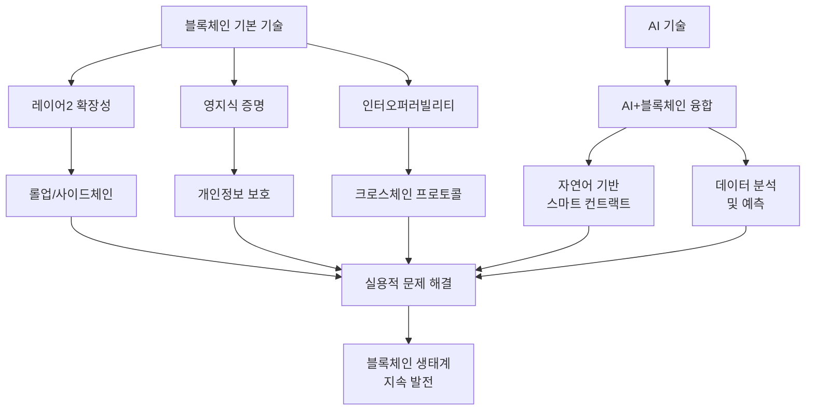

# 블록체인 동향: 실용성과 융합을 통한 기술 혁신의 현재

<!-- mtoc-start -->

- [정의 및 개념](#정의-및-개념)
- [주요 특징](#주요-특징)
- [기술 메커니즘](#기술-메커니즘)
- [활용 사례](#활용-사례)
- [기대 효과 및 필요성](#기대-효과-및-필요성)
- [마무리](#마무리)
- [Keywords](#keywords)

<!-- mtoc-end -->

블록체인 기술은 가상자산 시장의 변동성 감소로 대중의 관심이 다소 줄어들었지만, 기술적 혁신은 꾸준히 진행되고 있습니다. 특히 블록체인(Blockchain) 분야에서는 레이어2 확장성 솔루션, 영지식 증명(Zero-Knowledge Proof) 기반 개인정보 보호 기술, 그리고 체인 간 인터오퍼러빌리티(Interoperability) 등 실용적 문제 해결을 위한 연구와 개발이 활발하게 이루어지고 있습니다.

## 정의 및 개념

- 블록체인: 분산원장 기술을 기반으로 한 데이터 구조로, 암호화 기술을 통해 데이터의 무결성과 신뢰성을 보장하는 시스템.
- 특징: 탈중앙화, 투명성, 불변성, 보안성
- 목적: 중앙 집중형 시스템의 한계 극복 및 신뢰 기반 디지털 경제 인프라 구축

## 주요 특징

- **레이어2 확장성**: 메인체인의 트랜잭션 처리 부담을 줄이고 처리 속도와 효율성을 높이기 위한 오프체인 솔루션으로, 롤업(Rollup)과 사이드체인 등의 기술이 개발 중
- **영지식 증명(ZKP) 기술**: 데이터의 내용을 공개하지 않고도 특정 조건이 충족되었음을 증명할 수 있는 암호학적 방법으로, 프라이버시 보호와 검증 효율성 강화
- **체인 간 인터오퍼러빌리티**: 서로 다른 블록체인 네트워크 간의 상호운용성을 확보하기 위한 기술로, 크로스체인 통신과 자산 이동을 가능하게 함
- **AI와 블록체인 융합**: 인공지능 기술을 블록체인에 접목하여 자연어 기반 스마트 컨트랙트 작성, 데이터 분석 및 보안 강화 등 새로운 응용 영역 창출

## 기술 메커니즘

현재 블록체인 기술 혁신의 주요 흐름과 각 기술 요소 간의 관계를 보여줍니다. 기본 기술에서 시작된 혁신이 실용적 문제 해결로 연결되며, AI 기술과의 융합을 통해 블록체인 생태계가 지속적으로 발전하는 구조입니다.

## 활용 사례

- **TON(The Open Network) 프로젝트**: 텔레그램 기반으로 개발된 블록체인 프로젝트로, 최근 GitHub 트렌딩 상위에 오르며 개발자 커뮤니티의 관심이 재조명됨
- **Avalanche VM 연구**: AI 에이전트가 자연어 명령을 해석하여 스마트 컨트랙트를 자동으로 작성해주는 가상머신 개발 프로젝트
- **엔터프라이즈 블록체인**: 금융, 공급망, 의료, 공공서비스 등 다양한 산업 분야에서 블록체인 기술을 활용한 비즈니스 프로세스 최적화 및 투명성 강화

## 기대 효과 및 필요성

- **확장성 개선**: 레이어2 솔루션을 통한 트랜잭션 처리 속도 향상 및 비용 감소로 대규모 상용화 기반 마련
- **개인정보 보호 강화**: 영지식 증명 기술을 통해 프라이버시를 보장하면서도 필요한 검증은 가능한 시스템 구현
- **블록체인 생태계 통합**: 인터오퍼러빌리티 기술을 통한 다양한 블록체인 네트워크 간 연결성 강화 및 시너지 창출
- **기술 융합 촉진**: AI와 블록체인의 융합을 통한 새로운 서비스 모델 및 응용 분야 발굴

## 마무리

블록체인 기술은 대중의 관심 변화에 관계없이 꾸준한 기술적 진화를 이어가고 있습니다. 특히 실용성과 융합에 초점을 맞춘 현재의 기술 개발 방향은 블록체인이 단순한 가상자산의 기반 기술을 넘어 다양한 산업과 서비스에 적용 가능한 범용 인프라로 발전해 나가고 있음을 보여줍니다. 기업과 조직들은 이러한 기술 동향을 주시하며 자신들의 비즈니스 모델에 블록체인 기술을 효과적으로 접목할 수 있는 방안을 모색해야 할 것입니다.

## Keywords

Blockchain, Layer2 Solutions, Zero-Knowledge Proof, 인터오퍼러빌리티, AI 융합, 스마트 컨트랙트, 탈중앙화, 분산원장, 확장성, 프라이버시
