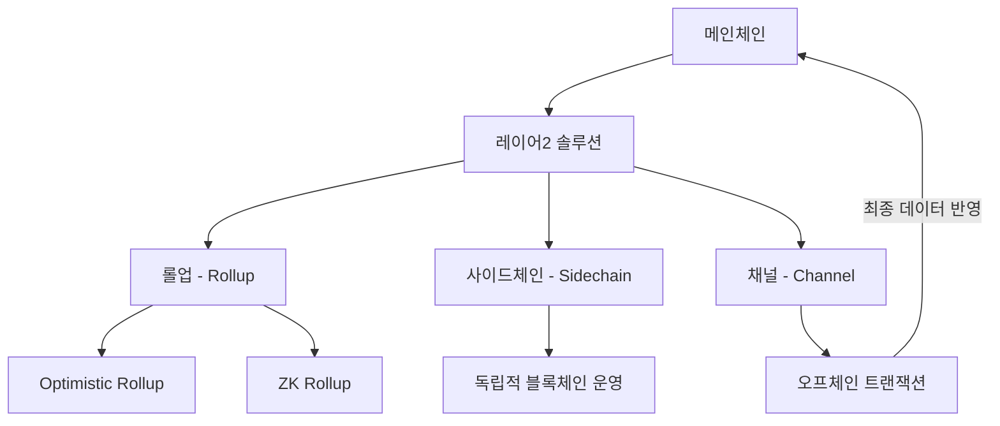

# 블록체인 레이어2 확장성: 트랜잭션 처리 속도와 효율성 향상

<!-- mtoc-start -->

- [정의 및 개념](#정의-및-개념)
- [주요 특징](#주요-특징)
  - [1. 트랜잭션 처리 속도 향상](#1-트랜잭션-처리-속도-향상)
  - [2. 수수료 절감](#2-수수료-절감)
  - [3. 메인체인과의 보안성 유지](#3-메인체인과의-보안성-유지)
  - [4. 다양한 확장 기술 적용](#4-다양한-확장-기술-적용)
  - [5. 블록체인 대중화 기여](#5-블록체인-대중화-기여)
- [구성도](#구성도)
- [활용 사례](#활용-사례)
  - [1. 롤업(Rollup) 기반 확장성 개선](#1-롤업rollup-기반-확장성-개선)
  - [2. 사이드체인(Sidechain) 활용](#2-사이드체인sidechain-활용)
  - [3. 오프체인 결제 채널](#3-오프체인-결제-채널)
  - [4. NFT 및 게임 산업 적용](#4-nft-및-게임-산업-적용)
  - [5. DeFi 서비스 확장](#5-defi-서비스-확장)
- [기대 효과 및 필요성](#기대-효과-및-필요성)
- [마무리](#마무리)
- [Keywords](#keywords)

<!-- mtoc-end -->

블록체인의 확장성 문제를 해결하기 위해 레이어2 솔루션이 주목받고 있다. 메인체인의 트랜잭션 처리 부담을 줄이고, 비용 절감과 속도 향상을 목표로 롤업(Rollup), 사이드체인(Sidechain) 등의 오프체인 솔루션이 활발히 개발되고 있다. 이러한 기술은 블록체인의 대중화와 실용성을 높이는 핵심 요소로 자리 잡고 있다.

## 정의 및 개념

- **레이어2 확장성**: 블록체인 메인체인의 부하를 줄이고 성능을 향상시키기 위해 별도의 프로토콜을 활용하는 기술
- **특징**: 높은 트랜잭션 처리 속도, 낮은 수수료, 보안성 유지, 메인체인과의 상호운용성
- **필요성**: 블록체인의 트랜잭션 처리량 제한을 극복하고 대규모 애플리케이션 도입을 지원

## 주요 특징

### 1. 트랜잭션 처리 속도 향상

레이어2 솔루션은 트랜잭션을 메인체인이 아닌 별도의 네트워크에서 처리하여 속도를 증가시킨다.

### 2. 수수료 절감

메인체인의 높은 가스비(Gas Fee) 문제를 해결하고, 사용자가 저렴한 비용으로 트랜잭션을 수행할 수 있도록 한다.

### 3. 메인체인과의 보안성 유지

레이어2 솔루션은 트랜잭션을 별도로 처리하지만, 최종 데이터를 메인체인에 기록하여 보안성을 유지한다.

### 4. 다양한 확장 기술 적용

롤업(Rollup), 사이드체인(Sidechain), 채널(Channel) 등 다양한 기술이 존재하며, 각각의 방식에 따라 확장성과 보안성이 달라진다.

### 5. 블록체인 대중화 기여

확장성 문제를 해결함으로써 NFT, 게임, 금융(DeFi) 등 다양한 블록체인 기반 서비스의 대중화를 촉진한다.

## 구성도

레이어2 솔루션은 롤업, 사이드체인, 채널 등의 기술을 활용하여 트랜잭션을 메인체인 밖에서 처리한 후, 최종 결과를 메인체인에 기록하는 방식으로 작동한다.

## 활용 사례

### 1. 롤업(Rollup) 기반 확장성 개선

ZK-Rollup과 Optimistic Rollup을 활용하여 Ethereum 네트워크의 트랜잭션 속도를 높이고 가스비를 절감

### 2. 사이드체인(Sidechain) 활용

Polygon(폴리곤)과 같은 사이드체인 솔루션을 통해 독립적인 블록체인을 운영하면서도 메인체인과 연계

### 3. 오프체인 결제 채널

Bitcoin의 라이트닝 네트워크(Lightning Network)를 활용하여 빠르고 저렴한 결제 가능

### 4. NFT 및 게임 산업 적용

레이어2 솔루션을 통해 NFT 마켓플레이스 및 블록체인 게임에서 저렴한 비용으로 다수의 트랜잭션 처리

### 5. DeFi 서비스 확장

레이어2 기술을 활용하여 탈중앙화 금융(DeFi) 플랫폼의 거래 처리량 증가 및 사용자 경험 개선

## 기대 효과 및 필요성

- **처리 속도 증가**: 블록체인의 확장성을 개선하여 초당 수천 건의 트랜잭션 처리 가능
- **비용 절감**: 가스비 절감으로 사용자 부담 완화
- **보안성 유지**: 메인체인의 신뢰성과 보안성을 유지하면서 트랜잭션 처리
- **대중화 촉진**: 블록체인 기반 서비스의 실용성과 접근성을 높여 대규모 채택 가능
- **다양한 산업 적용**: 금융, 게임, NFT, 결제 등 다양한 분야에서 활용 가능

## 마무리

블록체인 레이어2 확장성 기술은 트랜잭션 처리 속도와 효율성을 향상시키며, 블록체인의 대중화를 위한 필수 요소로 자리 잡고 있다. 롤업, 사이드체인, 채널 등의 솔루션을 적극적으로 도입함으로써 블록체인 기반 애플리케이션의 성능을 극대화하고, 사용자 경험을 개선할 수 있을 것이다.

## Keywords

Blockchain Layer2, 블록체인 확장성, 롤업 기술, 사이드체인, ZK-Rollup, Optimistic Rollup, Lightning Network, 가스비 절감, 블록체인 트랜잭션, DeFi 확장성
