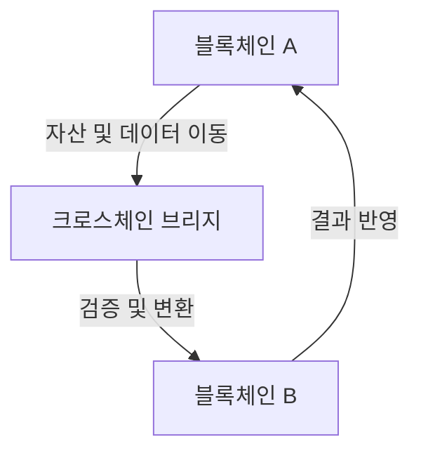

# 체인 인터오퍼러빌리티: 블록체인 네트워크 간 상호운용성 강화

<!-- mtoc-start -->

- [정의 및 개념](#정의-및-개념)
- [주요 특징](#주요-특징)
  - [1. 크로스체인 자산 이동](#1-크로스체인-자산-이동)
  - [2. 스마트 컨트랙트 상호 작용](#2-스마트-컨트랙트-상호-작용)
  - [3. 블록체인 간 데이터 공유](#3-블록체인-간-데이터-공유)
  - [4. 다양한 기술 적용](#4-다양한-기술-적용)
  - [5. 보안성과 탈중앙화 유지](#5-보안성과-탈중앙화-유지)
- [구성도](#구성도)
- [활용 사례](#활용-사례)
  - [1. 디파이(DeFi) 유동성 확대](#1-디파이defi-유동성-확대)
  - [2. 크로스체인 NFT 거래](#2-크로스체인-nft-거래)
  - [3. 글로벌 결제 및 송금](#3-글로벌-결제-및-송금)
  - [4. 멀티체인 디앱(DApp) 개발](#4-멀티체인-디앱dapp-개발)
  - [5. 블록체인 기반 신원 인증](#5-블록체인-기반-신원-인증)
- [기대 효과 및 필요성](#기대-효과-및-필요성)
- [마무리](#마무리)
- [Keywords](#keywords)

<!-- mtoc-end -->

블록체인 기술이 발전하면서 다양한 네트워크가 등장했지만, 각각의 블록체인은 독립적으로 운영되어 서로 간의 데이터 및 자산 이동이 어려운 문제가 있다. 체인 인터오퍼러빌리티(Chain Interoperability)는 이러한 한계를 극복하기 위한 기술로, 크로스체인 통신과 자산 이동을 가능하게 하여 블록체인 생태계의 확장성을 높인다.

## 정의 및 개념

- **체인 인터오퍼러빌리티**: 서로 다른 블록체인 네트워크 간 데이터 및 자산을 상호 이동할 수 있도록 지원하는 기술
- **특징**: 크로스체인 통신, 자산 및 스마트 컨트랙트 상호 운용, 탈중앙화 보장
- **필요성**: 블록체인 네트워크 간 단절 문제 해결, 유동성 확보, 디앱(DApp) 확장성 강화

## 주요 특징

### 1. 크로스체인 자산 이동

한 블록체인의 자산을 다른 블록체인으로 전송할 수 있으며, 대표적인 예로 Wrapped Token(WBTC)이나 Cross-chain Bridge가 있다.

### 2. 스마트 컨트랙트 상호 작용

이더리움, 솔라나, 폴카닷 등 다양한 블록체인 간 스마트 컨트랙트가 상호작용하여 디앱(DApp)의 확장성을 높일 수 있다.

### 3. 블록체인 간 데이터 공유

공공 데이터, 거래 내역, 인증 정보 등의 데이터를 안전하게 공유하여 블록체인 생태계를 연결한다.

### 4. 다양한 기술 적용

인터체인(Interchain), 크로스체인 브리지(Cross-chain Bridge), 아토믹 스왑(Atomic Swap), 릴레이(Relayer) 등 다양한 기술을 활용하여 상호운용성을 지원한다.

### 5. 보안성과 탈중앙화 유지

중앙화된 시스템을 배제하고, 스마트 컨트랙트 및 블록체인 검증 노드를 활용하여 보안성과 탈중앙성을 유지한다.

## 구성도

체인 인터오퍼러빌리티는 블록체인 A와 B 간의 크로스체인 브리지를 통해 자산 및 데이터를 이동시키는 방식으로 운영된다.

## 활용 사례

### 1. 디파이(DeFi) 유동성 확대

체인 간 유동성을 제공하여 디파이 플랫폼에서 더 많은 자산을 활용할 수 있도록 지원

### 2. 크로스체인 NFT 거래

NFT를 특정 블록체인에 한정하지 않고, 여러 블록체인에서 자유롭게 이동 및 거래 가능

### 3. 글로벌 결제 및 송금

비트코인, 이더리움, 스테이블코인 등을 크로스체인 기술을 활용해 빠르고 저렴한 비용으로 송금

### 4. 멀티체인 디앱(DApp) 개발

한 블록체인에서만 운영되던 애플리케이션을 여러 체인에서 사용할 수 있도록 확장 가능

### 5. 블록체인 기반 신원 인증

여러 블록체인에서 인증 데이터를 공유하여 분산 신원(DID) 및 KYC 인증 시스템 구축

## 기대 효과 및 필요성

- **상호운용성 강화**: 블록체인 간 데이터와 자산 이동을 원활하게 하여 더 강력한 생태계 조성
- **디앱 확장성 증가**: 멀티체인 환경을 활용한 더 다양한 디앱 개발 가능
- **거래 비용 절감**: 네트워크를 최적화하여 거래 수수료 절감
- **보안성 유지**: 탈중앙화된 방식으로 크로스체인 트랜잭션을 처리하여 보안 강화
- **블록체인 대중화 촉진**: 개별 블록체인의 한계를 넘어서 사용자 경험을 개선하고 접근성을 확대

## 마무리

체인 인터오퍼러빌리티 기술은 블록체인 네트워크 간의 장벽을 허물고, 자산과 데이터를 자유롭게 이동시킬 수 있도록 지원한다. 이를 통해 블록체인 생태계의 확장성과 효율성이 증가하며, 더 많은 기업과 사용자가 블록체인을 실생활에서 활용할 수 있게 될 것이다.

## Keywords

Blockchain Interoperability, 체인 인터오퍼러빌리티, 크로스체인, Cross-chain Bridge, Atomic Swap, Interchain, 멀티체인, 블록체인 상호운용성, 스마트 컨트랙트, 디파이 유동성
