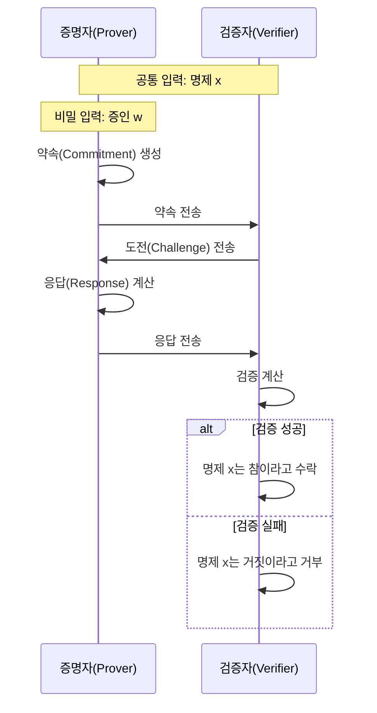

# 영지식 증명(ZKP): 데이터 비공개 상태에서의 신뢰성 있는 검증 기술

<!-- mtoc-start -->

- [정의 및 개념](#정의-및-개념)
- [주요 특징](#주요-특징)
- [메커니즘](#메커니즘)
- [활용 사례](#활용-사례)
- [기대 효과 및 필요성](#기대-효과-및-필요성)
- [마무리](#마무리)
- [Keywords](#keywords)

<!-- mtoc-end -->

영지식 증명(Zero-Knowledge Proof, ZKP)은 정보 보안과 프라이버시 분야에서 혁신적인 개념으로, 민감한 데이터를 공개하지 않으면서도 그 데이터가 특정 조건을 만족한다는 사실을 증명할 수 있는 암호학적 방법입니다. 최근 블록체인, 디지털 신원 관리, 금융 기술 등 다양한 영역에서 프라이버시 보호와 검증 효율성을 동시에 달성하기 위한 핵심 기술로 주목받고 있습니다.

## 정의 및 개념

- 정의: 증명자(Prover)가 검증자(Verifier)에게 어떤 명제의 참/거짓 여부를 증명하되, 증명 과정에서 명제의 참임을 증명하는 데 필요한 정보 외에는 어떠한 추가 정보도 누설하지 않는 암호학적 증명 방식.
- 목적: 데이터 프라이버시 보호와 동시에 정보의 무결성 및 신뢰성 검증 가능.
- 특징: 완전성(Completeness), 건전성(Soundness), 영지식성(Zero-Knowledge) 속성 충족.
- 필요성: 개인정보 보호 규제 강화 환경에서 데이터 활용과 보안 사이의 균형점 제공.

## 주요 특징

- **완전성(Completeness)**: 명제가 참이라면, 정직한 증명자는 항상 검증자를 설득할 수 있음.
- **건전성(Soundness)**: 명제가 거짓이라면, 부정직한 증명자가 검증자를 속일 확률은 매우 낮음.
- **영지식성(Zero-Knowledge)**: 증명 과정에서 명제의 참/거짓 여부 외에 어떠한 추가 정보도 공개되지 않음.
- **계산 효율성**: 기존 증명 방식에 비해 검증 과정이 간소화되어 계산 자원의 효율적 활용 가능.
- **상호작용성**: 증명자와 검증자 간 대화형(Interactive) 또는 비대화형(Non-Interactive) 증명 방식으로 구분.

## 메커니즘

영지식 증명의 기본 메커니즘은 증명자가 비밀 정보를 직접 공개하지 않고도 약속-도전-응답 과정을 통해 검증자에게 명제의 참임을 확신시키는 방식으로 작동합니다. 이 과정에서 검증자는 증명의 유효성만 확인할 뿐, 비밀 정보 자체에 대해서는 어떠한 추가 지식도 얻지 못합니다.

## 활용 사례

- **블록체인 프라이버시**: zk-SNARK, zk-STARK 등을 활용한 프라이버시 보호형 암호화폐(Zcash 등)와 트랜잭션 검증.
- **디지털 신원 관리**: 개인정보 노출 없이 나이, 신용도 등 특정 속성만 선택적으로 증명.
- **전자투표 시스템**: 투표 내용을 공개하지 않으면서도 투표의 유효성과 결과의 정확성 검증.
- **기업 간 데이터 공유**: 민감한 비즈니스 데이터를 직접 공개하지 않고도 규제 준수나 특정 조건 충족 여부 증명.
- **금융 규제 준수**: 자금세탁방지(AML) 및 고객알기제도(KYC) 요구사항 충족 시 개인정보 보호.

## 기대 효과 및 필요성

- **데이터 프라이버시 강화**: 민감 정보 노출 위험 감소로 데이터 주체의 프라이버시 권리 보호.
- **규제 준수 효율화**: 개인정보보호법, GDPR 등 데이터 보호 규제 준수 용이성 증대.
- **디지털 신뢰 기반 구축**: 데이터 검증과 프라이버시 보호의 균형을 통한 신뢰 생태계 조성.
- **시스템 효율성 향상**: 대규모 증명 시스템에서 검증 프로세스의 계산 부하 및 저장 공간 요구 감소.
- **새로운 비즈니스 모델 창출**: 민감 데이터 활용이 필요한 산업에서 프라이버시 보호와 데이터 활용의 공존 가능성 확대.

## 마무리

영지식 증명 기술은 디지털 사회에서 점점 더 중요해지는 프라이버시 보호와 데이터 검증 사이의 균형을 이루는 혁신적인 접근법입니다. 특히 개인정보 보호에 대한 규제적 요구사항이 강화되고, 데이터 기반 의사결정의 중요성이 증가하는 현대 비즈니스 환경에서 ZKP의 도입은 조직에게 경쟁 우위를 제공할 수 있습니다. 기술의 성숙도가 높아짐에 따라 구현 복잡성과 계산 비용의 문제가 지속적으로 개선되고 있으며, 향후 데이터 프라이버시와 검증이 중요한 다양한 영역에서 ZKP의 적용이 확대될 것으로 전망됩니다.

## Keywords

Zero-Knowledge Proof, 영지식 증명, Interactive Proof, 대화형 증명, zk-SNARK, zk-STARK, Privacy-Preserving Technology, 프라이버시 보존 기술, Cryptographic Protocol, 암호학적 프로토콜, Data Verification, 데이터 검증, Blockchain Privacy, 블록체인 프라이버시
