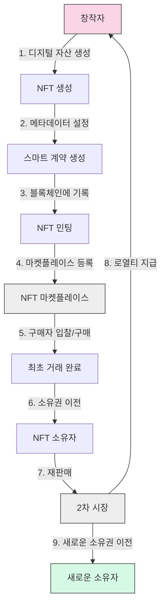

# NFT (Non-Fungible Token): 디지털 자산의 고유성과 소유권을 보장하는 혁신 기술

<!-- mtoc-start -->

- [정의 및 개념](#정의-및-개념)
- [주요 특징](#주요-특징)
- [NFT 작동 메커니즘](#nft-작동-메커니즘)
- [NFT 표준 프로토콜](#nft-표준-프로토콜)
  - [이더리움 기반 표준](#이더리움-기반-표준)
  - [기타 블록체인 표준](#기타-블록체인-표준)
- [활용 사례](#활용-사례)
  - [디지털 아트 및 콘텐츠](#디지털-아트-및-콘텐츠)
  - [게임 및 메타버스](#게임-및-메타버스)
  - [신원 및 소유권 증명](#신원-및-소유권-증명)
- [기술적 구현 요소](#기술적-구현-요소)
  - [블록체인 인프라](#블록체인-인프라)
  - [메타데이터 저장](#메타데이터-저장)
  - [스마트 계약 개발](#스마트-계약-개발)
- [기대 효과 및 필요성](#기대-효과-및-필요성)
  - [창작자 생태계 혁신](#창작자-생태계-혁신)
  - [디지털 경제 확장](#디지털-경제-확장)
  - [기술 및 인프라 발전](#기술-및-인프라-발전)
- [도전 과제와 해결 방안](#도전-과제와-해결-방안)
  - [환경적 문제](#환경적-문제)
  - [법적 문제](#법적-문제)
  - [기술적 문제](#기술적-문제)
- [마무리](#마무리)
- [Keywords](#keywords)

<!-- mtoc-end -->

블록체인 기술의 발전과 함께 등장한 NFT(Non-Fungible Token, 대체 불가능 토큰)는 디지털 환경에서 자산의 고유성과 소유권을 보장하는 혁신적인 기술입니다. 기존의 디지털 콘텐츠가 쉽게 복제되고 공유되는 한계를 넘어서, NFT는 각 디지털 자산에 고유한 가치와 소유권을 부여함으로써 디지털 경제의 새로운 패러다임을 제시하고 있습니다. 예술, 게임, 부동산, 신원 증명 등 다양한 분야에서 활용되며 디지털 자산 관리의 새로운 지평을 열고 있습니다.

## 정의 및 개념

- NFT(Non-Fungible Token): 블록체인 기술을 기반으로 고유한 식별자와 메타데이터를 포함하는 디지털 토큰으로, 복제나 대체가 불가능한 고유성을 지닌 디지털 자산.
- 스마트 계약을 통해 생성 및 거래되며, 발행자와 소유자의 정보, 거래 이력 등이 투명하게 기록되고 검증 가능한 디지털 소유권 증명 메커니즘.

- 특징: 고유성(Uniqueness), 불변성(Immutability), 분할 불가능성(Indivisibility), 희소성(Scarcity), 소유권 증명(Proof of Ownership)
- 목적: 디지털 자산의 고유성 보장, 창작자 권리 보호, 디지털 자산의 소유권 및 거래 이력 추적, 디지털 경제 생태계 확장
- 필요성: 디지털 희소성 구현, 창작자 보상 체계 확립, 디지털 자산의 진위 검증, 새로운 디지털 경제 모델 구축

## 주요 특징

1. **고유성과 희소성**: 각 NFT는 고유한 식별자(Token ID)를 보유하여 복제가 불가능하며, 발행자가 설정한 수량에 따라 희소성이 결정됩니다. 이는 디지털 환경에서 실물 자산과 같은 가치 체계를 구현하는 기반이 됩니다.

2. **소유권 추적 및 검증**: 블록체인에 기록된 거래 이력을 통해 자산의 원 소유자부터 현재 소유자까지 모든 거래 과정을 투명하게 추적할 수 있으며, 이를 통해 위조나 불법 거래를 방지합니다.

3. **스마트 계약 기반 로열티**: 창작자는 NFT에 스마트 계약을 통해 2차 판매 시 로열티(재판매 수수료)를 설정할 수 있어, 작품이 재판매될 때마다 자동으로 수익을 얻을 수 있는 지속 가능한 수익 모델을 구현합니다.

4. **상호운용성**: 다양한 블록체인 플랫폼과 마켓플레이스 간에 NFT의 이동 및 거래가 가능하며, 이를 통해 더 넓은 시장과 사용자 기반을 확보할 수 있습니다.

5. **메타데이터 저장**: NFT에는 자산에 대한 설명, 이미지, 속성 등 다양한 메타데이터를 포함할 수 있어 자산의 가치와 특성을 명확히 표현할 수 있습니다.

## NFT 작동 메커니즘

NFT의 작동 메커니즘은 자산 생성부터 소유권 이전까지의 전체 생명주기를 보여줍니다. 창작자가 디지털 자산을 생성하고 민팅(Minting)하여 블록체인에 기록한 후, 마켓플레이스를 통해 거래되며 스마트 계약에 의해 소유권 이전과 로열티 지급이 자동으로 이루어집니다.

## NFT 표준 프로토콜

### 이더리움 기반 표준

- **ERC-721**: 최초의 NFT 표준으로, 각 토큰에 고유한 ID를 부여하여 대체 불가능성을 구현
- **ERC-1155**: 대체 가능한 토큰(FT)과 대체 불가능한 토큰(NFT)을 동시에 지원하는 멀티 토큰 표준
- **ERC-2981**: NFT 로열티 표준으로, 2차 판매 시 원 창작자에게 자동으로 로열티를 지급하는 메커니즘 정의

### 기타 블록체인 표준

- **솔라나 Metaplex**: 솔라나 블록체인에서 사용되는 NFT 표준으로 낮은 거래 수수료와 빠른 처리 속도가 특징
- **플로우 Flow NFT**: Dapper Labs에서 개발한 플로우 블록체인의 NFT 표준으로 NBA Top Shot 등에 활용
- **바이낸스 스마트 체인 BEP-721**: 이더리움의 ERC-721과 호환되는 바이낸스 스마트 체인의 NFT 표준

## 활용 사례

### 디지털 아트 및 콘텐츠

- **크립토 아트**: Beeple의 'Everydays: The First 5000 Days'가 6,950만 달러에 낙찰되며 NFT 아트의 가능성 제시
- **음악 및 영상**: 음악가들이 앨범이나 단일 트랙을 NFT로 발행하여 팬들에게 직접 판매하고 지속적인 로열티 수익 창출
- **가상 부동산**: 디센트럴랜드(Decentraland), 샌드박스(The Sandbox) 등의 메타버스 플랫폼에서 가상 토지를 NFT로 거래

### 게임 및 메타버스

- **게임 아이템**: 액시 인피니티(Axie Infinity)의 캐릭터나 아이템을 NFT로 소유하고 거래하는 Play-to-Earn 모델 구현
- **메타버스 아바타**: 가상 세계에서 사용되는 아바타와 아이템을 NFT로 소유하고 다양한 플랫폼에서 활용
- **게임 내 자산**: 블록체인 게임에서 획득한 아이템이나 캐릭터를 NFT로 소유하고 실제 가치로 환산 가능

### 신원 및 소유권 증명

- **디지털 신원**: 학위증, 자격증, 신분증 등을 NFT로 발행하여 위변조 방지 및 간편한 인증 시스템 구현
- **티켓팅**: 콘서트, 스포츠 이벤트 등의 입장권을 NFT로 발행하여 2차 시장에서의 투명한 거래 및 위조 방지
- **물리적 자산 연동**: 실물 자산(예술품, 명품, 부동산 등)의 소유권을 NFT로 연동하여 디지털 소유권 증명 및 거래 간소화

## 기술적 구현 요소

### 블록체인 인프라

- **이더리움(Ethereum)**: 가장 널리 사용되는 NFT 플랫폼으로 ERC-721, ERC-1155 표준을 통해 NFT 구현
- **솔라나(Solana)**: 높은 처리량과 낮은 거래 수수료가 특징인 블록체인으로 NFT 마켓플레이스 구축에 적합
- **폴리곤(Polygon)**: 이더리움 레이어2 솔루션으로 낮은 가스비와 빠른 거래 속도로 NFT 거래 활성화에 기여

### 메타데이터 저장

- **IPFS(InterPlanetary File System)**: 분산형 파일 시스템으로 NFT 메타데이터와 실제 디지털 자산을 저장
- **Arweave**: 영구적인 데이터 저장을 제공하는 블록체인 기반 저장소로 NFT의 장기적 접근성 보장
- **Filecoin**: 분산 저장소 네트워크로 NFT 관련 대용량 파일을 효율적으로 저장 및 관리

### 스마트 계약 개발

- **Solidity**: 이더리움 기반 NFT 스마트 계약 개발에 사용되는 프로그래밍 언어
- **Rust**: 솔라나 블록체인의 NFT 스마트 계약 개발에 주로 사용되는 언어
- **개발 프레임워크**: OpenZeppelin, Hardhat, Truffle 등을 활용한 안전하고 효율적인 NFT 스마트 계약 개발

## 기대 효과 및 필요성

### 창작자 생태계 혁신

- **직접 수익 모델**: 중개자 없이 창작자가 소비자에게 직접 작품을 판매하고 수익을 얻을 수 있는 구조 확립
- **지속적 로열티**: 2차 판매에서도 창작자에게 로열티가 자동으로 지급되어 지속 가능한 창작 활동 지원
- **새로운 창작 형태**: 디지털 네이티브 작품, 인터랙티브 아트 등 기존에 없던 새로운 형태의 창작물 등장

### 디지털 경제 확장

- **디지털 희소성**: 무한 복제 가능했던 디지털 자산에 희소성과 고유성을 부여하여 새로운 가치 체계 형성
- **자산 유동화**: 실물 자산을 NFT로 토큰화하여 분할 소유 및 유동성 증가 가능
- **크로스 플랫폼 경제**: 다양한 게임과 메타버스 플랫폼 간 자산 이동 및 활용으로 확장된 디지털 경제 생태계 구축

### 기술 및 인프라 발전

- **블록체인 확장성**: NFT 활용 증가로 인한 블록체인 기술의 확장성 및 처리 효율성 개선
- **분산 저장소 발전**: NFT 메타데이터와 디지털 자산의 안전한 저장을 위한 분산 저장소 기술 발전
- **표준화 진전**: 다양한 블록체인 간 NFT 표준 통합 및 상호운용성 향상

## 도전 과제와 해결 방안

### 환경적 문제

- **에너지 소비**: 작업증명(PoW) 기반 블록체인의 높은 에너지 소비 문제
- **해결 방안**: 지분증명(PoS) 기반 블록체인으로의 전환, 카본 오프셋 프로그램 도입, 친환경 NFT 민팅 솔루션 개발

### 법적 문제

- **지적 재산권**: NFT 민팅 시 지적 재산권 침해 문제 및 법적 분쟁
- **규제 불확실성**: 국가별 상이한 규제와 법적 프레임워크 부재로 인한 불확실성
- **해결 방안**: 검증된 창작자 인증 시스템, NFT 법적 지위 명확화를 위한 규제 프레임워크 개발

### 기술적 문제

- **영구 접근성**: NFT 메타데이터와 연결된 디지털 자산의 장기적 접근성 보장 문제
- **가스비 변동성**: 이더리움 등 블록체인의 가스비 변동으로 인한 거래 비용 예측 어려움
- **해결 방안**: 분산 저장소 활용, 레이어2 솔루션 도입, 가스비 최적화 계약 설계

## 마무리

NFT는 단순한 디지털 토큰을 넘어 디지털 소유권과 가치 교환의 패러다임을 변화시키는 혁신적인 기술입니다. 창작자에게는 새로운 수익 모델을, 소비자에게는 진정한 디지털 소유권을, 기업에게는 새로운 비즈니스 기회를 제공합니다. 환경 문제, 법적 불확실성, 기술적 한계 등의 도전 과제가 존재하지만, 이를 해결하기 위한 다양한 노력이 진행 중입니다. NFT는 블록체인 기술의 실용적 활용 사례로서 디지털 경제의 새로운 지평을 열고 있으며, 앞으로도 다양한 산업 분야에서 혁신을 이끌어낼 것으로 기대됩니다. 조직과 기업들은 NFT의 가능성을 인식하고 관련 기술과 인프라에 대한 이해를 바탕으로 새로운 가치 창출 기회를 모색할 필요가 있습니다.

## Keywords

Non-Fungible Token, 대체 불가능 토큰, Digital Ownership, 디지털 소유권, ERC-721, Smart Contract, 스마트 계약, Digital Scarcity, 디지털 희소성, Creator Economy, 창작자 경제, Blockchain, 블록체인, Metaverse, 메타버스, Digital Asset, 디지털 자산
