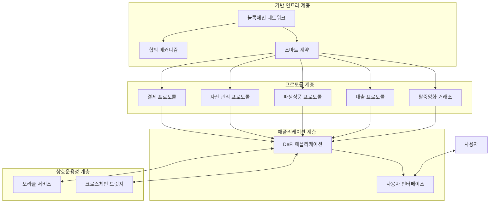

# DeFi (Decentralized Finance): 블록체인 기반 탈중앙화 금융 생태계

<!-- mtoc-start -->

- [정의 및 개념](#정의-및-개념)
- [주요 구성요소](#주요-구성요소)
- [DeFi 프로토콜 구성도](#defi-프로토콜-구성도)
- [DeFi 서비스 유형](#defi-서비스-유형)
  - [탈중앙화 거래소(DEX)](#탈중앙화-거래소dex)
  - [대출 및 차입 서비스](#대출-및-차입-서비스)
  - [스테이블코인](#스테이블코인)
  - [자산 관리 프로토콜](#자산-관리-프로토콜)
- [활용 사례](#활용-사례)
- [기술적 과제 및 위험](#기술적-과제-및-위험)
  - [보안 위험](#보안-위험)
  - [확장성 문제](#확장성-문제)
- [기대 효과 및 필요성](#기대-효과-및-필요성)
- [마무리](#마무리)
- [Keywords](#keywords)

<!-- mtoc-end -->

이더리움과 같은 퍼블릭 블록체인 네트워크를 기반으로 중앙 기관의 개입 없이 P2P 방식으로 제공되는 금융 서비스인 탈중앙화 금융(Decentralized Finance, DeFi)은 기존 금융 시스템의 한계를 뛰어넘는 혁신적 패러다임으로 주목받고 있습니다. 스마트 계약을 통해 대출, 거래, 자산 관리 등 전통적인 금융 서비스를 탈중앙화된 방식으로 구현함으로써 금융 서비스의 접근성과 투명성을 높이고 있습니다.

## 정의 및 개념

- 개념: 중앙화된 금융 기관 없이 블록체인 기술과 스마트 계약을 활용하여 금융 서비스를 제공하는 개방형 금융 생태계.
- 목적: 금융 서비스의 탈중개화를 통한 접근성 향상, 투명성 제고, 비용 절감 및 금융 포용성 확대.

- 특징: 신뢰 기관의 불필요, 오픈소스 기반 개발, 상호 운용성, 무허가성, 투명성
- 필요성: 전통 금융의 중개자 의존성 감소, 국경을 초월한 금융 서비스 제공, 금융 서비스 접근성 확대

## 주요 구성요소

- **스마트 계약(Smart Contracts)**: 자동 실행되는 코드로 금융 로직 구현
- **디앱(DApps)**: 탈중앙화된 애플리케이션으로 사용자 인터페이스 제공
- **프로토콜(Protocols)**: 상호작용 규칙과 표준을 정의하는 기본 계층
- **토큰(Tokens)**: 자산, 거버넌스 권한, 인센티브 등을 표현하는 디지털 단위
- **오라클(Oracles)**: 블록체인 외부 데이터를 안전하게 제공하는 연결 장치

## DeFi 프로토콜 구성도

DeFi 생태계는 기반 인프라, 프로토콜, 애플리케이션, 상호운용성 등 여러 계층으로 구성되어 있습니다. 각 계층은 고유한 기능을 제공하며 상호 연결되어 완전한 금융 서비스 생태계를 형성합니다.

## DeFi 서비스 유형

### 탈중앙화 거래소(DEX)

- **개념**: 중앙화된 중개자 없이 P2P 방식으로 암호화폐를 교환할 수 있는 플랫폼
- **예시**: Uniswap, SushiSwap, PancakeSwap
- **메커니즘**: 자동화된 마켓 메이커(AMM) 또는 오더북 기반 시스템

### 대출 및 차입 서비스

- **개념**: 담보를 제공하고 암호화폐를 대출받거나 자산을 예치하여 이자를 받는 서비스
- **예시**: Compound, Aave, MakerDAO
- **특징**: 무허가 대출, 변동 이자율, 청산 메커니즘

### 스테이블코인

- **개념**: 가격 변동성을 최소화하기 위해 법정통화나 다른 자산에 페그된 암호화폐
- **유형**: 법정통화 담보형(USDC), 암호화폐 담보형(DAI), 알고리즘형(UST)
- **역할**: DeFi 생태계 내 안정적인 가치 저장 및 교환 수단 제공

### 자산 관리 프로토콜

- **개념**: 분산형 포트폴리오 관리, 수익 창출 전략을 자동화하는 서비스
- **예시**: Yearn Finance, Set Protocol
- **특징**: 자동화된 수익 최적화, 위험 분산, 저비용 관리

## 활용 사례

- **국경 간 송금**: 기존 시스템보다 빠르고 저렴한 비용으로 국제 송금 가능
- **금융 포용성 확대**: 은행 계좌 없는 사람들에게도 금융 서비스 접근성 제공
- **유동성 풀 참여**: 자산을 예치하여 거래 수수료 수익 창출 기회 제공
- **합성 자산 생성**: 실물 자산을 토큰화하여 프랙셔널 소유권 및 거래 가능
- **보험 서비스**: P2P 기반 위험 공유 및 보험금 청구 자동화 시스템 구현

## 기술적 과제 및 위험

### 보안 위험

- **스마트 계약 취약점**: 코드 오류나 설계 결함으로 인한 해킹 및 자금 손실 위험
- **플래시론 공격**: 단일 트랜잭션 내에서 대출과 상환을 통한 시장 조작 가능성
- **오라클 실패**: 외부 데이터 소스의 조작이나 오작동으로 인한 시스템 불안정

### 확장성 문제

- **네트워크 혼잡**: 이더리움 등 기반 블록체인의 처리 용량 한계로 인한 높은 수수료
- **L2 솔루션**: 확장성 문제 해결을 위한 사이드체인, 롤업 등 계층2 기술 발전 중
- **크로스체인 상호운용성**: 다양한 블록체인 간 자산 및 데이터 이동의 복잡성

## 기대 효과 및 필요성

- **금융 민주화**: 중앙화된 기관의 통제와 제약 없이 누구나 금융 서비스 이용 가능
- **투명성 강화**: 모든 거래와 금융 활동이 블록체인에 기록되어 감사 및 검증 용이
- **효율성 증대**: 중개자 제거를 통한 수수료 절감 및 처리 시간 단축
- **혁신 촉진**: 개방형 생태계에서 새로운 금융 상품과 서비스의 지속적 개발 활성화
- **규제 기술 발전**: 탈중앙화된 시스템에서의 규제 준수를 위한 새로운 접근법 모색

## 마무리

탈중앙화 금융(DeFi)은 블록체인 기술을 활용하여 전통적인 금융 서비스의 패러다임을 근본적으로 변화시키고 있습니다. 중앙화된 통제 없이 투명하고 효율적인 금융 서비스를 제공함으로써 금융 접근성과 포용성을 확대하는 동시에, 새로운 형태의 금융 혁신을 가능하게 합니다. 다만 보안, A정성, 규제 등의 과제들을 해결해 나가며 성숙한 생태계로 발전해야 할 것입니다. 블록체인과 금융의 결합이 가져올 미래를 준비하고 이해하는 것은 모든 금융 및 IT 전문가에게 중요한 과제입니다.

## Keywords

Decentralized Finance, Smart Contracts, 탈중앙화 금융, 스마트 계약, Liquidity Pool, 유동성 풀, Yield Farming, 수익 농사, AMM(Automated Market Maker), 오라클(Oracle), 거버넌스 토큰, 담보화 대출, 합성 자산
