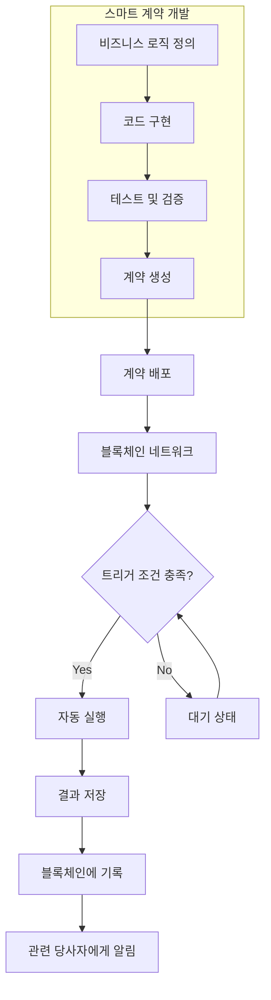

# 스마트 계약 (Smart Contract): 블록체인 기반 자동화 계약 혁신

<!-- mtoc-start -->

- [정의 및 개념](#정의-및-개념)
- [주요 특징](#주요-특징)
- [작동 메커니즘](#작동-메커니즘)
- [개발 프레임워크 및 언어](#개발-프레임워크-및-언어)
- [활용 사례](#활용-사례)
- [기술적 과제와 한계](#기술적-과제와-한계)
- [기대 효과 및 필요성](#기대-효과-및-필요성)
- [마무리](#마무리)
- [Keywords](#keywords)

<!-- mtoc-end -->

블록체인 기술의 발전과 함께 주목받고 있는 스마트 계약(Smart Contract)은 전통적인 계약의 패러다임을 바꾸고 있습니다. 이는 단순한 디지털 계약을 넘어 사전에 정의된 조건이 충족되면 자동으로 실행되는 자체 집행 메커니즘을 가진 혁신적인 기술입니다. 블록체인에 저장되어 분산 네트워크에서 작동하는 스마트 계약은 중개자 없이도 신뢰할 수 있는 거래 환경을 구축하며, 비즈니스 프로세스의 효율성과 투명성을 크게 향상시키고 있습니다.

## 정의 및 개념

- 개념: 블록체인에 저장된 자체 실행되는 코드 형태의 계약으로, 사전에 정해진 조건이 충족되면 자동으로 거래나 절차가 수행되는 프로그램.
- 특성: 탈중앙화된 환경에서 동작하여 중개자 필요성 제거, 불변성 보장, 투명한 거래 이력 제공, 신뢰할 수 있는 자동화된 계약 실행 환경 구축.

## 주요 특징

- **자동 실행성**: 사전에 정의된 조건이 충족되면 외부 개입 없이 자동으로 계약 내용이 실행되어 효율성 향상과 인적 오류 감소.
- **불변성과 투명성**: 블록체인에 기록된 스마트 계약은 변경이 불가능하며, 모든 거래 내역이 공개되어 투명한 비즈니스 환경 조성.
- **탈중앙화**: 중앙 기관의 개입 없이 P2P 네트워크에서 작동하여 중개 비용 절감 및 거래 지연 최소화.
- **보안성**: 암호화 기술과 분산 저장 방식을 통해 단일 실패점 제거 및 해킹 위험 감소.
- **비용 효율성**: 중개자 제거와 프로세스 자동화를 통한 거래 비용 절감 및 업무 효율성 향상.

## 작동 메커니즘

스마트 계약은 사전에 정의된 조건과 로직을 코드로 구현하여 블록체인 네트워크에 배포됩니다. 이후 트리거 조건이 충족되면 자동으로 실행되어 결과를 블록체인에 기록하고, 관련 당사자에게 알림이 전송됩니다.

## 개발 프레임워크 및 언어

- **Solidity**: 이더리움 블록체인을 위한 가장 널리 사용되는 객체지향 프로그래밍 언어로, 스마트 계약 개발에 최적화된 문법과 기능 제공.
- **Vyper**: 보안성과 가독성에 중점을 둔 파이썬 기반 계약 언어로, 의도적으로 단순화된 문법 제공.
- **Chaincode**: 하이퍼레저 패브릭에서 사용되는 스마트 계약 언어로, Go, JavaScript, Java 등 다양한 프로그래밍 언어 지원.
- **Rust**: 폴카닷, 솔라나 등의 블록체인에서 사용되는 고성능 스마트 계약 언어로, 메모리 안전성과 병렬 처리 효율성 제공.
- **개발 도구**: Truffle, Hardhat, Remix IDE 등 테스트, 배포, 디버깅을 위한 통합 개발 환경 제공.

## 활용 사례

- **금융 서비스**: 자동화된 대출 실행, 보험금 지급, 에스크로 서비스, 자산 토큰화 등 금융 프로세스의 효율화 및 신뢰성 향상.
- **공급망 관리**: 제품 원산지 추적, 품질 보증, 자동 결제 시스템 구축을 통한 투명한 공급망 구축 및 운영 효율성 증대.
- **부동산 거래**: 토지대장 관리, 자동화된 임대 계약, 소유권 이전 등 복잡한 부동산 거래 프로세스 간소화 및 투명성 확보.
- **디지털 신원 관리**: 개인 정보 자기 주권 실현, 안전한 신원 인증, 접근 권한 관리를 통한 프라이버시 보호 및 보안 강화.
- **투표 시스템**: 투명하고 조작이 불가능한 전자 투표 시스템 구축을 통한 민주적 의사결정 프로세스 신뢰성 향상.
- **지적재산권 관리**: 디지털 콘텐츠의 소유권 등록, 사용권 관리, 로열티 자동 지급 등 창작자 권리 보호 및 수익 보장.

## 기술적 과제와 한계

- **확장성 문제**: 블록체인 네트워크의 처리 속도와 용량 한계로 인한 대규모 트랜잭션 처리 어려움.
- **오라클 의존성**: 외부 데이터를 블록체인으로 가져오는 오라클 시스템의 신뢰성과 분산화 수준에 대한 의존성 존재.
- **코드 불변성의 양면성**: 한번 배포된 코드의 수정이 어려워 버그나 취약점 발견 시 대응 방안 마련 필요.
- **법적 규제 불확실성**: 스마트 계약의 법적 지위와 관련 규제 프레임워크 미비로 인한 도입 장벽 존재.
- **개발자 실수 위험성**: 코드 작성 오류가 심각한 보안 취약점이나 자산 손실로 이어질 수 있는 고위험 환경.

## 기대 효과 및 필요성

- **거래 효율성 향상**: 중개자 제거와 프로세스 자동화를 통한 거래 시간 단축 및 비용 절감 실현.
- **투명성과 신뢰성 증대**: 모든 거래 기록의 불변성과 공개성을 통한 비즈니스 투명성 확보 및 신뢰 구축.
- **글로벌 접근성 확대**: 국경과 제도적 장벽을 넘어 전 세계 누구나 접근 가능한 계약 플랫폼 제공.
- **보안성 강화**: 분산화된 네트워크와 암호화 기술을 통한 데이터 무결성 보장 및 조작 방지.
- **프로세스 혁신 촉진**: 기존 비즈니스 모델과 운영 방식의 근본적인 변화를 통한 혁신 생태계 조성.

## 마무리

스마트 계약은 블록체인 기술을 기반으로 기존 계약 체계의 한계를 극복하고, 더욱 효율적이고 투명한 비즈니스 환경을 구축할 수 있는 혁신적인 도구입니다. 기술적 과제가 존재하지만, 지속적인 연구 개발과 산업 적용 사례 확대를 통해 그 가치와 잠재력이 점차 현실화되고 있습니다. 기업과 조직은 스마트 계약의 도입을 통한 프로세스 혁신과 비즈니스 모델 재정의를 고려함으로써 디지털 전환 시대의 경쟁력을 확보할 수 있을 것입니다.

## Keywords

Smart Contract, 스마트 계약, Blockchain Technology, 블록체인 기술, Self-executing Contract, 자동실행 계약, Distributed Ledger, 분산원장, Decentralized Applications (DApps), 탈중앙화 애플리케이션, Consensus Mechanism, 합의 메커니즘, Immutability, 불변성, Digital Trust, 디지털 신뢰, Oracle Problem, 오라클 문제
