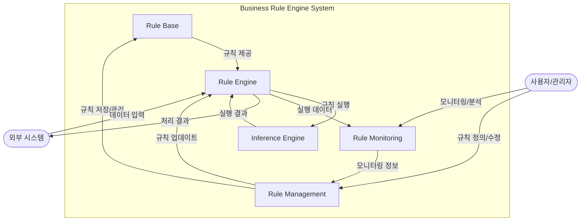

# BRE(Business Rule Engine): 기업의 업무 규칙을 효율적으로 관리하는 핵심 도구

## BRE 정의

비즈니스 규칙 엔진(Business Rule Engine)은 기업의 업무규칙이나 절차 등을 효과적으로 개발, 관리함으로써 변화 대응력을 제고하기 위한 지원 도구

- 특징: 업무 규칙의 가시성 확보(비즈니스 로직과 데이터 처리 로직의 분리), 리스크 관리 강화(중앙집중적 규칙 관리와 실행), 실시간 대응력 향상(신속한 환경 변화 대응)

## BRE의 주요 구성요소

### 1. Rule Base

- 모든 비즈니스 규칙들이 저장되고 관리되는 저장소
- 기업의 각종 정책, 규정, 의사결정 기준 등이 체계적으로 보관됩니다.

### 2. Rule Management

- 비즈니스 규칙을 생성, 수정, 삭제 등의 관리 기능 제공
- 관리자는 이를 통해 규칙을 효율적으로 유지보수

### 3. Rule Monitoring

- 규칙의 실행과 적용 현황을 모니터링하고 분석하는 기능
- 규칙의 효과성을 평가하고 개선점 도출

### 4. Rule Engine

- 정의된 규칙들을 실제로 실행하고 처리하는 엔진
- 비즈니스 로직을 규칙에 따라 수행하는 핵심 구성요소

### 5. Inference Engine

- 추론 알고리즘을 통해 복잡한 규칙들 간의 관계를 분석하고 최적의 의사결정을 도출하는 엔진

## BRE 구조도

## BRE의 장점

BRE를 도입함으로써 기업은 다음과 같은 이점을 얻을 수 있습니다:

1. 업무 규칙의 일관성 확보
2. 신속한 규칙 변경 및 적용
3. 의사결정 프로세스의 투명성 향상
4. 운영 효율성 증대
5. 비즈니스 민첩성 향상

## 마무리

디지털 전환이 가속화되는 현대 기업 환경에서 BRE의 도입은 선택이 아닌 필수가 되어가고 있습니다. 특히 복잡한 비즈니스 규칙을 효율적으로 관리하고 빠르게 변화하는 시장 환경에 민첩하게 대응하기 위해서는 BRE의 활용이 더욱 중요해질 것으로 전망됩니다.

## Keywords

Business Rule Engine, Rule Management, Decision Engine, Business Logic, Enterprise Architecture, 업무규칙 엔진, 의사결정 관리, 규칙 기반 시스템, 비즈니스 로직, 추론 엔진