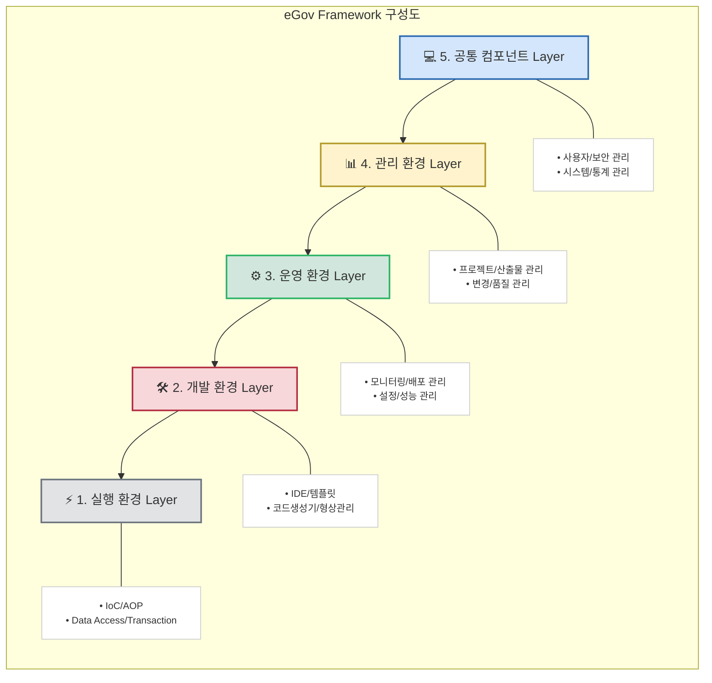

# eGov Framework(전자정부프레임워크): 전자정부 서비스의 표준 개발 플랫폼

<!-- mtoc-start -->

- [eGov Framework 정의](#egov-framework-정의)
- [eGov Framework 구성요소 (실개운관공)](#egov-framework-구성요소-실개운관공)
  - [1. 실행 환경](#1-실행-환경)
  - [2. 개발 환경](#2-개발-환경)
  - [3. 운영 환경](#3-운영-환경)
  - [4. 관리 환경](#4-관리-환경)
  - [5. 공통 컴포넌트](#5-공통-컴포넌트)
- [eGov Framework 구성도](#egov-framework-구성도)
- [주요 특징과 장점](#주요-특징과-장점)
  - [1. 표준화된 개발 환경](#1-표준화된-개발-환경)
  - [2. 검증된 오픈소스 기반](#2-검증된-오픈소스-기반)
  - [3. 강력한 보안성](#3-강력한-보안성)
- [도입 효과](#도입-효과)
  - [1. 효율성 측면](#1-효율성-측면)
  - [2. 품질 측면](#2-품질-측면)
- [마무리](#마무리)
- [Keywords](#keywords)

<!-- mtoc-end -->

정부의 디지털 전환이 가속화되면서, 전자정부 서비스의 중요성이 날로 커지고 있습니다. 이러한 흐름 속에서 안정적이고 효율적인 전자정부 서비스 개발을 위한 표준 플랫폼의 필요성이 대두되었고, 그 해답으로 제시된 것이 바로 전자정부프레임워크입니다. 오늘은 전자정부 서비스 개발의 핵심 기반이 되는 전자정부프레임워크에 대해 알아보겠습니다.

## eGov Framework 정의

전자정부 서비스의 품질 향상과 정보화 투자 효율성 향상을 위해 소프트웨어의 구성 기반과 기본 기능을 제공하는 개발 프레임워크

- 특징: 표준화된 개발 환경(재사용성 향상), 품질 향상(검증된 아키텍처), 효율적 예산 관리(중복 투자 방지)

## eGov Framework 구성요소 (실개운관공)

### 1. 실행 환경

- 표준 프레임워크 실행 환경 제공
- 공통 컴포넌트 실행 환경 구성
- IoC Container 지원
- AOP 지원 기능
- Data Access 처리 기능
- Transaction 처리 기능

### 2. 개발 환경

- IDE 도구 제공
- 템플릿 프로젝트 제공
- 코드 생성기 제공
- 디버깅 환경 제공
- 테스트 도구 지원
- 형상관리 도구 연동

### 3. 운영 환경

- 모니터링 도구 제공
- 배포 관리 기능
- 설정 관리 기능
- 운영 모니터링 기능
- 성능 현황 분석 기능
- 장애 진단 기능

### 4. 관리 환경

- 프로젝트 관리 기능
- 개발 산출물 관리
- 커뮤니티 관리 기능
- 변경 관리 기능
- 배포 관리 기능
- 품질 관리 기능

### 5. 공통 컴포넌트

- 사용자 관리 컴포넌트
- 보안 관리 컴포넌트
- 시스템 관리 컴포넌트
- 통계 관리 컴포넌트
- 게시판 관리 컴포넌트
- 공통 기능 컴포넌트

## eGov Framework 구성도

- 전자정부프레임워크는 실행 환경을 기반으로 하여 개발, 운영, 관리 환경이 순차적으로 구성
- 최상위에 공통 컴포넌트가 위치하는 계층화된 구조
- 각 레이어는 독립적이면서도 유기적으로 연계되어 있어 효율적인 전자정부 서비스 개발 지원

## 주요 특징과 장점

### 1. 표준화된 개발 환경

- 개발 표준 및 공통 기반 제공
- 일관된 개발 방법 준수
- 개발 생산성 향상

### 2. 검증된 오픈소스 기반

- Spring Framework 기반
- 검증된 오픈소스 활용
- 기술 종속성 해소

### 3. 강력한 보안성

- 표준 보안 취약점 대응
- 시큐어 코딩 가이드 제공
- 보안 공통컴포넌트 제공

## 도입 효과

### 1. 효율성 측면

- 개발 기간 단축
- 유지보수 비용 절감
- 중복 개발 방지

### 2. 품질 측면

- 표준화된 아키텍처 적용
- 검증된 기능 재사용
- 안정적인 운영 기반

## 마무리

전자정부프레임워크는 공공 정보화 사업의 표준 개발 플랫폼으로서, 품질과 효율성을 동시에 향상시키는 핵심 도구입니다. 특히 급변하는 IT 환경 속에서 안정적이고 효율적인 전자정부 서비스 개발을 위한 필수 요소로 자리잡고 있으며, 그 중요성은 더욱 커질 것으로 예상됩니다.

## Keywords

eGov Framework, Java Framework, Public Sector Development, Standard Platform, Spring Framework, 전자정부프레임워크, 자바프레임워크, 공공개발플랫폼, 표준개발환경, 스프링프레임워크