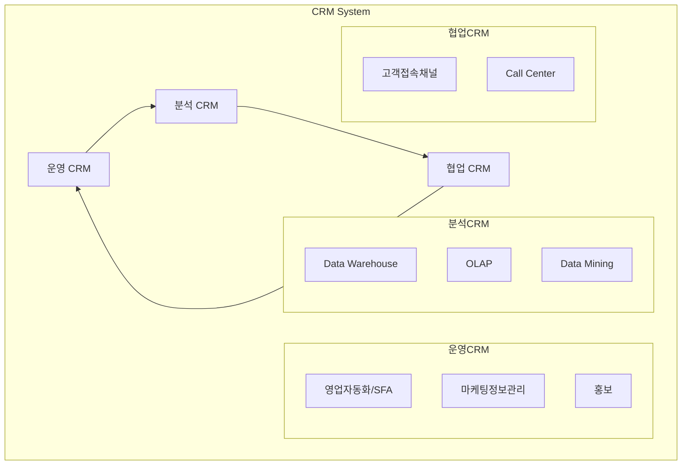

# CRM과 CEM: 고객 중심 경영을 위한 핵심 전략 이해

<!-- mtoc-start -->

- [정의](#정의)
- [CRM의 주요 구성요소(운분협)](#crm의-주요-구성요소운분협)
  - [1. 운영 CRM](#1-운영-crm)
  - [2. 분석 CRM](#2-분석-crm)
  - [3. 협업 CRM](#3-협업-crm)
- [CRM의 구조도](#crm의-구조도)
- [CRM의 매체 확장](#crm의-매체-확장)
- [CRM의 기대효과](#crm의-기대효과)
- [CRM 2.0의 특징](#crm-20의-특징)
- [현장 자동화 시스템](#현장-자동화-시스템)
  - [FFA(Field Force Automation)](#ffafield-force-automation)
  - [SFA(Sales Force Automation)](#sfasales-force-automation)
- [마무리](#마무리)
- [Keywords](#keywords)

<!-- mtoc-end -->

디지털 시대의 비즈니스 환경에서 고객과의 관계 관리는 기업의 성패를 좌우하는 핵심 요소가 되었습니다. 특히 고객 데이터의 중요성이 날로 증가하면서, 이를 체계적으로 관리하고 활용하는 CRM과 CEM은 현대 기업의 필수 전략으로 자리잡았습니다. 이번 포스트에서는 CRM과 CEM의 개념부터 구성요소, 최신 트렌드까지 자세히 알아보겠습니다.

## 정의

Customer Relationship Management(CRM)와 Customer Experience Management(CEM)는 고객 생애 가치(LTV, Life Time Value)를 극대화하기 위한 마케팅 관리 기법입니다. 이는 고객에 대한 정확한 이해를 바탕으로 고객층별 개인화된 제품과 서비스를 지속적으로 제공하여 고객 충성도를 향상시키는 것을 목표로 합니다.

- 특징: 전사적 고객 데이터 통합 관리, 고객 중심의 업무 프로세스 재정립, 다채널 통합 고객 서비스 제공
- 목적: 고객 생애 가치 극대화, 개인화된 서비스 제공, 고객 충성도 향상
- 필요성: Mass Marketing에서 Target 변화, 고객기대수준 향상, 지식화, 파레토법칙

## CRM의 주요 구성요소(운분협)

CRM은 크게 다음의 세 가지 요소(운분협)로 구성됩니다:

### 1. 운영 CRM

- 고객관리 지원 시스템
  - SFA(Sales Force Automation, 영업 자동화)
  - 마케팅 정보 관리
  - 홍보 활동 관리

### 2. 분석 CRM

- Data Warehouse(DW)
- OLAP(Online Analytical Processing)
- Data Mining 기술 활용

### 3. 협업 CRM

- 다양한 고객 접속 채널 관리
- 콜센터 운영 및 관리

## CRM의 구조도

## CRM의 매체 확장

CRM은 기술의 발전과 함께 다음과 같이 진화하고 있습니다:

1. 전통적 CRM: 기본적인 고객 관계 관리
2. e-CRM: 전자상거래 환경에서의 CRM
3. g-CRM: 정부/공공기관의 CRM
4. m-CRM: 모바일 환경에서의 CRM

## CRM의 기대효과

CRM 도입을 통해 기업은 다음과 같은 효과를 기대할 수 있습니다:

1. 일관된 고객 지원 체계 구축
2. 고객 분류별 차별화된 서비스 제공

## CRM 2.0의 특징

현대의 CRM은 2.0 시대로 진화하며 다음과 같은 특징을 보입니다:

1. Prosumer 개념의 도입
2. 양방향 커뮤니케이션 강화
3. 참여, 공유, 개방의 가치 실현
4. 고객 중심의 Value Chain 구축

## 현장 자동화 시스템

### FFA(Field Force Automation)

현장 자동화 시스템은 기업의 현장 업무를 효율적으로 관리하고 자동화하는 시스템입니다. 실시간 데이터 수집과 분석을 통해 현장 업무의 생산성을 향상시킵니다.

### SFA(Sales Force Automation)

영업 자동화 시스템은 영업 프로세스를 체계화하고 자동화하여 영업 활동의 효율성을 높이는 시스템입니다. 이를 통해 영업 사원들의 생산성 향상과 고객 서비스 품질 개선을 도모할 수 있습니다.

## 마무리

디지털 전환이 가속화되는 현대 비즈니스 환경에서 CRM과 CEM의 중요성은 더욱 커지고 있습니다. 특히 고객 경험이 핵심 경쟁력으로 부상하면서, 체계적인 CRM 전략의 수립과 실행은 기업의 지속가능한 성장을 위한 필수 요소가 되었습니다. 앞으로도 기술의 발전과 함께 CRM은 계속 진화할 것이며, 이에 대한 기업들의 전략적 대응이 더욱 중요해질 것으로 전망됩니다.

## Keywords

CRM, CEM, Customer Relationship Management, Customer Experience Management, 고객관계관리, SFA, FFA, Data Mining, OLAP, Value Chain, Prosumer, 고객경험관리, 운영CRM, 분석CRM, 협업CRM, 영업자동화, 현장자동화, 데이터웨어하우스