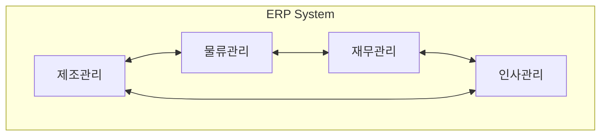
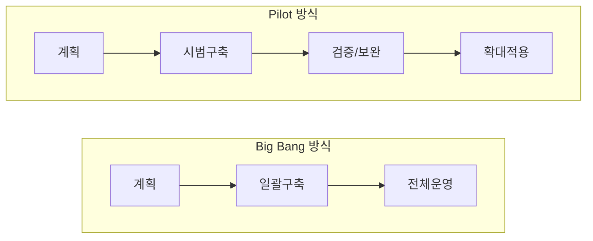

# ERP(Enterprise Resource Planning): 기업의 핵심 자원 통합 관리 시스템

<!-- mtoc-start -->

- [정의](#정의)
- [ERP의 구조도](#erp의-구조도)
- [ERP 구축 방법](#erp-구축-방법)
  - [1. Big Bang 방식](#1-big-bang-방식)
  - [2. Pilot 방식](#2-pilot-방식)
- [ERP의 발전 유형](#erp의-발전-유형)
  - [1. XRP(eXtended Resource Planning)](#1-xrpextended-resource-planning)
  - [2. ERP II](#2-erp-ii)
- [마무리](#마무리)
- [Keywords](#keywords)

<!-- mtoc-end -->

현대 기업의 경쟁력은 효율적인 자원 관리에서 시작됩니다. 기업의 모든 자원을 통합적으로 관리하고 활용하는 ERP 시스템은 디지털 시대의 필수 경영 도구로 자리잡았습니다. 이번 포스트에서는 ERP의 개념부터 구축 방법, 최신 트렌드까지 상세히 알아보겠습니다.

## 정의

기업의 제조, 물류, 판매, 재무 등 각종 자원 정보를 하나의 체계로 통합하여 효율성과 경쟁력 극대화를 위한 전사적 자원관리 시스템.

- 특징: 비즈니스 프로세스 모델, 파라미터에 의한 개발, 통합성, 유연성, 개방성, 국제성
- 통합성: 그룹웨어 연동, 오픈/멀티벤더 지원(업계표준, 국제표준채택)

## ERP의 구조도

## ERP 구축 방법

### 1. Big Bang 방식

- 전체 시스템을 한 번에 구축
- 장점: 빠른 구축, 통합 효과 극대화
- 단점: 높은 리스크, 초기 혼란 가능성

### 2. Pilot 방식

- 기능별 적용: 핵심 기능부터 단계적 구축
- 사업장별 적용: 특정 사업장에서 시범 운영 후 확대

## ERP의 발전 유형

### 1. XRP(eXtended Resource Planning)

- ERP + CRM + SCM의 통합
- 기업 내부 자원 관리를 넘어 고객 관리와 공급망 관리까지 확장
- 통합적인 비즈니스 프로세스 관리 가능

### 2. ERP II

- 고객, 협력사, 외부 프로세스를 통합하는 웹 환경 제공
- 클라우드 기반의 확장된 기업 자원 관리
- 실시간 협업과 의사결정 지원

## 마무리

ERP 시스템은 기업의 디지털 전환에서 핵심적인 역할을 수행합니다. 특히 XRP와 ERP II로의 진화는 기업이 내부 자원 관리를 넘어 외부 이해관계자들과의 효과적인 협업을 가능하게 합니다. 앞으로도 클라우드, AI 등 새로운 기술과의 융합을 통해 ERP는 계속 발전할 것으로 전망됩니다.

## Keywords

ERP, Enterprise Resource Planning, 전사적자원관리, XRP, ERP II, Big Bang, Pilot, 통합업무시스템, 그룹웨어, 멀티벤더, 비즈니스 프로세스