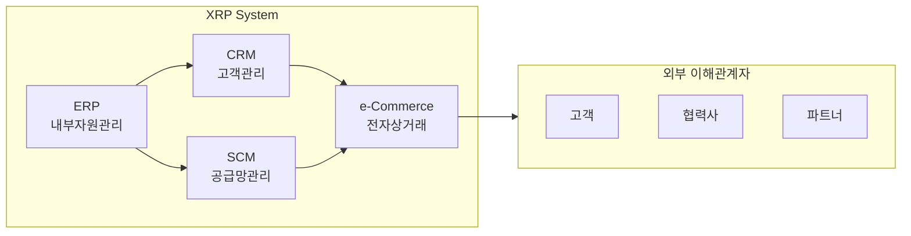

# XRP(eXtended Resource Management): 확장된 전사적 자원 관리 시스템

<!-- mtoc-start -->

- [정의](#정의)
- [XRP의 주요 구성요소](#xrp의-주요-구성요소)
  - [1. 내부 자원 관리(ERP)](#1-내부-자원-관리erp)
  - [2. 고객 관계 관리(CRM)](#2-고객-관계-관리crm)
  - [3. 공급망 관리(SCM)](#3-공급망-관리scm)
- [XRP의 구조도](#xrp의-구조도)
- [마무리](#마무리)
- [Keywords](#keywords)

<!-- mtoc-end -->

디지털 혁신이 가속화되면서 기업의 자원 관리는 내부를 넘어 외부로 확장되고 있습니다. XRP는 이러한 변화에 대응하여 ERP의 영역을 확장한 새로운 형태의 전사적 자원 관리 시스템입니다. XRP의 개념과 특징에 대해 알아보겠습니다.

## 정의

ERP의 적용 범위를 영업과 마케팅, 협력사와 고객 관리 등 실질적인 업무 활동으로 확대한 전사적 자원 관리 시스템.

- 특징: 외부 확장성, 통합 업무 관리, 실시간 협업 지원
- 목적: 기업 내외부의 효율적 자원 관리, 협력사 및 고객과의 연계 강화, 비즈니스 프로세스 최적화

## XRP의 주요 구성요소

### 1. 내부 자원 관리(ERP)

- 기존 ERP의 기본 기능 포함
- 제조, 물류, 재무, 인사 등 관리

### 2. 고객 관계 관리(CRM)

- 고객 데이터 통합 관리
- 마케팅 및 영업 활동 지원
- 고객 서비스 개선

### 3. 공급망 관리(SCM)

- 협력사와의 실시간 정보 공유
- 효율적인 재고 관리
- 공급망 최적화

## XRP의 구조도

## 마무리

XRP는 기업의 자원 관리를 내부에서 외부로 확장함으로써 더욱 효율적이고 통합된 비즈니스 운영을 가능하게 합니다. 앞으로 디지털 전환이 더욱 가속화되면서 XRP의 중요성은 더욱 커질 것으로 전망됩니다.

## Keywords

XRP, Extended Resource Planning, ERP, CRM, SCM, 전사적자원관리, 공급망관리, 고객관계관리, 기업자원관리, 통합업무관리