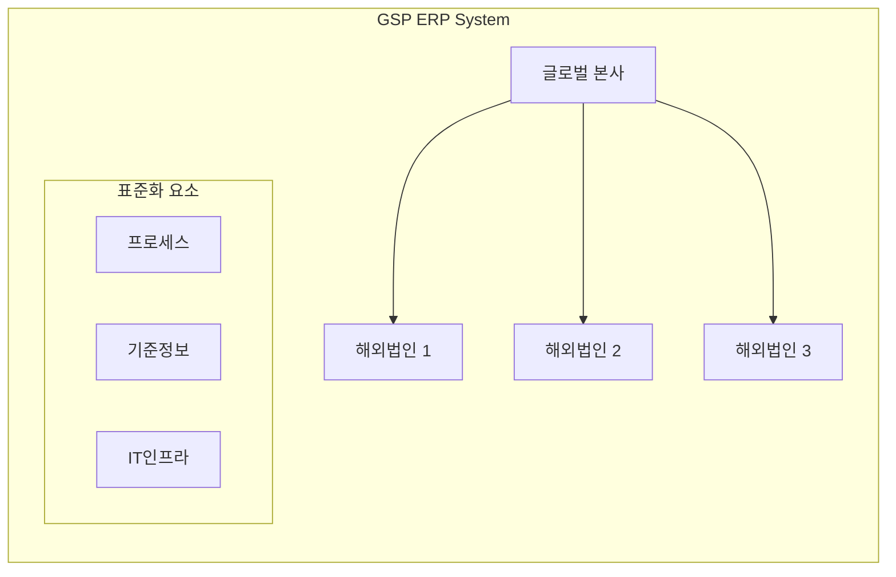

# GSP ERP(Global Single Instance): 글로벌 단일 인스턴스 기업자원관리 시스템

<!-- mtoc-start -->

- [정의](#정의)
- [GSP ERP의 구조도](#gsp-erp의-구조도)
- [GSP ERP 구축 필요요소](#gsp-erp-구축-필요요소)
  - [1. 기준정보와 프로세스 표준화](#1-기준정보와-프로세스-표준화)
  - [2. 글로벌 조직구조 반영](#2-글로벌-조직구조-반영)
- [GSP ERP의 장점](#gsp-erp의-장점)
  - [1. 통합 관리 효율성](#1-통합-관리-효율성)
  - [2. 글로벌 거버넌스](#2-글로벌-거버넌스)
- [마무리](#마무리)
- [Keywords](#keywords)

<!-- mtoc-end -->

급속히 글로벌화되는 기업 환경에서 해외 법인들의 효율적인 시스템 통합 관리는 매우 중요한 과제가 되었습니다. GSP ERP는 'One Source One Use'의 원칙 하에 글로벌 기업의 시스템을 통합하는 혁신적인 접근 방식입니다. GSP ERP의 개념과 특징에 대해 자세히 알아보겠습니다.

## 정의

해외 법인별 별도 구축했던 ERP 시스템을 하나의 시스템으로 통합하여 단일화된 체계를 구축하는 글로벌 통합 자원관리 시스템.

- 특징: Roll-in 방식 적용, OSOU(One Source One Use), SPoF(Single Point of Failure)
- 구축 필요요소: 기준정보와 프로세스 표준화, 다양한 글로벌 조직구조 반영
- 기대효과: 동기화된 전략 보유, 유연한 글로벌 거버넌스 체계 구현

## GSP ERP의 구조도

## GSP ERP 구축 필요요소

### 1. 기준정보와 프로세스 표준화

- 기준정보 표준화: 전사적 데이터 일관성 확보
- 프로세스 표준화: 업무 절차의 글로벌 통일
- IT 인프라의 표준화: 시스템 아키텍처 통합

### 2. 글로벌 조직구조 반영

- 글로벌 표준의 지속적 확대
- 도입 효과 창출을 위한 조직적 지원
- 전사적 변화관리 및 교육

## GSP ERP의 장점

### 1. 통합 관리 효율성

- 중앙 집중식 시스템 관리
- 유지보수 비용 절감
- 데이터 일관성 확보

### 2. 글로벌 거버넌스

- 표준화된 업무 프로세스
- 실시간 정보 공유
- 신속한 의사결정 지원

## 마무리

GSP ERP는 글로벌 기업의 시스템 통합을 통해 효율성과 일관성을 제고하는 핵심 도구입니다. 특히 다국적 기업의 증가와 글로벌 비즈니스 환경의 복잡성이 높아지면서 그 중요성은 더욱 커질 것으로 전망됩니다.

## Keywords

GSP ERP, Global Single Instance, OSOU, One Source One Use, SPoF, Single Point of Failure, 글로벌 단일 인스턴스, 기업자원관리, 프로세스 표준화, 글로벌 거버넌스