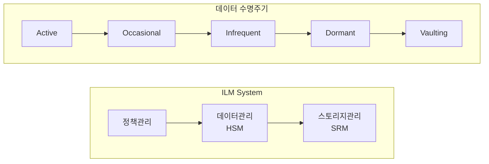

# ILM(Information Lifecycle Management): 정보 수명주기 통합 관리 시스템

<!-- mtoc-start -->

- [정의](#정의)
- [ILM의 구성요소](#ilm의-구성요소)
  - [1. 정책관리](#1-정책관리)
  - [2. 데이터관리(HSM)](#2-데이터관리hsm)
  - [3. 스토리지관리(SRM)](#3-스토리지관리srm)
- [ILM의 구조도](#ilm의-구조도)
- [ILM 구축 절차(데정인아)](#ilm-구축-절차데정인아)
  - [1. 데이터 분류](#1-데이터-분류)
  - [2. 정책 정의](#2-정책-정의)
  - [3. 인프라 고도화](#3-인프라-고도화)
  - [4. ILM 실현](#4-ilm-실현)
- [데이터 분류 체계](#데이터-분류-체계)
  - [1. 접근성 기준](#1-접근성-기준)
  - [2. 데이터 수명주기](#2-데이터-수명주기)
- [ILM 주요기술](#ilm-주요기술)
  - [1. 가상화 기술](#1-가상화-기술)
  - [2. 데이터 보호 기술](#2-데이터-보호-기술)
  - [3. 저장장치 기술](#3-저장장치-기술)
  - [4. 아카이브 매니저](#4-아카이브-매니저)
- [마무리](#마무리)
- [Keywords](#keywords)

<!-- mtoc-end -->

데이터의 폭발적 증가와 함께 효율적인 정보 관리의 중요성이 날로 커지고 있습니다. ILM은 정보의 전체 생애주기를 체계적으로 관리하여 비용 효율성을 극대화하는 방법론입니다. ILM의 개념부터 구현 방안까지 자세히 알아보겠습니다.

## 정의

정보의 생성에서부터 저장, 활용, 소멸까지의 단계를 가장 효율적이고 경제적인 방법으로 관리하기 위한 종합적인 체계.

- 특징: 정보 수명주기 관리, 데이터 비용 절감, 체계적 데이터 관리
- 필요성: 데이터스모그, 성능저하, 비용절감
- 구축절차(데정인아): 데이터분류 → 정책정의 → 인프라고도화 → ILM실현

## ILM의 구성요소

### 1. 정책관리

- 데이터 분류 기준 수립
- 저장 정책 정의
- 접근 권한 관리

### 2. 데이터관리(HSM)

- 계층적 저장 관리
- 데이터 이동 자동화
- 성능 최적화

### 3. 스토리지관리(SRM)

- 저장 공간 모니터링
- 용량 계획 수립
- 리소스 할당 관리

## ILM의 구조도

## ILM 구축 절차(데정인아)

### 1. 데이터 분류

- 데이터의 중요도와 활용도 평가
- 보관 기간 및 접근 빈도 분석
- 데이터 특성별 카테고리화

### 2. 정책 정의

- 데이터 관리 정책 수립
- 보안 및 접근 정책 설정
- 백업 및 복구 정책 수립

### 3. 인프라 고도화

- 스토리지 인프라 최적화
- 관리 도구 구현
- 모니터링 체계 구축

### 4. ILM 실현

- 정책 기반 자동화 구현
- 지속적인 모니터링 및 개선
- 성과 측정 및 피드백

## 데이터 분류 체계

### 1. 접근성 기준

- Online: 즉시 접근 가능
- Nearline: 단기 보관
- Offline: 장기 보관

### 2. 데이터 수명주기

1. Active: 활발한 사용 단계
2. Occasional: 가끔 사용되는 단계
3. Infrequent: 드물게 사용되는 단계
4. Dormant: 휴면 상태
5. Vaulting: 최종 보관 단계

## ILM 주요기술

### 1. 가상화 기술

- 스토리지 가상화: 물리적 저장장치를 논리적 단일 자원으로 통합
- 데이터 가상화: 다양한 소스의 데이터를 단일 뷰로 통합
- 서버 가상화: 자원의 효율적 활용을 위한 서버 통합 관리

### 2. 데이터 보호 기술

- 백업 및 복구: 데이터 손실 방지와 신속한 복구 지원
- 암호화: 중요 데이터의 보안성 확보
- 접근 제어: 권한 기반의 데이터 접근 관리
- 복제: 데이터 이중화를 통한 가용성 확보

### 3. 저장장치 기술

- 계층형 스토리지: 데이터 중요도에 따른 저장매체 차별화
- 중복제거: 동일 데이터 제거를 통한 저장공간 최적화
- 압축: 데이터 용량 최소화를 통한 저장 효율성 증대
- 씬 프로비저닝: 스토리지 공간의 유연한 할당

### 4. 아카이브 매니저

- 장기 보관: 법적 요구사항에 따른 데이터 보관
- 인덱싱: 효율적인 데이터 검색 지원
- 라이프사이클 관리: 데이터의 수명주기별 정책 적용
- WORM(Write Once Read Many): 데이터 무결성 보장

## 마무리

ILM은 폭증하는 데이터 관리 비용을 절감하고 효율성을 높이는 핵심 전략입니다. 특히 빅데이터 시대를 맞아 체계적인 정보 수명주기 관리의 중요성은 더욱 커질 것으로 전망됩니다.

## Keywords

ILM, Information Lifecycle Management, HSM, SRM, 정보수명주기관리, 데이터관리, 스토리지관리, 아카이브, 데이터분류, 가상화기술