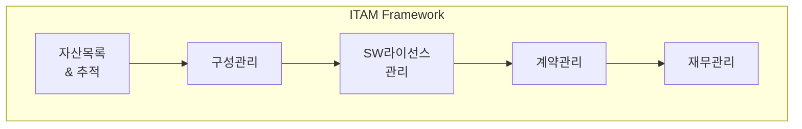

# ITAM(IT Asset Management): IT 자산 수명주기 관리 프레임워크

<!-- mtoc-start -->

- [정의](#정의)
- [ITAM의 개념도](#itam의-개념도)
- [ITAM 프로세스(ACSCF)](#itam-프로세스acscf)
  - [1. Asset Inventory & Tracking](#1-asset-inventory--tracking)
  - [2. Configuration Management](#2-configuration-management)
  - [3. SW License Management](#3-sw-license-management)
  - [4. Contract Management](#4-contract-management)
  - [5. Financial Management](#5-financial-management)
- [ITAM 주요기능(자비리생)](#itam-주요기능자비리생)
  - [1. 자산관리](#1-자산관리)
  - [2. 비용관리](#2-비용관리)
  - [3. 리스크관리](#3-리스크관리)
  - [4. 생명주기관리](#4-생명주기관리)
- [마무리](#마무리)
- [Keywords](#keywords)

<!-- mtoc-end -->

현대 기업에서 IT 자산의 효율적인 관리는 비즈니스 성과와 직결됩니다. ITAM은 IT 자산의 전체 수명주기를 체계적으로 관리하여 투자 효율성을 극대화하는 관리 체계입니다. 이번 포스트에서는 ITAM의 개념부터 주요 프로세스까지 자세히 알아보겠습니다.

## 정의

IT 자산의 구매, 사용, 유지관리, 폐기를 사전 대응적이고 전략적으로 관리하는 프레임워크.

- 특징: IT자산 가시화, ROI극대화, TCO절감, 외부규제대응
- 프로세스(ACSCF): Asset Inventory & Tracking → Configuration Mgmt → SW License Mgmt → Contract Mgmt → Financial Mgmt
- 주요기능(자비리생): 자산관리, 비용관리, 리스크관리, 생명주기관리

## ITAM의 개념도

## ITAM 프로세스(ACSCF)

### 1. Asset Inventory & Tracking

- IT 자산 목록 관리
- 자산 위치 추적
- 실시간 현황 모니터링

### 2. Configuration Management

- 구성 요소 관리
- 변경 이력 관리
- 구성 정보 통합 관리

### 3. SW License Management

- 라이선스 준수 관리
- 사용량 모니터링
- 최적화된 라이선스 운영

### 4. Contract Management

- 계약 정보 관리
- 갱신 일정 관리
- 벤더 관계 관리

### 5. Financial Management

- 비용 분석
- 예산 계획
- ROI 분석

## ITAM 주요기능(자비리생)

### 1. 자산관리

- 자산 이력 관리
- 자산 현황 파악
- 자산 분류 체계 수립

### 2. 비용관리

- TCO 분석
- 비용 최적화
- 예산 통제

### 3. 리스크관리

- 컴플라이언스 대응
- 보안 위험 관리
- 규제 준수 확인

### 4. 생명주기관리

- 위치 추적
- 도입부터 폐기까지 관리
- 자산 효율성 분석

## 마무리

ITAM은 기업의 IT 자산을 전략적으로 관리하여 비용 효율성을 높이고 리스크를 줄이는 핵심 도구입니다. 특히 디지털 전환이 가속화되면서 체계적인 IT 자산 관리의 중요성은 더욱 커질 것으로 전망됩니다.

## Keywords

ITAM, IT Asset Management, Configuration Management, Software License Management, Contract Management, Financial Management, IT자산관리, 구성관리, 라이선스관리, TCO, ROI, 컴플라이언스