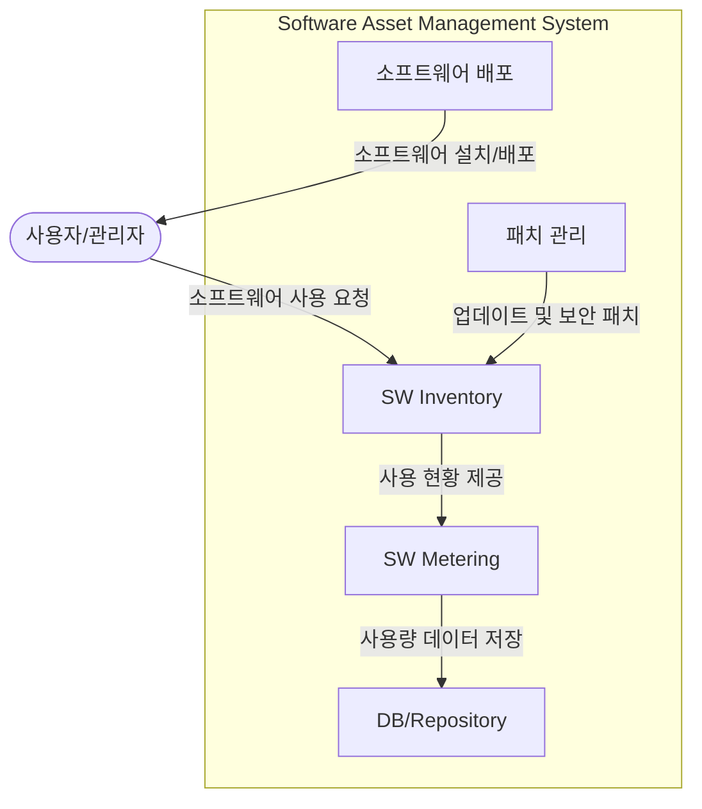

# SAM(Software Asset Management): 소프트웨어 자산을 효율적으로 관리하는 핵심 도구

<!-- mtoc-start -->

- [정의](#정의)
- [주요 구성요소(IMD패배)](#주요-구성요소imd패배)
- [구성도](#구성도)
- [SAM의 장점](#sam의-장점)
- [마무리](#마무리)
- [키워드](#키워드)

<!-- mtoc-end -->

소프트웨어 자산 관리(Software Asset Management, SAM)는 기업의 소프트웨어 자산을 효과적으로 통제하고 관리하기 위한 절차와 인프라를 제공합니다. SAM을 도입함으로써 기업은 소프트웨어의 라이프사이클 전반에 걸쳐 법적 문제와 비용 관리를 최적화하며, 불필요한 위험 요소를 최소화할 수 있습니다. 이를 통해 기업은 소프트웨어 자산의 효율성을 극대화하고 비용 절감을 실현할 수 있습니다.

## 정의

소프트웨어 자산 관리(Software Asset Management, SAM)는 기업의 소프트웨어 자산을 라이프사이클 전체 단계에 걸쳐 효과적으로 통제하고 관리하기 위한 인프라 및 절차를 제공하는 관리 도구. SAM의 주요 목적은 소프트웨어 자산을 최적화하여 법적, 비용적 위험을 줄이고, 효율적인 사용을 보장합니다.

- **목적**: 소프트웨어 라이센스 준수, 비용 절감, 효율적 소프트웨어 사용
- **필요성**: 법적 문제 예방, 기업의 책임 강화, 자산 효율성 향상
- **특징**: 라이프사이클 전 단계 관리, 리스크 최소화, 비용 최적화

## 주요 구성요소(IMD패배)

- **SW Inventory**: 기업 내 모든 소프트웨어의 현황을 파악하고 관리하는 저장소 역할
- **SW Metering**: 소프트웨어 사용량을 모니터링하여 실제 사용 여부를 확인하고 불필요한 라이센스 제거
- **DB/Repository**: 소프트웨어 자산 정보를 체계적으로 관리하는 데이터베이스 및 저장소
- **패치 관리**: 소프트웨어 업데이트 및 보안 패치를 관리하여 시스템의 안전성을 유지
- **소프트웨어 배포**: 소프트웨어의 설치 및 배포를 효율적으로 수행하여 관리 복잡성을 줄임

## 구성도

## SAM의 장점

- 법적 리스크 최소화
- 소프트웨어 비용 절감 및 최적화
- 자산의 효율적 사용 보장
- 기업의 책임 문제 해결
- 시스템 안전성 및 보안 강화

## 마무리

디지털 전환이 가속화되고 있는 오늘날, 소프트웨어 자산 관리의 중요성은 더욱 커지고 있습니다. SAM은 기업이 소프트웨어 자산을 효과적으로 관리하고, 법적 리스크와 비용을 최소화할 수 있는 필수적인 도구로 자리 잡고 있습니다. 앞으로의 비즈니스 환경에서는 SAM의 도입이 기업 경쟁력의 중요한 요소가 될 것입니다.

## 키워드

Software Asset Management, SAM, SW Inventory, 소프트웨어 자산 관리, 라이센스 관리, 패치 관리, 소프트웨어 배포, 법적 리스크, 비용 절감