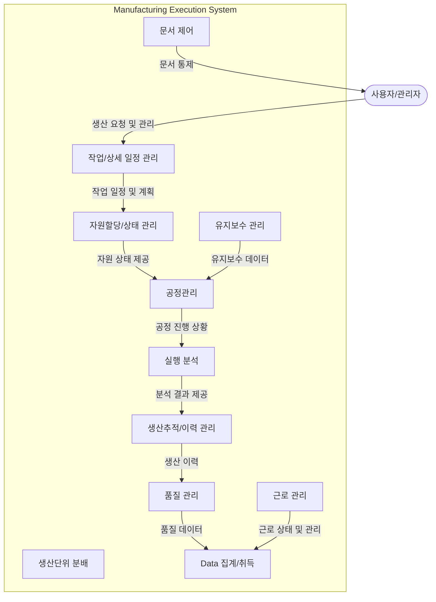

# MES(Manufacturing Execution System): 제조현장의 통합과 최적화를 위한 핵심 도구

<!-- mtoc-start -->

- [개요](#개요)
- [주요 기능](#주요-기능)
  - [생산 관리](#생산-관리)
  - [공정 및 품질 관리](#공정-및-품질-관리)
  - [데이터 및 이력 관리](#데이터-및-이력-관리)
  - [작업자 관리](#작업자-관리)
- [프로세스 구성도](#프로세스-구성도)
- [MES의 장점](#mes의-장점)
- [마무리](#마무리)
- [키워드](#키워드)

<!-- mtoc-end -->

제조 실행 시스템(Manufacturing Execution System, MES)은 제조현장의 통합화 및 최적화된 생산 활동을 지원하여 생산성을 향상시키는 통합 생산 정보 시스템입니다. MES를 통해 기업은 제조 과정의 실시간 모니터링과 통제, 생산 활동의 효율성을 극대화하고, 생산의 융합화와 최적화를 실현할 수 있습니다. 이를 통해 생산 현장에서 발생할 수 있는 문제를 즉시 해결하고, 전반적인 생산성을 향상시킬 수 있습니다.

## 개요

제조 실행 시스템(Manufacturing Execution System, MES)은 제조현장 전반의 통합화 및 최적화된 생산 활동을 지원하고 생산성을 향상시키기 위한 통합 생산 정보 시스템. MES는 실시간으로 제조 공정을 관리하고 최적화하여 제조 현장의 생산성을 높이는 데 기여.

- **목적**: 제조 공정의 실시간 통제, 생산성 극대화, 통합된 생산 관리
- **필요성**: 제조 과정의 효율성 향상, 실시간 데이터 기반 관리, 생산 문제의 신속한 대응
- **특징**: 생산의 융합화, 생산의 최적화, 실시간 정보 제공, 통계 정보 관리

## 주요 기능

### 생산 관리

- **자원할당/상태 관리**: 제조에 필요한 자원의 할당과 각 자원의 상태를 관리
- **작업/상세 일정 관리**: 작업의 스케줄과 상세 일정을 관리하여 효율적인 생산 계획 수립
- **생산단위 분배**: 생산 단위를 나누고 각 생산 단위의 할당 및 관리

### 공정 및 품질 관리

- **공정관리**: 생산 공정의 진행 상황을 모니터링하고 최적화
- **실행 분석**: 제조 현장의 실행 데이터를 분석하여 개선점 도출
- **유지보수 관리**: 제조 장비의 유지보수 일정을 관리하여 안정적인 생산 활동 지원
- **품질 관리**: 생산 제품의 품질을 관리하고 품질 문제를 예방

### 데이터 및 이력 관리

- **생산추적/이력 관리**: 생산된 제품의 이력을 추적하고 기록
- **Data 집계/취득**: 제조 과정에서 발생하는 데이터를 집계하고 취득하여 통합 관리
- **문서 제어**: 생산 관련 문서의 생성, 수정, 배포를 관리

### 작업자 관리

- **근로 관리**: 작업자의 근로 상태와 일정 관리

## 프로세스 구성도

## MES의 장점

- 제조 공정의 실시간 통제 및 최적화
- 생산성 극대화 및 비용 절감
- 품질 관리 및 문제 예방
- 데이터 기반의 통합 생산 관리
- 작업자 및 자원의 효율적 관리

## 마무리

MES는 제조 현장에서 생산의 통합과 최적화를 실현할 수 있는 필수적인 시스템으로, 기업의 생산성을 극대화하고 제조 과정의 효율성을 높이는 데 큰 역할을 하고 있습니다. 실시간 데이터 기반의 관리와 제조 현장의 통합 관리를 통해 MES는 경쟁력 있는 제조 환경을 구축하는 데 중요한 역할을 할 것입니다.

## 키워드

Manufacturing Execution System, MES, 생산 관리, 실시간 통제, 자원 할당, 공정 관리, 생산 최적화, 품질 관리, 데이터 집계, 제조 현장 관리