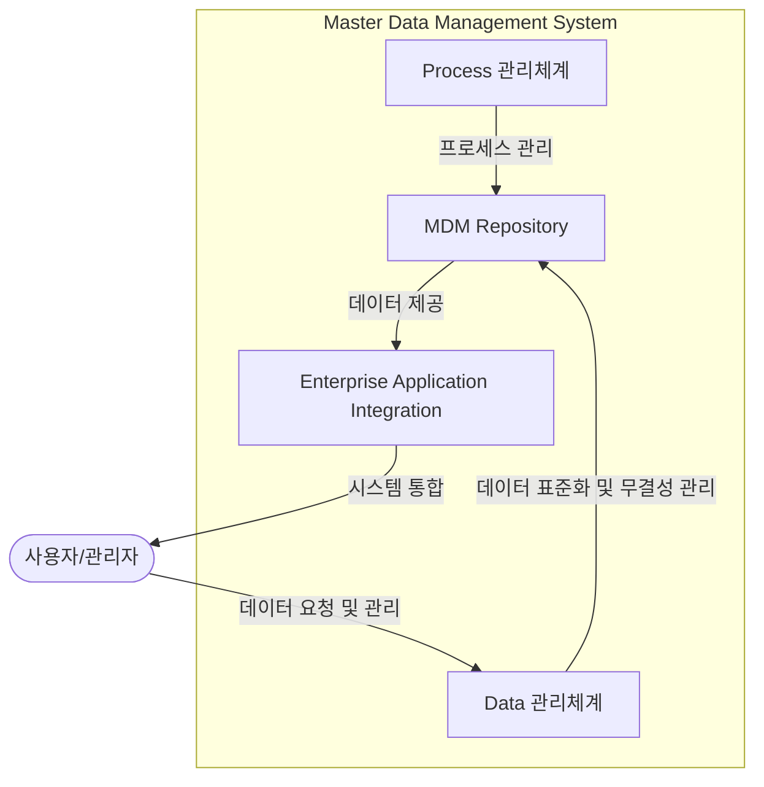

# MDM(Master Data Management): 데이터의 정합성과 통합 관리를 위한 핵심 도구

<!-- mtoc-start -->

- [개요](#개요)
- [주요 구성요소](#주요-구성요소)
  - [데이터 관리 체계](#데이터-관리-체계)
- [MDM 기능요소 (O, S, P, C)](#mdm-기능요소-o-s-p-c)
- [유형](#유형)
- [구성도](#구성도)
- [MDM의 장점](#mdm의-장점)
- [마무리](#마무리)
- [키워드](#키워드)

<!-- mtoc-end -->

마스터 데이터 관리(Master Data Management, MDM)는 기업의 다양한 관점에서 흩어져 있는 데이터를 통합 관리하여 정합성을 유지하고 일관된 정보를 제공하는 관리 방법입니다. MDM을 통해 기업은 분산된 시스템에서 데이터를 통합하고 공유함으로써 데이터의 신뢰성을 높이고, 효율적인 비즈니스 운영을 실현할 수 있습니다. 이를 통해 데이터 관리 비효율과 무결성 문제를 해결하고, 데이터 기반 의사결정을 지원할 수 있습니다.

## 개요

마스터 데이터 관리(Master Data Management, MDM)는 기업 운영에 근간이 되는 마스터 데이터(고정/동일/공통적 기본 자료)를 애플리케이션과 분리하여 일관성 있게 통합 및 관리하는 기법. MDM은 다양한 시스템에서 데이터를 통합 관리하고 공유함으로써 데이터의 정합성을 유지하고 기업의 데이터 기반 운영 효율성을 극대화함.

- **목적**: 마스터 데이터의 일관성 유지, 데이터 통합 관리, 정보 신뢰성 향상
- **필요성**: 마스터 데이터 표준화, 유지보수 비용 절감, 정보 공유, 데이터 신뢰도 향상
- **특징**: 데이터의 통합 관리, 정합성 유지, 다양한 시스템 간 데이터 공유

## 주요 구성요소

### 데이터 관리 체계

- **MDM Repository**: 마스터 데이터를 저장하고 관리하는 중앙 저장소
- **Data 관리체계**: 데이터의 표준화와 무결성을 유지하며 관리하는 체계
- **Process 관리체계**: 마스터 데이터 관리와 관련된 프로세스를 체계적으로 관리
- **EAI(Enterprise Application Integration)**: 다양한 시스템 간 데이터를 통합하고 연결하는 기술

## MDM 기능요소 (O, S, P, C)

- **Object Layer**: 데이터 모델을 설계하고 정의하는 작업
- **Service Layer**: 마스터 데이터의 검색, 조회, 유지보수 기능 제공
- **Provisioning Layer**: 기준 정보를 다양한 시스템에 배포하는 기능
- **Content Integrator**: 기준 정보의 정합성을 유지하고 통합 관리하는 기능

## 유형

- **중앙마스터**: 데이터를 중앙에서 일관성 있게 관리하는 방식
- **트랜잭션 허브**: 각 시스템 간 데이터를 실시간으로 연결하고 교환하는 방식
- **가상화/레지스트리**: 데이터의 물리적 이동 없이 통합 관리하는 방식

## 구성도

## MDM의 장점

- 데이터의 정합성 및 일관성 유지
- 다양한 시스템 간 데이터 통합 및 공유
- 데이터 관리의 효율성 향상 및 유지보수 비용 절감
- 데이터 기반 의사결정의 신뢰도 향상
- 기업 전반의 정보 일관성 확보

## 마무리

MDM은 기업의 다양한 시스템에서 발생하는 데이터를 통합적으로 관리하고 정합성을 유지하는 중요한 관리 방법입니다. MDM을 통해 기업은 데이터 관리의 효율성을 높이고, 데이터 기반의 의사결정 신뢰성을 향상시킬 수 있습니다. 데이터의 표준화와 일관된 관리를 통해 기업은 더욱 경쟁력 있는 비즈니스 환경을 구축할 수 있을 것입니다.

## 키워드

Master Data Management, MDM, 데이터 관리, 정합성 유지, 데이터 통합, 정보 일관성, EAI, 데이터 표준화, 마스터 데이터, 프로세스 관리