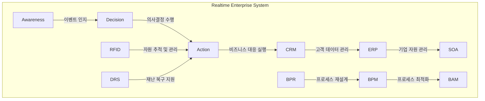

# RTE(Realtime Enterprise): 실시간 기업을 위한 핵심 전략

<!-- mtoc-start -->

- [개요](#개요)
- [주요 개념 (A, D, A)](#주요-개념-a-d-a)
- [RTE 기반 기술](#rte-기반-기술)
  - [소프트웨어 기술](#소프트웨어-기술)
  - [프로세스 기술](#프로세스-기술)
  - [기술적 요소](#기술적-요소)
- [기대효과](#기대효과)
- [RTE의 동인](#rte의-동인)
- [전제조건](#전제조건)
- [구성도](#구성도)
- [마무리](#마무리)
- [키워드](#키워드)

<!-- mtoc-end -->

실시간 기업(Realtime Enterprise, RTE)은 기업의 경영 자원을 실시간으로 관리하고 최적의 의사결정을 통해 신속하게 대응하는 경영 모델입니다. RTE는 빠른 ROI(Return on Investment)와 즉각적인 액션을 통해 시장 변화에 민첩하게 대응하고 기업의 경쟁력을 강화합니다. 이러한 실시간 기업 모델은 인지(Awareness), 의사결정(Decision), 행동(Action)의 세 단계로 이루어져 있어 변화에 빠르게 적응하고 전략을 세울 수 있도록 지원합니다.

## 개요

실시간 기업(Realtime Enterprise, RTE)은 기업의 경영 자원을 효과적으로 배분하여 실시간 전략 수립 및 의사결정을 수행하는 기업 모델. RTE는 인지(Awareness), 의사결정(Decision), 행동(Action)의 순서로 경영 활동을 진행하며 신속한 대응을 가능하게 함.

- **목적**: 신속한 의사결정과 빠른 대응을 통한 시장 경쟁력 강화
- **필요성**: 경영 활동의 실시간 모니터링, 빠른 의사결정 지원, 변화하는 경영 환경에 대한 신속한 대응
- **특징**: 실시간 데이터 관리, 신속한 의사결정, 통합된 경영 자원 관리

## 주요 개념 (A, D, A)

- **Awareness (Event)**: 실시간으로 이벤트와 상황을 인지하여 필요한 정보를 수집하는 단계
- **Decision**: 수집된 정보를 바탕으로 경영에 필요한 의사결정을 내리는 단계
- **Action (Business Response)**: 의사결정에 따라 비즈니스 대응을 즉각적으로 실행하는 단계

## RTE 기반 기술

### 소프트웨어 기술

- **CRM(Customer Relationship Management)**: 고객 관계 관리를 통해 실시간 고객 데이터를 관리하고 활용
- **ERP(Enterprise Resource Planning)**: 기업 자원을 통합 관리하여 실시간 의사결정 지원
- **SOA(Service-Oriented Architecture)**: 서비스를 기반으로 한 유연한 시스템 구조를 통해 신속한 대응 지원

### 프로세스 기술

- **BPR(Business Process Reengineering)**: 비즈니스 프로세스를 재설계하여 효율성 향상
- **BPM(Business Process Management)**: 비즈니스 프로세스의 최적화 및 관리
- **BAM(Business Activity Monitoring)**: 비즈니스 활동을 실시간으로 모니터링하여 필요한 정보를 제공

### 기술적 요소

- **RFID(Radio-Frequency Identification)**: 실시간으로 자원 및 제품 정보를 추적하고 관리
- **DRS(Disaster Recovery System)**: 재난 상황에 대비한 복구 시스템을 통해 안정성을 보장

## 기대효과

- **관리적 측면**: 정확한 성과 관리, 사업 현황과 미래에 대한 올바른 판단
- **운영적 측면**: 업무 처리 시간 단축, 신속한 정보 제공, 생산성 향상
- **기술적 측면**: BPM, BRE 등을 적용한 프로세스 최적화

## RTE의 동인

- **경영활동 실시간 모니터링(Visibility)**: 기업 내 모든 경영 활동을 실시간으로 모니터링하여 상황을 정확하게 파악
- **최적의 의사결정 지원(Intelligence)**: 데이터를 분석하여 최적의 의사결정을 지원
- **경영환경 변화 신속 대응(Speed)**: 변화하는 경영 환경에 빠르게 적응하고 대응할 수 있는 능력

## 전제조건

1. **데이터 통합(DW, DM)**: 데이터웨어하우스(DW)와 데이터 마트(DM)를 통해 데이터를 통합하고 품질 관리 및 메타데이터 관리를 통한 데이터 정합성 유지
2. **프로세스 통합(BPM, BRE)**: 통합된 데이터를 기반으로 비즈니스 프로세스를 통합하고 최적화
3. **의사결정 시스템 구축(BI, SOA)**: 통합된 프로세스를 활용하여 효율적인 의사결정 시스템을 구축

## 구성도

## 마무리

RTE는 기업이 실시간으로 경영 활동을 모니터링하고 빠르게 대응할 수 있도록 도와주는 혁신적인 기업 모델입니다. 실시간 데이터를 기반으로 한 의사결정과 신속한 대응을 통해 기업은 변화하는 경영 환경에 민첩하게 대응하고, 지속적인 경쟁력을 유지할 수 있습니다. 이러한 실시간 경영 모델은 앞으로의 비즈니스 환경에서 더욱 중요한 역할을 할 것입니다.

## 키워드

Realtime Enterprise, RTE, 실시간 기업, 실시간 의사결정, 경영자원 관리, CRM, ERP, SOA, BPM, BAM, 경영 활동 모니터링