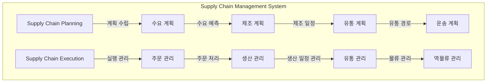

# SCM(Supply Chain Management): 가치 사슬 관점의 공급망 최적화

<!-- mtoc-start -->

- [정의 및 소개](#정의-및-소개)
- [주요 구성요소](#주요-구성요소)
  - [SCP(Supply Chain Planning) - 계획 관리](#scpsupply-chain-planning---계획-관리)
  - [SCE(Supply Chain Execution) - 실행 관리](#scesupply-chain-execution---실행-관리)
- [SCM의 기술 요소](#scm의-기술-요소)
- [기대효과](#기대효과)
- [SCM의 동인](#scm의-동인)
- [구성도](#구성도)
- [마무리](#마무리)
- [키워드](#키워드)

<!-- mtoc-end -->

공급망 관리(Supply Chain Management, SCM)는 제품 생산에서 유통에 이르는 전체 프로세스를 협력업체와 협업하여 최적화하는 관리 체계입니다. SCM을 도입함으로써 기업은 공급망 전체의 효율성을 높이고 비용을 절감하며, 신속한 시장 대응을 통해 경영 효율성을 극대화할 수 있습니다. 가치 사슬(Value Chain) 관점에서 공급망 최적화를 목표로 하는 SCM은 기업에 다양한 경쟁력을 제공하는 중요한 도구입니다.

## 정의 및 소개

공급망 관리(Supply Chain Management, SCM)는 기업의 제품 생산에서 유통까지의 모든 프로세스를 최적화하기 위해 협력업체와의 협력을 통해 공급망을 통합 관리하는 기법. SCM은 가치 사슬 전체에서 비용을 절감하고 경영 효율성을 높이는 데 목적이 있음.

- **목적**: 재고 감축, 수익 증대, 경영 효율성 극대화
- **필요성**: 높은 물류 비용, 예측 불확실성, 세계화, 대량 맞춤 요구, 경쟁 심화
- **특징**: 정보 공유를 통한 재고 관리, 전반적인 공급망 효율성 향상, 가치 사슬 최적화

## 주요 구성요소

### SCP(Supply Chain Planning) - 계획 관리

- **수요 계획**: 시장 수요를 예측하고 이에 맞춘 생산 계획을 수립
- **제조 계획**: 수요를 기반으로 제조 일정을 계획하고 생산 자원을 효율적으로 배분
- **유통 계획**: 생산된 제품을 효율적으로 유통하기 위한 계획 수립
- **운송 계획**: 제품을 고객에게 신속하고 안전하게 전달하기 위한 운송 경로 및 방법 계획

### SCE(Supply Chain Execution) - 실행 관리

- **주문 관리**: 고객 주문을 수집하고 이를 관리하는 프로세스
- **생산 관리**: 제조 공정에서의 생산 일정을 관리하고 최적화
- **유통 관리**: 제품의 물류와 유통을 관리하여 고객에게 전달
- **역물류 관리**: 반품, 재활용 등의 역방향 물류를 관리하여 효율성 극대화

## SCM의 기술 요소

- **연계 기술**: 시스템 간 데이터 연계를 통해 공급망 내 정보의 흐름을 원활히 함
- **분석 기술**: 데이터웨어하우스(DW), 데이터 마트(DM) 등을 통해 데이터를 분석하고 의사결정 지원
- **거래/결재 기술**: 전자상거래(EC)와 전자 자금 이체(EFT)를 통해 공급망 내 거래 및 결재를 효율적으로 처리

## 기대효과

- **관리적 측면**: 공급망 전체의 효율성 향상, 정확한 성과 관리, 사업 현황에 대한 올바른 판단
- **운영적 측면**: 업무 처리 시간 단축, 신속한 정보 제공, 생산성 향상
- **기술적 측면**: 분석 및 연계 기술을 활용한 프로세스 최적화

## SCM의 동인

- **높은 물류 비용 감소**: 물류 비용을 줄이기 위한 공급망 최적화 필요
- **예측 불확실성 해결**: 수요의 변동성에 대응하여 공급망의 유연성 강화
- **세계화 대응**: 글로벌 시장에서의 공급망 통합 관리 필요성 증가
- **대량 맞춤 요구**: 다양한 소비자의 요구에 대응할 수 있는 공급망 설계 필요
- **경쟁 심화**: 경쟁 우위를 확보하기 위한 공급망의 효율적 운영

## 구성도

## 마무리

SCM은 기업이 제품 생산부터 유통까지의 모든 과정을 최적화하여 비용을 절감하고 경영 효율성을 극대화할 수 있도록 도와주는 중요한 관리 기법입니다. 가치 사슬 전반에서 공급망을 통합 관리하고 협력업체와의 협업을 통해 정보를 공유함으로써 기업은 시장 변화에 민첩하게 대응하고 경쟁력을 강화할 수 있습니다. 앞으로의 비즈니스 환경에서 SCM의 중요성은 더욱 커질 것입니다.

## 키워드

Supply Chain Management, SCM, 공급망 관리, 수요 계획, 제조 계획, 유통 계획, 역물류 관리, 가치 사슬, 물류 비용 절감, 경영 효율성