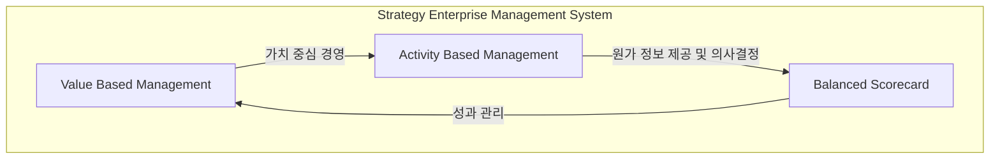

# SEM(Strategy Enterprise Management): 전략적 기업 경영의 핵심 도구

<!-- mtoc-start -->

- [정의 및 소개](#정의-및-소개)
- [SEM의 핵심 요소](#sem의-핵심-요소)
- [SEM의 주요 구성요소](#sem의-주요-구성요소)
  - [가치 중심 경영(VBM)](#가치-중심-경영vbm)
  - [활동 중심 원가 관리(ABM)](#활동-중심-원가-관리abm)
  - [기업 성과 관리(BSC)](#기업-성과-관리bsc)
- [기대효과](#기대효과)
- [SEM의 특징](#sem의-특징)
- [구성도](#구성도)
- [마무리](#마무리)
- [키워드](#키워드)

<!-- mtoc-end -->

전략적 기업 경영(Strategy Enterprise Management, SEM)은 기업의 전사적 가치를 실현하기 위해 경영 전략과 경영 활동을 연결하는 시스템입니다. SEM은 전사 정보를 명확히 파악하고 가치 중심의 경영을 전사적으로 구현하는 전략 경영 시스템으로, 이해관계자 간의 원활한 소통을 통해 기업의 가치를 극대화할 수 있습니다. SEM은 VBM(Value Based Management), BSC(Balanced Scorecard), ABM(Activity Based Management) 등 다양한 기법을 바탕으로 경영 전략의 실현을 돕습니다.

## 정의 및 소개

전략적 기업 경영(Strategy Enterprise Management, SEM)은 기업 가치를 실현하기 위해 전사 정보를 명확히 파악하고 가치 중심 경영을 전사적으로 구현하는 전략 경영 시스템. SEM은 경영 전략과 경영 활동을 VBM, BSC, ABM을 통해 연결하여 전략적 목표를 달성함.

- **목적**: 전사적 정보 파악과 원인 분석, 입체적 성과 모니터링, 이해관계자 간 의사소통
- **특징**: 전략과 운영 업무의 통합 기반 제공, Key Value Driver의 효율적인 관리

## SEM의 핵심 요소

- **VBM(Value Based Management)**: 주주와 투자자 중심의 가치 경영 실현
- **ABM(Activity Based Management)**: 활동 중심 원가 정보(ABC)를 이용하여 의사결정을 지원하는 경영 활동
- **BSC(Balanced Scorecard)**: 재무적, 비재무적 성과를 균형 있게 관리하는 기업 성과 관리 기법

## SEM의 주요 구성요소

### 가치 중심 경영(VBM)

- **주주와 투자자 중심**: 기업 가치를 최대로 하기 위해 주주와 투자자의 가치를 중심으로 경영 활동을 설계하고 운영

### 활동 중심 원가 관리(ABM)

- **ABC 원가 정보 활용**: 활동 기반 원가 계산(Activity Based Costing, ABC)을 통해 정확한 비용 정보 제공 및 경영 의사결정 지원
- **의사결정 지원**: 원가 정보와 활동 데이터를 활용하여 경영의 효율성을 높임

### 기업 성과 관리(BSC)

- **재무적 성과 관리**: 전통적인 재무 지표를 통해 기업의 재무적 성과를 평가
- **비재무적 성과 관리**: 고객, 내부 프로세스, 학습과 성장 관점에서 비재무적 성과를 관리하여 균형 잡힌 기업 성과 관리 실현

## 기대효과

- **종합적 Overview와 원인 분석**: 전사 정보를 종합적으로 파악하고 문제의 원인을 분석할 수 있음
- **입체적 성과 모니터링**: 재무적, 비재무적 성과를 종합적으로 모니터링하여 기업 성과 개선
- **이해관계자 간 의사소통 강화**: 이해관계자 간의 효과적인 의사소통을 통해 경영 목표를 공유하고 실현

## SEM의 특징

- **전략과 운영의 통합**: 경영 전략과 실제 운영 업무를 연계하여 일관성 있는 기업 경영 실현
- **Key Value Driver 관리**: 기업의 핵심 가치 요소를 파악하고 이를 효율적으로 관리하여 기업 가치를 극대화

## 구성도

## 마무리

SEM은 기업이 전사적 가치를 실현하고 전략적 목표를 달성하기 위한 중요한 경영 시스템입니다. VBM, ABM, BSC 등의 기법을 통해 경영 전략과 활동을 일관성 있게 연결하고, 전사적 정보를 명확히 파악하여 기업의 가치를 극대화합니다. 이러한 전략적 경영 시스템을 도입함으로써 기업은 변화하는 시장 환경에 효과적으로 대응하고 지속적인 성장을 이룰 수 있을 것입니다.

## 키워드

Strategy Enterprise Management, SEM, 전략적 기업 경영, VBM, ABM, BSC, 가치 중심 경영, 성과 관리, 경영 전략, Key Value Driver