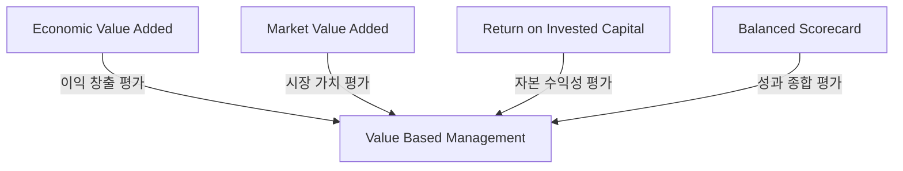

# VBM(Value Based Management): 주주와 투자자를 위한 가치 중심 경영

<!-- mtoc-start -->

- [정의 및 소개](#정의-및-소개)
- [VBM의 주요 요소](#vbm의-주요-요소)
  - [EVA (Economic Value Added, 경제적 부가가치)](#eva-economic-value-added-경제적-부가가치)
  - [MVA (Market Value Added, 시장 부가가치)](#mva-market-value-added-시장-부가가치)
  - [ROIC (Return on Invested Capital, 투자자본 수익률)](#roic-return-on-invested-capital-투자자본-수익률)
  - [BSC (Balanced Scorecard, 균형성과표)](#bsc-balanced-scorecard-균형성과표)
- [기대효과](#기대효과)
- [VBM의 특징](#vbm의-특징)
- [구성도](#구성도)
- [마무리](#마무리)
- [키워드](#키워드)

<!-- mtoc-end -->

가치 중심 경영(Value Based Management, VBM)은 주주와 투자자에게 가치를 제공하기 위해 기업의 가치를 극대화하는 경영 기법입니다. VBM은 기업 가치에 영향을 미치는 다양한 요인들에 초점을 맞추어 경영 활동을 전개하며, 이를 통해 주주와 투자자에게 최대의 가치를 제공하는 것을 목표로 합니다. 경영 전략의 일환으로서 의사결정 및 평가에 있어서 기업의 장기적인 가치를 우선시합니다.

## 정의 및 소개

가치 중심 경영(Value Based Management, VBM)은 기업의 가치를 극대화하기 위해 가치 결정 요인들에 초점을 맞춰 경영 활동(의사결정, 평가)을 전개하는 경영 기법. VBM은 주주와 투자자 중심의 경영을 통해 장기적인 기업 가치 실현을 목표로 함.

- **목적**: 기업 가치 극대화, 주주 및 투자자에게 최대의 가치 제공
- **특징**: 기업 가치 결정 요인에 초점, 장기적 가치 실현을 위한 의사결정
- **주요 지표**: EVA(경제적 부가가치), MVA(시장 부가가치), ROIC(투자자본 수익률), BSC(균형성과표)

## VBM의 주요 요소

### EVA (Economic Value Added, 경제적 부가가치)

- **정의**: 기업이 영업 활동을 통해 창출한 이익에서 자본 비용을 제외한 경제적 부가가치
- **역할**: 기업이 실질적으로 창출한 가치를 평가하는 지표로, 투자자와 주주에게 중요한 정보 제공

### MVA (Market Value Added, 시장 부가가치)

- **정의**: 기업의 시장 가치에서 자본 투입 비용을 뺀 순 부가가치
- **역할**: 기업이 시장에서 얼마나 높은 평가를 받고 있는지를 나타내는 지표

### ROIC (Return on Invested Capital, 투자자본 수익률)

- **정의**: 기업이 투자한 자본에 대한 수익률로, 얼마나 효율적으로 자본을 사용하고 있는지를 평가
- **역할**: 자본 비용 대비 수익을 평가하여 투자자에게 수익성을 설명

### BSC (Balanced Scorecard, 균형성과표)

- **정의**: 재무적, 비재무적 성과를 균형 있게 관리하여 기업의 전반적인 성과를 평가하는 기법
- **역할**: 가치 중심 경영을 실현하기 위해 재무적 성과뿐만 아니라 고객, 내부 프로세스, 학습과 성장의 관점에서 기업 성과를 종합적으로 평가

## 기대효과

- **기업 가치 극대화**: 가치 결정 요인에 따른 경영 활동을 통해 기업 가치를 극대화할 수 있음
- **주주 및 투자자 만족도 향상**: 주주와 투자자에게 장기적인 가치를 제공함으로써 만족도와 신뢰도를 높임
- **효율적인 경영 의사결정**: EVA, MVA, ROIC 등의 지표를 기반으로 경영 의사결정을 내림으로써 효율성을 극대화

## VBM의 특징

- **투하 자본에 대한 이익에 초점**: 투하 자본에 대한 이익을 극대화하기 위해 경영 전략을 수립하고 실행
- **장기적 가치 실현**: 단기적인 이익보다 기업의 장기적인 가치를 중요시하며 경영 활동을 계획하고 평가
- **Key Value Driver 관리**: 기업 가치에 영향을 미치는 주요 요소들을 식별하고 관리하여 가치를 극대화

## 구성도

## 마무리

VBM은 기업 가치를 극대화하고 주주와 투자자에게 장기적인 가치를 제공하기 위한 경영 기법입니다. EVA, MVA, ROIC 등의 지표를 통해 기업의 성과를 측정하고, 이를 바탕으로 경영 전략을 수립함으로써 기업의 장기적인 경쟁력을 확보할 수 있습니다. VBM은 기업이 장기적인 성공을 이끌어낼 수 있도록 돕는 중요한 도구입니다.

## 키워드

Value Based Management, VBM, 기업 가치, EVA, MVA, ROIC, 균형성과표, 주주 가치, 투자자 만족, 경영 전략, Key Value Driver