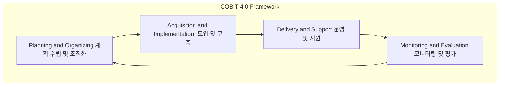

# COBIT 4.0: IT 거버넌스 구현을 위한 프레임워크

<!-- mtoc-start -->

- [개요](#개요)
- [COBIT 4.0의 특징](#cobit-40의-특징)
- [COBIT 4.0의 주요 프로세스 (계도운모)](#cobit-40의-주요-프로세스-계도운모)
- [성숙도 모델 (부초반정관최)](#성숙도-모델-부초반정관최)
- [기대효과](#기대효과)
- [구성도](#구성도)
- [마무리](#마무리)
- [키워드](#키워드)

<!-- mtoc-end -->

COBIT(Control Objectives for Information and related Technology) 4.0은 IT 거버넌스를 구현하기 위한 프레임워크로, 기업이 IT 통제 수준을 진단하고 업계 표준에 맞춘 최적의 운영 방안을 수립할 수 있도록 지원합니다. COBIT은 IT 거버넌스를 실현하고 IT 운영의 효율성을 극대화하기 위해 Best Practice와 업계 표준을 따르는 통합적 접근법을 제공합니다. 이를 통해 기업은 IT와 비즈니스 목표를 정렬하고 리스크를 관리할 수 있습니다.

## 개요

COBIT 4.0은 정보와 관련 기술에 대한 통제 목표(Control Objectives)를 기반으로 한 IT 거버넌스 구현 프레임워크. IT 거버넌스를 실현하고 IT 통제 수준을 진단하기 위한 업계 표준 및 Best Practice로 활용됨. COBIT은 IT와 비즈니스의 목표를 통합하고 최적의 성과를 달성하기 위한 기반을 제공함.

- **목적**: IT 거버넌스 구현, IT 통제 수준 진단, 업계 표준 준수
- **특징**: 비즈니스 집중(BSC, IT-BSC), 프로세스 중심, 통제 기반, 측정 중심 접근

## COBIT 4.0의 특징

- **Business Focused**: BSC(Balanced Scorecard)와 IT-BSC를 통해 비즈니스 목표와 IT 목표를 정렬
- **Process Oriented**: 프로세스 중심으로 IT 운영의 효율성을 극대화
- **Control Based**: IT 통제 활동을 중심으로 리스크를 최소화
- **Measurement Driven**: 성과 측정을 통해 목표 달성 여부를 확인하고 개선

## COBIT 4.0의 주요 프로세스 (계도운모)

1. **계획 수립 및 조직화(Planning and Organizing)**: IT 전략을 수립하고 조직화하여 비즈니스 목표와 일치하도록 지원
2. **도입 및 구축(Acquisition and Implementation)**: IT 솔루션을 도입하고 구축하여 비즈니스 요구 사항을 충족
3. **운영 및 지원(Delivery and Support)**: IT 서비스를 운영하고 지원하여 안정적이고 효율적인 서비스를 제공
4. **모니터링 및 평가(Monitoring and Evaluation)**: IT 성과를 모니터링하고 평가하여 개선 사항을 도출

## 성숙도 모델 (부초반정관최)

COBIT 4.0은 IT 관리 성숙도를 평가하기 위해 성숙도 모델을 제공함. 이 모델은 조직의 IT 관리 수준을 단계별로 평가하고 개선 방향을 제시함.

1. **부재(Non-existent)**: IT 관리 프로세스가 전혀 존재하지 않음
2. **초기(Initial)**: 비공식적이며 일관성이 부족한 초기 단계
3. **반복(Repeatable)**: 일부 프로세스가 반복적으로 수행되지만 표준화되지 않음
4. **정의(Defined)**: 프로세스가 표준화되고 문서화되어 있으며 일관성 있게 수행됨
5. **관리(Managed)**: 프로세스 성과가 측정되고 관리됨
6. **최적화(Optimized)**: 지속적인 개선을 통해 프로세스가 최적화됨

## 기대효과

- **IT와 비즈니스 목표 정렬**: COBIT을 통해 IT와 비즈니스 목표를 일치시켜 조직의 성과 극대화
- **IT 리스크 관리 강화**: 통제 기반 접근을 통해 IT 관련 리스크를 효과적으로 관리
- **성과 측정 및 개선**: 성과 지표를 통해 IT 성과를 평가하고 지속적으로 개선

## 구성도

## 마무리

COBIT 4.0은 IT 거버넌스를 효과적으로 구현하고 비즈니스 목표와 IT 목표를 정렬하는 데 중요한 역할을 하는 프레임워크입니다. COBIT을 통해 기업은 IT 운영의 성숙도를 평가하고, 이를 개선하여 IT와 비즈니스의 시너지를 극대화할 수 있습니다. 지속적인 성과 측정과 통제를 통해 기업의 IT 운영은 더 높은 수준으로 발전할 수 있습니다.

## 키워드

COBIT 4.0, IT 거버넌스, IT 통제, Best Practice, 성숙도 모델, IT-BSC, 프로세스 중심, 비즈니스 목표 정렬, IT 리스크 관리, 성과 측정