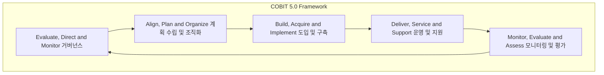

# COBIT 5.0: IT 거버넌스를 위한 통합 프레임워크

<!-- mtoc-start -->

- [개요](#개요)
- [COBIT 5.0의 주요 변화](#cobit-50의-주요-변화)
- [COBIT 5.0의 5가지 원칙 (거인이비통)](#cobit-50의-5가지-원칙-거인이비통)
- [COBIT 5.0의 주요 프로세스 (애들아빠댄스미)](#cobit-50의-주요-프로세스-애들아빠댄스미)
  - [Governance (EDM)](#governance-edm)
  - [Management (APO, BAI, DSS, MEA)](#management-apo-bai-dss-mea)
- [7 Enablers (촉진 요소)](#7-enablers-촉진-요소)
- [기대효과](#기대효과)
- [구성도](#구성도)
- [마무리](#마무리)
- [키워드](#키워드)

<!-- mtoc-end -->

COBIT 5.0은 IT 거버넌스를 실현하고 기업의 가치를 창출하기 위한 통합 프레임워크입니다. COBIT 5.0은 이전 버전인 COBIT 4.1, Val IT 2.0, Risk IT 등 기존의 ISACA 프레임워크를 통합하여 일관성을 확보하고 중복을 최소화했습니다. 또한 ITIL, PMBOK, TOGAF, ISO 등의 글로벌 표준과 연계성을 확대한 통제 프레임워크로, IT 거버넌스와 관리를 분리하여 더욱 명확하게 정의했습니다.

## 개요

COBIT 5.0은 IT와 비즈니스 간의 가치를 창출하고 이익을 실현하기 위해 위험과 자원을 최적화하는 IT 거버넌스 통합 프레임워크입니다. COBIT 5.0은 기존 ISACA 프레임워크의 중복을 최소화하고, ITIL, PMBOK, TOGAF, ISO 등 다양한 표준과의 연계를 통해 IT 거버넌스를 강화합니다.

- **목적**: 가치 창출, 이익 실현, 위험 및 자원 최적화
- **특징**: 통합 프레임워크, 비즈니스 초점, 위험 관리 강화, 글로벌 표준 연계 확대

## COBIT 5.0의 주요 변화

- **IT 거버넌스 지향**: 기존 프레임워크와의 통합을 통해 IT 거버넌스 강화
- **도메인/프로세스 진화**: 기존 프로세스를 통합하고 일관성 있게 발전시킴
- **Management와 Governance 분리**: IT 관리와 IT 거버넌스를 명확하게 분리하여 운영의 효율성을 높임

## COBIT 5.0의 5가지 원칙 (거인이비통)

1. **통합 프레임워크(Integrated Framework)**: 다양한 IT 관리 프레임워크와의 통합을 통해 일관성 확보
2. **이해관계자 니즈 충족(Meeting Stakeholder Needs)**: 이해관계자의 요구를 반영하여 가치를 창출
3. **비즈니스 초점(Focus on Business Goals)**: IT 목표를 비즈니스 목표와 일치시켜 경영 성과를 극대화
4. **인에이블러 기반(Enabler Based Approach)**: 성과 달성을 위해 필요한 인에이블러들을 정의하고 관리
5. **거버넌스와 관리의 분리(Separation of Governance and Management)**: IT 거버넌스와 관리를 분리하여 역할과 책임 명확화

## COBIT 5.0의 주요 프로세스 (애들아빠댄스미)

COBIT 5.0은 Governance와 Management를 명확하게 분리하여 다음과 같은 프로세스를 제공합니다:

### Governance (EDM)

- **Evaluate, Direct and Monitor (평가, 지시 및 모니터링)**: IT 거버넌스를 수행하여 전략적 방향을 제시하고 성과를 평가

### Management (APO, BAI, DSS, MEA)

- **APO (Align, Plan and Organize)**: IT 전략과 비즈니스 전략의 정렬 및 계획 수립
- **BAI (Build, Acquire and Implement)**: 솔루션 구축, 획득 및 구현을 통해 비즈니스 요구 충족
- **DSS (Deliver, Service and Support)**: IT 서비스를 제공하고 운영 및 지원
- **MEA (Monitor, Evaluate and Assess)**: IT 성과를 모니터링하고 평가하여 개선 방향 도출

## 7 Enablers (촉진 요소)

COBIT 5.0은 조직의 성과 달성을 위한 7가지 Enabler(촉진 요소)를 정의합니다:

6. **Principles, Policies and Frameworks**: 원칙, 정책 및 프레임워크
7. **Processes**: 비즈니스 및 IT 프로세스
8. **Organizational Structures**: 조직 구조
9. **Culture, Ethics and Behavior**: 문화, 윤리 및 행동
10. **Information**: 정보 및 데이터
11. **Services, Infrastructures and Applications**: 서비스, 인프라 및 애플리케이션
12. **People, Skills and Competencies**: 인력, 기술 및 역량

## 기대효과

- **IT와 비즈니스 목표 정렬**: IT와 비즈니스 목표를 일치시켜 조직의 성과를 극대화
- **리스크 및 자원 최적화**: IT와 관련된 리스크를 줄이고 자원을 최적화하여 효율성 증대
- **글로벌 표준 연계**: ITIL, PMBOK, TOGAF, ISO 등 다양한 글로벌 표준과의 연계를 통해 일관된 IT 거버넌스 실현

## 구성도

## 마무리

COBIT 5.0은 IT 거버넌스를 강화하고 IT와 비즈니스 간의 시너지를 극대화하기 위한 중요한 프레임워크입니다. 통합된 접근 방식을 통해 기존의 다양한 프레임워크와 표준을 일관성 있게 연결하고, IT 운영의 효율성을 높이며 리스크를 최소화할 수 있습니다. 이러한 COBIT 5.0을 통해 기업은 변화하는 비즈니스 환경에 유연하게 대응하고 지속 가능한 성장을 이룰 수 있을 것입니다.

## 키워드

COBIT 5.0, IT 거버넌스, 통합 프레임워크, 이해관계자 니즈, 비즈니스 초점, 인에이블러, 성과 측정, ITIL, PMBOK, TOGAF, ISO, 리스크 관리