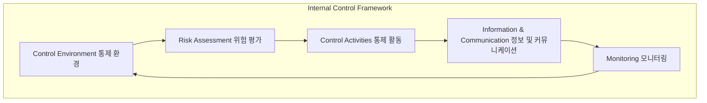

# COSO Internal Control Framework: 효과적인 내부 통제를 위한 포괄적 틀

<!-- mtoc-start -->

- [정의 및 소개](#정의-및-소개)
- [COSO의 주요 요소 (환위 활정모)](#coso의-주요-요소-환위-활정모)
- [기대효과](#기대효과)
- [구성도](#구성도)
- [마무리](#마무리)
- [키워드](#키워드)

<!-- mtoc-end -->

COSO(Committee of Sponsoring Organizations) 내부 통제 프레임워크는 기업의 재무, 운영, 컴플라이언스 등 다양한 측면에서 내부 통제를 관리하고 운용하기 위한 포괄적인 틀입니다. 이 프레임워크는 IT 거버넌스와 규제 준수를 지원하여 조직의 효과적인 경영을 보장합니다. COSO는 통제 환경, 위험 평가, 통제 활동, 정보 및 커뮤니케이션, 모니터링의 다섯 가지 핵심 요소를 통해 내부 통제를 체계적으로 구현합니다.

## 정의 및 소개

COSO Internal Control Framework는 기업이 내부 통제를 효과적으로 관리하고 운용할 수 있도록 하는 포괄적 프레임워크. 재무 보고, 운영 효율성, 규제 준수를 위한 내부 통제 관리 체계를 제공하며, 조직의 효과성 및 효율성을 보장하는 데 목적을 둡니다. COSO 프레임워크는 IT 거버넌스와 규제 준수를 포함하여 기업 전반의 리스크를 관리하는 데 중요한 역할을 합니다.

- **목적**: 내부 통제 관리 및 운용, 효과성 보장, 규제 준수 지원
- **특징**: 재무, 운영, 컴플라이언스 측면의 통합적 관리, 효과적인 통제 프레임워크 제공

## COSO의 주요 요소 (환위 활정모)

1. **Control Environment (통제 환경)**: 조직의 내부 통제 문화를 형성하는 기본 요소로, 윤리적 가치와 경영진의 리더십 및 책임을 포함
2. **Risk Assessment (위험 평가)**: 조직이 직면한 위험을 식별하고 분석하여, 이를 효과적으로 관리할 수 있도록 지원
3. **Control Activities (통제 활동)**: 위험을 관리하고 기업의 목표를 달성하기 위해 수행되는 정책과 절차
4. **Information & Communication (정보 및 커뮤니케이션)**: 내부 통제와 관련된 정보를 적시에 수집, 처리, 전달하여 의사결정을 지원
5. **Monitoring (모니터링)**: 내부 통제 시스템의 효과성을 평가하고 개선점을 도출하기 위해 지속적으로 모니터링

## 기대효과

- **효과적인 내부 통제 구현**: COSO를 통해 재무, 운영, 규제 측면의 리스크를 효과적으로 관리
- **IT 거버넌스 및 규제 준수 지원**: 내부 통제 수준을 높여 IT 거버넌스와 규제 준수 강화
- **성과 및 운영 효율성 개선**: 통제 환경과 위험 평가를 통한 운영의 효율성 극대화

## 구성도

## 마무리

COSO 내부 통제 프레임워크는 기업이 효과적인 내부 통제를 실현하고, 재무, 운영, 규제 측면에서 리스크를 체계적으로 관리할 수 있도록 돕는 중요한 도구입니다. COSO를 통해 조직은 내부 통제를 강화하고, 이를 통해 기업의 성과와 지속 가능한 성장을 도모할 수 있습니다.

## 키워드

COSO, Internal Control, 내부 통제, 통제 환경, 위험 평가, 통제 활동, 정보 및 커뮤니케이션, 모니터링, IT 거버넌스, 규제 준수