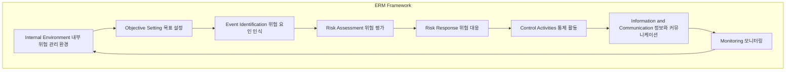

# COSO ERM Framework: 전사적 리스크 관리를 위한 포괄적 접근

<!-- mtoc-start -->

- [개요](#개요)
- [COSO ERM의 주요 요소 (환목식평대 활정모)](#coso-erm의-주요-요소-환목식평대-활정모)
- [기대효과](#기대효과)
- [구성도](#구성도)
- [마무리](#마무리)
- [키워드](#키워드)

<!-- mtoc-end -->

COSO(Committee of Sponsoring Organizations) 전사적 리스크 관리(Enterprise Risk Management, ERM) 프레임워크는 기업이 직면하는 주요 경영 리스크를 전사적 차원에서 통합적으로 인식하고 관리하기 위한 새로운 리스크 관리 프레임워크입니다. COSO ERM은 기업이 목표를 달성하는 과정에서 발생할 수 있는 다양한 위험 요소들을 체계적으로 관리하고, 전략적 의사결정을 지원하는 데 중점을 둡니다.

## 개요

COSO ERM 프레임워크는 기업이 직면하는 주요 경영 위험을 전사적으로 인식하고 관리하기 위한 프레임워크. 이를 통해 위험 요소들을 통합적으로 파악하고, 위험 관리 활동을 효과적으로 운영함으로써 기업의 목표 달성을 지원합니다. COSO ERM은 내부 환경, 목표 설정, 위험 인식, 위험 평가, 위험 대응, 통제 활동, 정보와 커뮤니케이션, 모니터링의 여덟 가지 요소를 포함하여 종합적인 위험 관리 접근 방식을 제공합니다.

- **목적**: 전사적 차원의 주요 리스크 통합 인식 및 관리, 목표 달성 지원
- **특징**: 통합적 리스크 관리, 기업 전략과의 연계, 지속적인 모니터링과 개선

## COSO ERM의 주요 요소 (환목식평대 활정모)

1. **Internal Environment (내부 위험 관리 환경)**: 기업의 전반적인 리스크 관리 문화를 형성하는 기본 요소로, 경영진의 리더십과 윤리적 가치, 위험 수용 수준을 포함
2. **Objective Setting (목표 설정)**: 기업의 전략적 목표를 설정하고, 목표 달성 과정에서 발생할 수 있는 위험을 고려
3. **Event Identification (위험 요인 인식)**: 목표 달성에 영향을 미칠 수 있는 내외부 사건을 식별하고, 잠재적인 위험 요소를 파악
4. **Risk Assessment (위험 평가)**: 위험의 가능성과 영향을 평가하여 우선순위를 정하고, 대응 전략을 수립
5. **Risk Response (위험 대응)**: 위험에 대한 대응 방안을 결정하고 실행하여, 위험을 수용하거나 완화
6. **Control Activities (통제 활동)**: 위험 대응을 지원하기 위해 정책과 절차를 수립하고 이행
7. **Information and Communication (정보와 커뮤니케이션)**: 리스크 관리와 관련된 정보를 수집, 처리하고 관련자에게 전달하여 의사결정을 지원
8. **Monitoring (모니터링)**: 리스크 관리 시스템의 효과성을 지속적으로 평가하고 개선점을 도출

## 기대효과

- **전사적 리스크 관리 구현**: COSO ERM을 통해 조직 전반에서 발생할 수 있는 리스크를 통합적으로 관리하고 통제
- **경영 목표와 리스크 관리 연계**: 전략적 목표와 리스크 관리 활동을 연계하여 목표 달성 지원
- **지속적인 리스크 모니터링**: 위험 요소의 변화를 실시간으로 모니터링하고, 필요에 따라 대응 방안을 조정

## 구성도

## 마무리

COSO ERM 프레임워크는 기업이 전사적 차원에서 리스크를 체계적으로 관리하고, 전략적 목표 달성을 지원하기 위한 중요한 관리 도구입니다. COSO ERM을 통해 기업은 리스크를 효과적으로 식별하고 평가하며, 이에 대한 대응 전략을 수립하여 지속 가능한 성장을 도모할 수 있습니다. 전사적 리스크 관리의 중요성은 점점 더 강조되고 있으며, COSO ERM은 이에 대한 최적의 솔루션을 제공합니다.

## 키워드

COSO ERM, Enterprise Risk Management, 전사적 리스크 관리, 내부 환경, 목표 설정, 위험 인식, 위험 평가, 위험 대응, 통제 활동, 정보와 커뮤니케이션, 모니터링