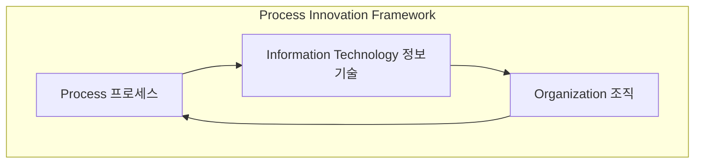

# PI (Process Innovation): 고객 지향적 업무 혁신의 핵심

<!-- mtoc-start -->

- [정의 및 소개](#정의-및-소개)
- [PI의 관리 영역](#pi의-관리-영역)
- [PI 추진 요소](#pi-추진-요소)
- [구성도](#구성도)
- [기대효과](#기대효과)
- [마무리](#마무리)
- [키워드](#키워드)

<!-- mtoc-end -->

프로세스 혁신(Process Innovation, PI)은 기존의 업무 처리 방식을 고객 지향으로 바꾸어 경쟁 우위를 확보하고 변화에 민첩하게 대응하기 위한 혁신 경영 기술입니다. PI는 고객의 요구에 부응하기 위해 업무 프로세스를 최적화하고, 기업 내 관리 영역을 혁신하여 조직의 효율성과 경쟁력을 극대화합니다. 이를 통해 기업은 빠르게 변화하는 시장 환경에서 경쟁 우위를 유지하고 새로운 비즈니스 기회를 창출할 수 있습니다.

## 정의 및 소개

Process Innovation(PI)은 고객 지향적 업무 처리 방식을 도입하여 기존의 프로세스를 개선하고, 이를 통해 경쟁 우위와 변화 대응력을 조기에 확보하는 혁신적인 경영 기술. PI는 조직의 프로세스를 고객의 요구에 맞추어 재설계함으로써 운영의 효율성과 고객 만족도를 높이는 데 중점을 둡니다.

- **목적**: 업무 처리 방식의 혁신을 통해 경쟁 우위 확보, 고객 지향적 운영 실현
- **특징**: 고객 요구 반영, 업무 효율성 향상, 경쟁 우위 확보

## PI의 관리 영역

1. **프로세스 개선**: 기존의 비효율적인 프로세스를 분석하고 개선하여 업무의 흐름을 최적화
2. **프로젝트 관리**: 프로세스 혁신을 추진하기 위해 프로젝트를 체계적으로 관리하고 성과를 모니터링
3. **형상 관리**: 업무 프로세스 변경 사항을 기록하고 추적하여 일관성 있는 관리를 보장
4. **영향 분석**: 프로세스 변화가 조직과 업무에 미치는 영향을 분석하여 리스크를 최소화
5. **표준화**: 개선된 프로세스를 표준화하여 지속 가능한 운영 체계를 구축

## PI 추진 요소

PI는 다음과 같은 세 가지 주요 요소를 중심으로 추진됩니다:

6. **프로세스(Process)**: 업무 프로세스를 최적화하고 재설계하여 운영 효율성을 극대화
7. **정보 기술(Information Technology)**: IT를 활용하여 프로세스 자동화 및 데이터 기반 의사결정을 지원
8. **조직(Organization)**: 프로세스 혁신이 성공적으로 이루어지도록 조직 구조와 문화를 조정

## 구성도

## 기대효과

- **업무 효율성 향상**: 프로세스 개선을 통해 업무 처리 시간을 단축하고 비용을 절감
- **고객 만족도 증대**: 고객 지향적 프로세스를 통해 고객의 요구를 신속하게 반영하고 만족도를 높임
- **경쟁력 강화**: 변화에 대한 빠른 대응력을 확보하여 시장에서의 경쟁 우위 유지

## 마무리

Process Innovation은 기업이 기존의 비효율적인 업무 처리 방식을 고객 지향으로 전환하여 경쟁력을 강화하고, 지속 가능한 성장을 도모할 수 있도록 돕는 중요한 경영 기법입니다. 프로세스, 정보 기술, 조직을 통합하여 업무 혁신을 실현함으로써 PI는 기업이 변화하는 환경에서 경쟁 우위를 확보하고, 더 나은 비즈니스 성과를 창출할 수 있도록 지원합니다.

## 키워드

Process Innovation, PI, 프로세스 혁신, 고객 지향, 업무 효율성, 경쟁 우위, 프로세스 개선, 정보 기술, 조직 변화, 프로젝트 관리