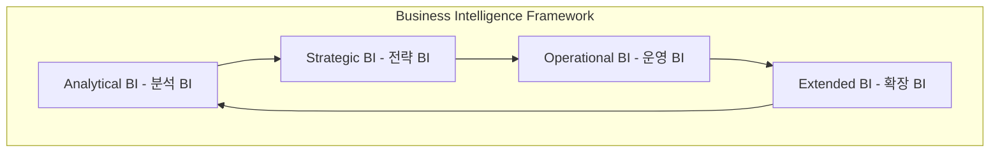

# BI (Business Intelligence): RTE를 위한 전략적 의사결정 서비스

<!-- mtoc-start -->

- [정의 및 소개](#정의-및-소개)
- [BI의 구성 및 유형 (분전운확)](#bi의-구성-및-유형-분전운확)
- [BI의 분석 분야](#bi의-분석-분야)
- [BI의 요구사항](#bi의-요구사항)
- [구성도](#구성도)
- [기대효과](#기대효과)
- [마무리](#마무리)
- [키워드](#키워드)

<!-- mtoc-end -->

비즈니스 인텔리전스(Business Intelligence, BI)는 조직의 과거와 현재 데이터를 분석하여 전략적 의사결정을 위한 실질적인 인사이트를 제공하는 서비스입니다. BI는 데이터를 통합하고 분석함으로써 조직이 경쟁력을 강화하고 신속한 의사결정을 내릴 수 있도록 지원합니다. 이를 통해 실시간 기업(Realtime Enterprise, RTE)의 전략적 의사결정을 도와 변화하는 환경에서 민첩하게 대응할 수 있습니다.

## 정의 및 소개

Business Intelligence(BI)는 조직의 데이터를 분석하여 전략적 의사결정을 위한 인사이트를 제공하는 서비스. BI는 결과 반응적 의사결정 방식을 통해 데이터 기반의 경영 전략을 수립하며, 이를 통해 비즈니스 가치 창출을 극대화합니다. BI는 사용자 중심으로 설계되어 비즈니스 의사결정에 실질적인 도움을 주며, 조직의 전반적인 운영 효율성을 높입니다.

- **목적**: 데이터를 기반으로 한 전략적 의사결정 지원, 비즈니스 가치 창출
- **특징**: 사용자 중심, 의사결정 지원, 비즈니스 가치 제공

## BI의 구성 및 유형 (분전운확)

1. **분석 BI (Analytical BI)**: OLAP, 데이터 마이닝, 데이터 웨어하우스(DW) 등을 활용하여 데이터를 분석하고 인사이트를 도출
2. **전략 BI (Strategic BI)**: SEM, VBM, BSC 등을 통해 전략적 목표 설정과 성과 관리
3. **운영 BI (Operational BI)**: ETT, ETL, EII, DW 등을 이용하여 운영 데이터를 실시간으로 통합 관리
4. **확장 BI (Extended BI)**: CRM, SCM 등 비즈니스 확장과 관련된 시스템과 연계하여 고객 및 공급망 데이터를 활용

## BI의 분석 분야

1. **운영 분석**: 운영 효율성을 평가하고 개선할 수 있는 인사이트 도출
2. **성과 분석**: 조직의 성과를 평가하고 목표 달성을 위한 개선 방안 제시
3. **위험 분석**: 다양한 리스크 요인을 식별하고 이를 관리하기 위한 전략 마련

## BI의 요구사항

BI는 성공적인 구현을 위해 다음과 같은 요구사항을 충족해야 합니다:

4. **Integration 측면**: 다양한 데이터 소스를 통합하여 일관성 있는 데이터 제공
5. **Analysis 측면**: 고급 분석 기법을 활용하여 데이터에서 의미 있는 인사이트 도출
6. **Presentation 측면**: 사용자 친화적인 방식으로 데이터를 시각화하고 제공
7. **DW 연계**: 데이터 웨어하우스와 연계하여 안정적이고 신뢰성 있는 데이터 관리

## 구성도

## 기대효과

- **전략적 의사결정 지원**: BI를 통해 데이터를 기반으로 한 전략적 의사결정을 내려 경영 효율성을 극대화
- **비즈니스 가치 제공**: 사용자 중심의 인사이트 제공을 통해 조직의 비즈니스 가치를 극대화
- **리스크 관리 강화**: 다양한 위험 요인을 분석하여 신속하게 대응하고 리스크를 최소화

## 마무리

Business Intelligence는 조직이 데이터를 통해 전략적 의사결정을 내리고, 운영의 효율성을 극대화할 수 있도록 돕는 중요한 도구입니다. BI는 분석, 전략, 운영, 확장 등 다양한 측면에서 조직의 데이터를 통합적으로 관리하고, 이를 통해 경쟁력을 확보할 수 있도록 지원합니다. BI의 활용을 통해 조직은 빠르게 변화하는 비즈니스 환경에서 민첩하게 대응하고 지속 가능한 성장을 이루어낼 수 있습니다.

## 키워드

Business Intelligence, BI, 전략적 의사결정, 데이터 분석, RTE, OLAP, 데이터 마이닝, SEM, VBM, BSC, 운영 BI, 확장 BI, CRM, SCM, 데이터 웨어하우스