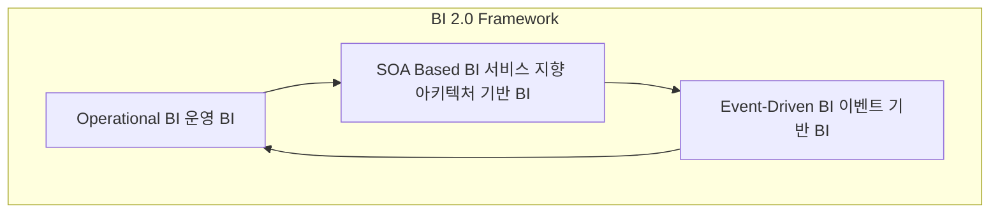

# BI 2.0: 실시간 데이터 분석을 위한 차세대 비즈니스 인텔리전스

<!-- mtoc-start -->

- [정의 및 소개](#정의-및-소개)
- [BI 2.0의 주요 특징 (운, S, E)](#bi-20의-주요-특징-운-s-e)
- [기대효과](#기대효과)
- [구성도](#구성도)
- [마무리](#마무리)
- [키워드](#키워드)

<!-- mtoc-end -->

BI 2.0은 기존 BI 1.0을 기반으로 실시간 데이터 분석 및 예측 기능을 추가하고, 사용자 편의성을 극대화하기 위해 Web 2.0 기술을 접목한 차세대 비즈니스 인텔리전스(Business Intelligence)입니다. BI 2.0은 기업이 실시간 데이터를 활용하여 신속하게 의사결정을 내릴 수 있도록 지원하며, 웹 기반의 상호작용 기능을 통해 사용자 경험을 향상시킵니다.

## 정의 및 소개

BI 2.0은 실시간 데이터 분석 및 예측을 중심으로 운영되는 차세대 비즈니스 인텔리전스. 기존의 BI 1.0이 과거 및 현재 데이터를 분석하여 의사결정을 지원했다면, BI 2.0은 실시간 데이터를 활용해 예측 분석까지 가능하게 하여 더욱 신속하고 정확한 의사결정을 가능하게 합니다. 또한 Web 2.0 기술을 활용해 사용자의 편의성을 높이고, 데이터 분석 결과를 쉽게 시각화하고 공유할 수 있도록 합니다.

- **목적**: 실시간 데이터 분석, 예측 기능 강화, 사용자 중심의 데이터 활용
- **특징**: 실시간 분석, Web 2.0 기반의 사용자 경험 개선, 신속한 의사결정 지원

## BI 2.0의 주요 특징 (운, S, E)

1. **운영 BI 중심 (Operational BI)**

   - **BPM (Business Process Management)** 및 **BAM (Business Activity Monitoring)**과 같은 운영 중심의 BI를 통해 실시간으로 비즈니스 프로세스를 모니터링하고 최적화
   - 운영 BI를 중심으로 조직의 운영 효율성을 극대화

2. **SOA 기반 BI (Service-Oriented Architecture Based BI)**

   - 서비스 지향 아키텍처(SOA)를 기반으로 BI 시스템을 유연하게 구축하여 다양한 애플리케이션과 통합
   - SOA 기반의 BI는 데이터 접근성을 높이고, 신속한 정보 제공을 지원

3. **이벤트 기반 BI (Event-Driven BI)**
   - **이벤트 기반(Event-Driven)** 분석을 통해 비즈니스 이벤트 발생 시 즉각적으로 대응
   - 실시간으로 이벤트를 감지하고, 분석 결과를 기반으로 적시에 대응할 수 있도록 지원

## 기대효과

- **실시간 의사결정 강화**: 실시간 데이터를 기반으로 한 분석 및 예측을 통해 신속한 의사결정 가능
- **사용자 경험 향상**: Web 2.0 기술을 활용하여 사용자 친화적인 인터페이스 제공, 데이터 접근성과 사용 편의성 강화
- **운영 효율성 극대화**: BPM, BAM과 같은 운영 BI를 통해 조직의 운영을 최적화하고, 실시간 모니터링 가능

## 구성도

- 구성도는 BI 2.0의 주요 구성 요소인 운영 BI, SOA 기반 BI, 이벤트 기반 BI 간의 관계를 보여줍니다. 각 구성 요소는 상호작용하며 실시간 데이터 분석과 의사결정을 지원합니다. 운영 BI는 실시간 프로세스 모니터링을 통해 데이터를 수집하고, SOA 기반 BI는 이를 유연하게 통합하여 분석을 지원합니다.

## 마무리

BI 2.0은 기존 BI의 한계를 극복하고 실시간 데이터 분석과 사용자 경험 개선을 통해 더욱 빠르고 정확한 의사결정을 지원하는 차세대 비즈니스 인텔리전스입니다. SOA와 이벤트 기반 접근 방식은 기업이 변화하는 환경에 민첩하게 대응할 수 있도록 돕습니다. BI 2.0의 도입을 통해 기업은 데이터 기반의 경쟁력을 강화하고, 운영 효율성을 극대화할 수 있습니다.

## 키워드

BI 2.0, Business Intelligence, 실시간 데이터 분석, Web 2.0, 운영 BI, SOA, 이벤트 기반 BI, BPM, BAM, 예측 분석, 차세대 BI