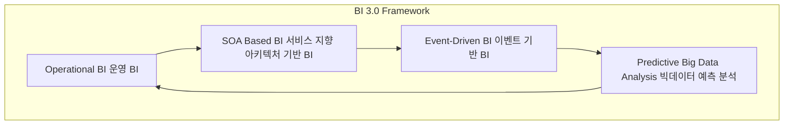

# BI 3.0: 미래 동향 예측을 위한 차세대 비즈니스 인텔리전스

<!-- mtoc-start -->

- [정의 및 소개](#정의-및-소개)
- [BI 3.0의 주요 특징 (운, S, E)](#bi-30의-주요-특징-운-s-e)
- [BI 3.0의 기대효과](#bi-30의-기대효과)
- [구성도](#구성도)
- [마무리](#마무리)
- [키워드](#키워드)

<!-- mtoc-end -->

BI 3.0은 기존 BI 2.0을 기반으로 미래 동향을 예측하고 선도적인 전략을 수립하기 위해 빅데이터를 활용한 분석 기능을 강화한 차세대 비즈니스 인텔리전스(Business Intelligence)입니다. BI 3.0은 기업이 전략적 목표를 달성하고 의사결정을 지원하기 위해 실시간 데이터뿐만 아니라 대규모 데이터 분석을 통해 미래를 예측하고 빠르게 대응할 수 있도록 돕습니다.

## 정의 및 소개

BI 3.0은 기업의 전략적 목표를 달성하고 의사결정을 지원하기 위해 빅데이터를 활용하여 미래 동향을 예측하고 선도적인 전략을 수립하는 일련의 프로세스. BI 3.0은 기존의 BI 1.0과 BI 2.0이 제공하는 실시간 분석 기능을 확장하여 예측 분석 기능을 더욱 강화하고, 사용자 중심의 웹 인터페이스를 통해 분석 결과를 쉽게 공유하고 활용할 수 있도록 합니다.

- **목적**: 빅데이터를 활용한 미래 동향 예측 및 선도적 전략 수립, 전략적 목표 달성
- **특징**: 실시간 데이터 분석, 빅데이터 기반 예측 분석, 사용자 중심의 비즈니스 인텔리전스

## BI 3.0의 주요 특징 (운, S, E)

1. **운영 BI 중심 (Operational BI)**

   - **BPM (Business Process Management)** 및 **BAM (Business Activity Monitoring)**과 같은 운영 중심의 BI를 통해 실시간으로 비즈니스 프로세스를 모니터링하고 최적화
   - 운영 BI를 중심으로 조직의 운영 효율성을 극대화

2. **SOA 기반 BI (Service-Oriented Architecture Based BI)**

   - 서비스 지향 아키텍처(SOA)를 기반으로 BI 시스템을 유연하게 구축하여 다양한 애플리케이션과 통합
   - SOA 기반의 BI는 데이터 접근성을 높이고, 신속한 정보 제공을 지원

3. **이벤트 기반 BI (Event-Driven BI)**
   - **이벤트 기반(Event-Driven)** 분석을 통해 비즈니스 이벤트 발생 시 즉각적으로 대응
   - 실시간으로 이벤트를 감지하고, 분석 결과를 기반으로 적시에 대응할 수 있도록 지원

## BI 3.0의 기대효과

- **미래 동향 예측 강화**: 빅데이터를 활용한 분석을 통해 미래 동향을 예측하고, 선도적인 전략 수립 가능
- **전략적 의사결정 지원**: 실시간 데이터와 예측 데이터를 활용하여 기업의 전략적 목표를 달성하기 위한 의사결정 지원
- **사용자 경험 향상**: Web 2.0을 넘어선 사용자 중심의 인터페이스 제공으로 데이터를 쉽게 접근하고 분석 결과 활용 가능

## 구성도

- BI 3.0의 주요 구성 요소인 운영 BI, SOA 기반 BI, 이벤트 기반 BI, 빅데이터 예측 분석 간의 상호작용을 보여줍니다. 각 구성 요소는 긴밀히 연결되어 실시간 데이터 분석, 예측 분석, 그리고 전략적 의사결정을 지원합니다.

## 마무리

BI 3.0은 기업이 빅데이터를 활용하여 미래 동향을 예측하고 선도적인 전략을 수립하는 데 중점을 둔 차세대 비즈니스 인텔리전스입니다. 실시간 데이터를 기반으로 한 예측 분석과 사용자 중심의 인사이트 제공은 기업이 변화하는 환경에 신속하게 대응하고, 경쟁력을 강화하는 데 중요한 역할을 합니다. BI 3.0을 통해 기업은 데이터 기반의 전략적 목표를 효과적으로 달성할 수 있습니다.

## 키워드

BI 3.0, Business Intelligence, 미래 동향 예측, 빅데이터, 의사결정 지원, 전략적 인텔리전스, 분석 인텔리전스, 확장 인텔리전스, 인텔리전스 인프라, 인텔리전스 정보전달