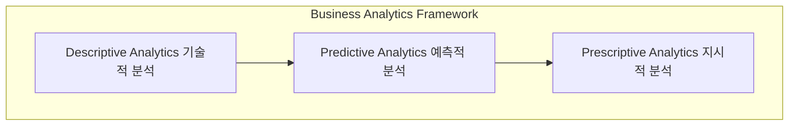

# BA (Business Analytics): 비즈니스 당면 과제를 해결하는 전략적 분석 방법론

<!-- mtoc-start -->

- [정의 및 소개](#정의-및-소개)
- [BA의 분석 분야 (기술적 분석, 예측적 분석, 지시적 분석)](#ba의-분석-분야-기술적-분석-예측적-분석-지시적-분석)
- [BA의 기대효과](#ba의-기대효과)
- [구성도](#구성도)
- [마무리](#마무리)
- [키워드](#키워드)

<!-- mtoc-end -->

비즈니스 분석(Business Analytics, BA)은 기업이 직면한 비즈니스 이슈를 내부 및 외부 데이터를 활용한 통계적, 수학적 분석을 통해 해결하는 전략적 의사결정 방법론입니다. BA는 데이터를 기반으로 한 선제적 의사결정을 통해 기업이 변화에 신속하게 대응하고, 경쟁력을 강화할 수 있도록 지원합니다. 이 분석 방법론은 기술적 분석, 예측적 분석, 지시적(처방적) 분석의 세 가지 주요 분야로 구성되어 있으며, 이를 통해 조직의 운영 효율성을 높이고 전략적 목표를 달성합니다.

## 정의 및 소개

Business Analytics(BA)는 비즈니스의 당면 이슈를 해결하기 위해 기업 내외부의 데이터를 통계적, 수학적으로 분석하여 전략적 의사결정을 내리는 방법론입니다. BA는 선제적 의사결정을 통해 미래를 예측하고 비즈니스 기회를 포착하여 조직의 효율성과 수익성을 극대화합니다.

- **목적**: 데이터 기반의 선제적 의사결정을 통해 비즈니스 이슈 해결 및 경쟁력 강화
- **특징**: 선제적 의사결정, 데이터 중심의 분석, 비즈니스 가치 제공

## BA의 분석 분야 (기술적 분석, 예측적 분석, 지시적 분석)

1. **기술적 분석 (Descriptive Analytics)**

   - **정의**: 과거의 데이터를 분석하여 현재의 상황을 이해하고 문제의 원인을 파악
   - **분석 도구**: Ad-hoc 쿼리, 차트, 리포트, 대시보드 등을 통해 데이터 시각화 및 요약 제공

2. **예측적 분석 (Predictive Analytics)**

   - **정의**: 과거 데이터를 기반으로 미래의 결과를 예측하고 의사결정을 지원
   - **분석 도구**: Forecasting, 데이터 마이닝, 가설 검정, 연관 분석 등을 활용하여 미래 동향 예측

3. **지시적(처방적) 분석 (Prescriptive Analytics)**

   - **정의**: 최적의 결과를 도출하기 위해 다양한 시나리오를 분석하고 실행 가능한 전략을 제안
   - **분석 도구**: 최적화, Trade-off 분석, What-if 분석 등을 통해 최적의 해결책 도출

## BA의 기대효과

- **선제적 의사결정 강화**: 데이터를 기반으로 한 예측과 최적의 대응 전략을 통해 신속한 의사결정 가능
- **경영 효율성 향상**: 기술적 분석과 예측적 분석을 통해 조직의 운영을 최적화하고 효율성을 극대화
- **경쟁력 제고**: 지시적 분석을 통해 비즈니스 이슈에 대한 최적의 해결책을 마련하고 경쟁력을 유지 및 강화

## 구성도

- 각 구성 요소는 상호작용하며 데이터를 기반으로 비즈니스 인사이트를 제공하고, 이를 통해 전략적 의사결정을 지원합니다.

## 마무리

Business Analytics는 비즈니스의 당면 과제를 해결하고 경쟁력을 강화하기 위한 데이터 기반의 분석 방법론입니다. 기술적, 예측적, 지시적 분석을 통해 기업은 과거 데이터를 이해하고 미래를 예측하며 최적의 해결책을 마련할 수 있습니다. BA를 통해 기업은 데이터 기반의 선제적 의사결정을 내리고, 변화하는 비즈니스 환경에 신속하게 대응할 수 있습니다.

## 키워드

Business Analytics, BA, 데이터 분석, 선제적 의사결정, 기술적 분석, 예측적 분석, 지시적 분석, 비즈니스 인텔리전스, 빅데이터, 최적화