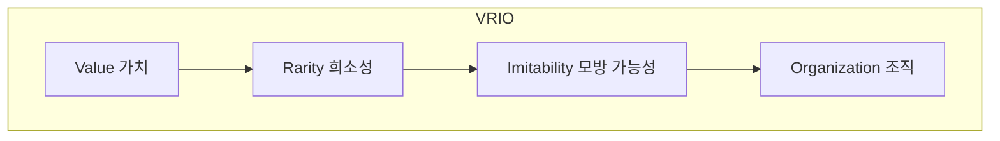

# VRIO: 경쟁우위의 원천을 파악하는 핵심 역량 분석 도구

<!-- mtoc-start -->

- [정의 및 소개](#정의-및-소개)
- [VRIO의 주요 요소](#vrio의-주요-요소)
- [VRIO 분석 결과](#vrio-분석-결과)
- [VRIO 분석 절차](#vrio-분석-절차)
- [마무리](#마무리)
- [키워드](#키워드)

<!-- mtoc-end -->

VRIO는 기업의 경쟁우위의 원천이 되는 자원과 능력의 조건을 파악하여, 핵심 역량을 알기 쉽게 분석하는 경영전략 도구입니다. 기업이 보유한 자원과 능력을 가치(Value), 희소성(Rarity), 모방 가능성(Imitability), 조직(Organization)이라는 네 가지 기준으로 평가함으로써, 어떤 자원이 장기적인 경쟁우위를 제공할 수 있는지 확인할 수 있습니다. 이를 통해 기업은 전략적 자산을 식별하고, 경쟁력 있는 경영 전략을 수립할 수 있습니다.

## 정의 및 소개

VRIO는 기업의 자원과 능력을 네 가지 조건으로 평가하여 경쟁우위의 원천을 파악하는 분석 도구. 이 네 가지 조건을 만족하는 자원과 능력만이 기업의 지속적인 경쟁우위를 보장할 수 있습니다. VRIO 분석은 기업이 보유한 자원의 특성을 파악하고, 이를 기반으로 전략적 의사결정을 내리는 데 도움을 줍니다.

- **목적**: 자원 및 능력의 경쟁우위 여부 파악, 핵심 역량 식별
- **특징**: 자원의 가치, 희소성, 모방 가능성, 조직화를 평가하여 경쟁우위를 판단

## VRIO의 주요 요소

1. **Value (가치)**

   - **정의**: 자원이나 능력이 기회를 이용하고 위협을 완화시킬 수 있다면 가치 있는 자원 또는 능력으로 간주
   - **의미**: 가치 있는 자원은 기업이 시장에서 기회를 포착하고 위험을 최소화할 수 있도록 지원

2. **Rarity (희소성)**

   - **정의**: 특정 자원이나 능력이 다른 경쟁기업에서 쉽게 찾아볼 수 없다면 희소성이 있는 자원으로 간주
   - **의미**: 희소성이 없는 자원은 경쟁우위를 제공할 수 없으며, 희소성이 있어야만 경쟁우위의 원천이 될 수 있음

3. **Imitability (모방 가능성)**

   - **정의**: 자원을 소유하지 않은 기업이 그 자원을 획득하거나 개발하는 데 높은 비용이 들거나 어렵다면 모방 가능성이 낮은 자원으로 간주
   - **의미**: 모방이 어려운 자원은 장기적인 경쟁우위를 제공하며, 경쟁사가 쉽게 따라할 수 없도록 해야 함

4. **Organization (조직)**

   - **정의**: 가치 있고 희소하며 모방이 어려운 자원을 효과적으로 활용할 수 있도록 기업이 조직되어 있는지 여부
   - **의미**: 조직이 자원을 적절히 활용할 수 있도록 구조화되어 있다면, 그 자원은 경쟁우위를 제공할 수 있음

## VRIO 분석 결과

- **가치 없음 (Value X)**: 경쟁 열위에 있음
- **가치 있음 (Value O), 희소성 없음 (Rarity X)**: 경쟁에 영향을 미치지 않음
- **가치 있음 (Value O), 희소성 있음 (Rarity O), 모방 가능 (Imitability O)**: 임시적 경쟁우위 보장
- **가치 있음 (Value O), 희소성 있음 (Rarity O), 모방 불가능 (Imitability X)**: 지속적 경쟁우위 보장
- **가치 있음 (Value O), 희소성 있음 (Rarity O), 모방 불가능 (Imitability X), 조직 특화적 (Organization O)**: 지속적 경쟁우위 유지 및 조직 특유의 성과 획득

## VRIO 분석 절차

- VRIO 분석의 각 요소가 단계적으로 연결되어 자원의 경쟁우위 평가를 진행하는 방식
- 각 단계는 자원의 가치를 평가하고, 이를 통해 기업이 지속 가능한 경쟁우위를 확보 지원

## 마무리

VRIO 분석은 기업의 자원과 능력을 평가하여 경쟁우위의 원천을 파악하는 데 중요한 역할을 합니다. 가치, 희소성, 모방 가능성, 조직화를 기준으로 자원을 분석함으로써, 기업은 장기적인 경쟁력을 유지하고 강화할 수 있는 전략을 수립할 수 있습니다. 이를 통해 조직은 변화하는 시장 환경에서도 경쟁우위를 지속적으로 확보할 수 있습니다.

## 키워드

VRIO, 경쟁우위, 핵심 역량, 자원 분석, 가치, 희소성, 모방 가능성, 조직, 경영 전략, 지속 가능 경쟁우위