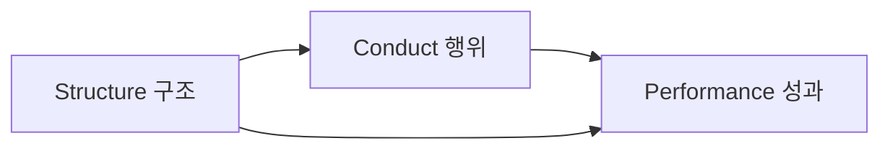

# SCP 모형: 기업 성과에 대한 구조, 행위, 성과 모델

<!-- mtoc-start -->

- [정의 및 소개](#정의-및-소개)
- [SCP 모형의 주요 요소](#scp-모형의-주요-요소)
- [SCP 모형의 적용 사례](#scp-모형의-적용-사례)
- [SCP 구성도](#scp-구성도)
- [마무리](#마무리)
- [키워드](#키워드)

<!-- mtoc-end -->

SCP(Structure-Conduct-Performance) 모형은 1930년대 미국의 경제학자들이 기업의 환경, 행동, 그리고 성과 사이의 관계를 이해하기 위해 개발한 경영전략 분석 도구입니다. 이 모형의 원래 목적은 산업 내 경쟁을 저해하는 요인들을 찾아내어 정부가 이러한 요인들을 제거하고 산업 내 경쟁을 유도하는 정책을 수립하는 데 도움을 주는 것이었습니다. SCP 모형은 기업의 구조, 행위, 그리고 성과가 상호작용하며 기업의 경쟁력을 결정하는 방식을 설명합니다.

## 정의 및 소개

SCP 모형은 구조(Structure), 행위(Conduct), 성과(Performance)라는 세 가지 요소를 중심으로 기업의 성과를 분석하는 모델. 각 요소는 기업의 경쟁 전략과 결과에 중대한 영향을 미치며, 산업 구조와 기업의 행동이 기업의 성과를 결정하는 중요한 역할을 합니다.

- **목적**: 산업 구조와 기업 행동이 기업 성과에 미치는 영향을 파악하고 경쟁력을 강화하기 위한 정책 도출
- **특징**: 산업 구조, 기업 행위, 그리고 성과의 상호작용을 통해 기업의 경쟁력과 성과를 분석

## SCP 모형의 주요 요소

1. **구조 (Structure)**

   - **정의**: 산업 구조를 의미하며, 산업 내 경쟁자의 수, 제품의 유사성, 진입과 퇴거의 비용 등과 같은 특성을 포함
   - **의미**: 산업 구조는 기업이 내릴 수 있는 의사결정의 범위를 제한하며, 기업의 전략과 성과에 중요한 영향을 미침

2. **행위 (Conduct)**

   - **정의**: 산업 내에서 기업들이 수행하는 다양한 전략과 행동을 의미
   - **의미**: 기업의 전략적 행동은 경쟁력 확보와 시장에서의 위치를 결정하는 핵심 요소로 작용

3. **성과 (Performance)**
   - **정의**: 개별 기업의 성과와 전체 사회의 경제적 성과를 의미하며, 특히 개별 기업 성과에 중점을 둠
   - **의미**: 산업 구조와 기업의 행위가 기업 성과에 미치는 영향을 분석하여 기업의 장기적인 경쟁 우위를 파악

## SCP 모형의 적용 사례

- **경쟁이 심한 산업**: 전략 선택의 대안이 제한적이고 의사결정에 제약이 많은 산업에서는 산업 구조가 기업 전략을 전적으로 결정하며, 이러한 경우 기업의 성과는 산업 구조에 크게 의존
- **경쟁이 적은 산업**: 경쟁이 심하지 않은 산업에서는 다양한 전략 선택의 대안이 존재하고 제약 요인이 적기 때문에 기업은 경쟁 우위를 쉽게 확보할 수 있음. 그러나 산업 구조는 여전히 전략 대안의 범위를 제한하고, 경쟁 우위의 지속 가능성에 영향을 미침

## SCP 구성도

- SCP 모형의 구성도는 산업 구조, 기업 행위, 그리고 성과 간의 관계를 나타냅니다.
- 산업 구조는 기업의 행동을 결정하며, 이러한 행동은 기업의 성과에 직접적인 영향을 미칩니다.

## 마무리

SCP 모형은 기업의 성과에 영향을 미치는 산업 구조와 기업의 행동을 분석하여 기업의 경쟁력을 강화하기 위한 중요한 경영전략 도구입니다. 산업 구조, 기업의 행위, 그리고 그로 인한 성과 간의 상호작용을 통해 기업이 경쟁 우위를 확보하고 장기적인 성과를 달성할 수 있도록 돕습니다. 이를 통해 SCP 모형은 기업이 경쟁력 있는 경영 전략을 수립하고 변화하는 시장 환경에 효과적으로 대응하는 데 중요한 역할을 합니다.

## 키워드

SCP 모형, Structure-Conduct-Performance, 산업 구조, 기업 행위, 기업 성과, 경쟁력, 경영전략, 시장 분석, 경쟁 우위