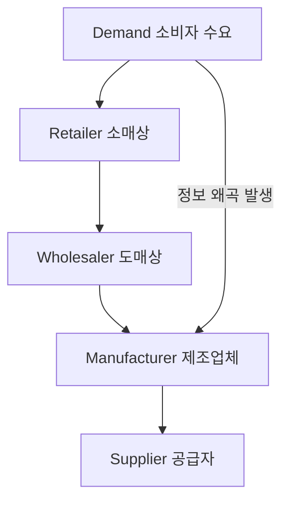

# 채찍효과 (Bullwhip Effect): 공급사슬에서 발생하는 수요 왜곡 현상

<!-- mtoc-start -->

- [채찍효과의 정의 및 원인](#채찍효과의-정의-및-원인)
- [채찍효과의 현상](#채찍효과의-현상)
- [채찍효과의 대응 방안](#채찍효과의-대응-방안)
- [CPFR (Collaborative Planning Forecasting & Replenishment)](#cpfr-collaborative-planning-forecasting--replenishment)
- [공급망 구성도](#공급망-구성도)
- [마무리](#마무리)
- [키워드](#키워드)

<!-- mtoc-end -->

채찍효과(Bullwhip Effect)는 공급사슬 관리에서 반복적으로 발생하는 문제 중 하나로, 제품에 대한 수요 정보가 공급사슬상의 참여 주체들에게 전달될 때마다 계속해서 왜곡되는 현상을 의미합니다. 이러한 왜곡은 공급망 전체의 효율성을 저하시켜 과잉 재고, 불필요한 비용 증가 등 부정적인 영향을 초래할 수 있습니다. 채찍효과의 주요 원인과 대응 방안을 파악함으로써, 기업은 공급망을 최적화하고 효율적인 운영을 달성할 수 있습니다.

## 채찍효과의 정의 및 원인

채찍효과는 수요 정보가 공급망 내에서 왜곡되어 전달됨으로써 소매 단계에서 제조 단계로 갈수록 수요의 변동 폭이 증폭되는 현상. 이는 공급망의 비효율을 초래하며, 결과적으로 비용 상승과 고객 서비스 품질 저하로 이어질 수 있습니다.

- **원인 (과일수가)**
  1. **과잉 주문**: 수요 변동에 대한 불확실성 때문에 각 참여 주체가 과도하게 주문을 넣음으로써 발생
  2. **일괄 주문**: 주문을 주기적으로 일괄 처리함으로써 수요 변동이 더 크게 나타남
  3. **수요 예측**: 각 단계에서 독립적으로 수요를 예측함으로써 정보의 왜곡 발생
  4. **가격 변동**: 프로모션이나 할인을 통한 가격 변동이 주문 패턴의 큰 변화를 초래

## 채찍효과의 현상

1. **수요 왜곡**: 공급망에서 소매상, 도매상, 제조업체로 이어지는 주문의 변화가 실제 소비자 수요보다 크게 왜곡되는 현상
2. **변화 확산**: 주문량의 변화가 공급망을 따라가며 점점 증대되는 현상

## 채찍효과의 대응 방안

채찍효과를 최소화하기 위해서는 공급망 내의 정보 공유와 계획의 통합이 중요합니다. 주요 대응 방안은 다음과 같습니다:

- **수요 불확실성 축소**: 보다 정확한 수요 예측을 통해 불확실성을 줄임
- **수요 변동 축소**: 프로모션이나 가격 변동을 최소화하여 수요의 변동성을 줄임
- **리드타임 단축**: 공급망의 리드타임을 줄여 수요 변화에 대한 민첩한 대응 가능
- **전략적 파트너십 강화**: 공급망 참여자 간의 협력을 통해 정보와 계획을 공유

## CPFR (Collaborative Planning Forecasting & Replenishment)

CPFR은 채찍효과를 최소화하기 위한 공급망 관리 기법으로, 협업을 통해 계획, 예측, 재고 보충을 수행합니다. 이를 통해 공급망 내 정보의 왜곡을 줄이고 효율적인 운영을 도모할 수 있습니다.

- **CPFR 유형**
  1. **거래 파트너 Hub형**: 거래 파트너 간의 협업을 중심으로 한 CPFR 모델
  2. **P2P형 (3PL)**: 제3자 물류업체와의 협력을 통해 정보 공유 및 예측 수행
  3. **거래 Exchange형**: 여러 거래 파트너 간의 정보 교환을 통해 협업을 수행

## 공급망 구성도

- 공급망 내 수요 정보가 각 단계로 전달될 때 왜곡되어 증폭되는 과정
- 소비자의 실제 수요가 소매상, 도매상, 제조업체, 그리고 공급자에게 전달되는 과정에서 정보 왜곡이 발생

## 마무리

채찍효과는 공급사슬 관리에서 흔히 발생하는 문제로, 수요 정보의 왜곡이 공급망 전체에 부정적인 영향을 미칠 수 있습니다. 이를 방지하기 위해서는 정보 공유, 리드타임 단축, 수요 예측의 개선 등이 필요합니다. CPFR과 같은 협업적 공급망 관리 기법을 통해 채찍효과를 최소화하고, 효율적인 공급망 운영을 이끌어낼 수 있습니다.

## 키워드

채찍효과, Bullwhip Effect, 공급사슬관리, 수요 왜곡, CPFR, 정보 공유, 수요 예측, 리드타임, 전략적 파트너십, 공급망 최적화