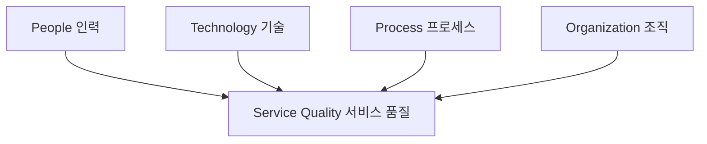

# ITSM: IT 서비스 수준 관리를 위한 프레임워크

<!-- mtoc-start -->

- [정의 및 소개](#정의-및-소개)
- [ITSM의 필요성](#itsm의-필요성)
- [ITSM의 효과](#itsm의-효과)
- [ITSM 실현을 위한 모델](#itsm-실현을-위한-모델)
- [ITSM의 구성 요소(프인기조)](#itsm의-구성-요소프인기조)
- [ITSM 구성도](#itsm-구성도)
- [마무리](#마무리)
- [키워드](#키워드)

<!-- mtoc-end -->

IT 서비스 관리(IT Service Management, ITSM)는 고객과 협의된 SLA(Service Level Agreement)에 맞춰 IT 서비스의 품질을 유지하고 개선하기 위한 관리 기법입니다. ITSM은 서비스의 일관성을 보장하고 IT 서비스의 신뢰성을 유지하기 위해 프로세스, 인력, 기술, 조직 간의 유기적인 연계를 통해 최적의 비용으로 고품질의 서비스를 제공합니다. 이를 통해 기업은 고객의 요구를 충족하고, IT 운영의 효율성을 극대화할 수 있습니다.

## 정의 및 소개

ITSM은 IT 서비스의 품질을 유지하고, 고객과 합의된 서비스 수준(SLA)을 달성하기 위한 관리 기법. ITSM은 SLA, SOW(Scope of Work), 사용자 기대 수준 등을 기반으로 서비스의 품질을 지속적으로 개선하며, IT 거버넌스를 강화합니다. ITSM의 필요성은 IT 운영의 복잡성 증가, 아웃소싱 확산, 자원 활용의 효율화, 품질 향상 요구, IT 거버넌스의 중요성 등에서 비롯됩니다.

- **목적**: SLA에 따른 IT 서비스 품질 유지 및 개선
- **특징**: 프로세스, 인력, 기술, 조직의 유기적 연계를 통한 서비스 관리

## ITSM의 필요성

- **복잡성**: IT 운영의 복잡성이 증가하며, 이를 효과적으로 관리하기 위해 필요
- **아웃소싱 확산**: IT 서비스의 아웃소싱이 확산됨에 따라 명확한 서비스 수준 관리 필요
- **자원 활용**: IT 자원의 효율적인 활용을 통해 비용 절감
- **품질 향상 요구**: 고객의 요구에 맞춰 서비스 품질을 지속적으로 향상
- **IT 거버넌스**: IT 거버넌스를 통해 조직 내 IT 서비스의 일관성과 투명성을 보장

## ITSM의 효과

1. **사용자 측면**

   - 서비스 일관성 보장: 사용자에게 일관된 수준의 서비스 제공
   - IT 서비스 신뢰성 확보: 서비스 품질을 유지하여 사용자 신뢰성 향상

2. **조직 측면**
   - 명확한 구조를 통한 효율성 향상: 서비스 제공 구조를 명확히 하여 운영 효율성 증대
   - 효과적인 아웃소싱 가능: 아웃소싱 시 서비스 수준을 명확히 정의하고 관리할 수 있음

## ITSM 실현을 위한 모델

- **CMM (Capability Maturity Model)**: 조직의 프로세스 성숙도를 평가하는 모델
- **CMMI (Capability Maturity Model Integration)**: 프로세스 개선을 위한 통합 모델
- **MOF (Microsoft Operation Framework)**: IT 서비스 관리를 위한 마이크로소프트의 프레임워크
- **ITIL (Information Technology Infrastructure Library)**: IT 서비스 관리의 베스트 프랙티스를 제공하는 프레임워크
- **eSCM (eSourcing Capability Model)**: 아웃소싱된 IT 서비스의 성숙도와 품질을 평가하는 모델

## ITSM의 구성 요소(프인기조)

ITSM은 **People, Process, Technology, Organization**의 네 가지 구성 요소를 중심으로 이루어져 있습니다. 이 요소들은 서로 유기적으로 연계되어 고객과 합의된 서비스 품질을 최적의 비용으로 제공하는 IT 운영 관리 체계를 형성합니다.

1. **People (인력)**: IT 서비스의 제공 및 관리에 필요한 역량을 갖춘 인력
2. **Process (프로세스)**: SLA에 따라 IT 서비스를 관리하고 제공하기 위한 절차와 방법
3. **Technology (기술)**: 서비스 제공에 필요한 기술적 인프라와 도구
4. **Organization (조직)**: IT 서비스 관리를 지원하는 조직 구조와 문화

## ITSM 구성도

- ITSM의 네 가지 구성 요소를 통해 서비스 품질을 형성
- 각 요소는 IT 서비스의 일관성과 품질 유지를 위해 서로 유기적으로 작용.

## 마무리

ITSM은 IT 서비스의 품질을 유지하고 고객과의 합의된 수준을 달성하기 위한 필수적인 관리 기법입니다. ITSM을 통해 조직은 IT 운영의 효율성을 높이고, 아웃소싱과 복잡한 IT 환경에서도 일관된 서비스 수준을 유지할 수 있습니다. ITSM의 성공적인 구현을 위해서는 People, Process, Technology, Organization의 유기적인 연계가 필요하며, 이를 통해 고객의 기대에 부응하는 고품질의 서비스를 제공할 수 있습니다.

## 키워드

ITSM, IT 서비스 관리, SLA, 서비스 수준 관리, ITIL, CMMI, MOF, eSCM, IT 거버넌스, 아웃소싱, IT 운영 효율성