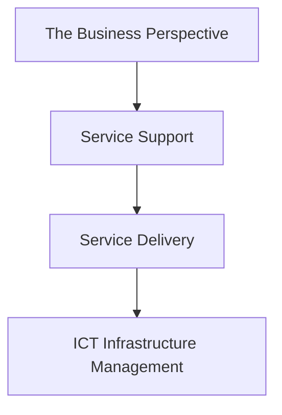

# ITIL: ITSM을 위한 Best Practice 모음집

<!-- mtoc-start -->

- [정의 및 소개](#정의-및-소개)
- [ITIL의 주요 프로세스](#itil의-주요-프로세스)
  - [서비스 딜리버리 (Service Delivery) - SD [AC2 FSL]](#서비스-딜리버리-service-delivery---sd-ac2-fsl)
  - [서비스 서포트 (Service Support) - SS [SIP CRC]](#서비스-서포트-service-support---ss-sip-crc)
- [ITIL 프레임워크의 구성 요소](#itil-프레임워크의-구성-요소)
- [ITIL 구성도](#itil-구성도)
- [마무리](#마무리)
- [키워드](#키워드)

<!-- mtoc-end -->

ITIL(Information Technology Infrastructure Library)은 IT 서비스 관리를 위해 영국 정부에 의해 만들어진 Best Practice 모음집으로, 전 세계적으로 ITSM(IT Service Management)의 사실상 표준(De-facto Standard)으로 자리 잡고 있습니다. ITIL은 IT 서비스의 품질을 높이고, 고객과의 SLA(Service Level Agreement)를 충족하기 위해 체계적인 접근 방식을 제공합니다. 이를 통해 IT 서비스 ROI 향상과 품질 높은 IT 서비스 구축 및 운영을 위한 지침을 제공합니다.

## 정의 및 소개

ITIL은 IT 서비스의 구축과 관리를 위한 Best Practice를 모아 놓은 지침서, IT 서비스 수준을 유지하고 고객의 요구를 충족하기 위한 체계적인 방법을 제시합니다. ITIL은 서비스 관리에 필요한 여러 프로세스를 명확히 정의하고 있으며, 이를 통해 조직은 IT 운영의 품질을 높이고 고객의 기대를 충족시킬 수 있습니다.

- **목적**: IT 서비스의 품질 유지 및 ROI 향상
- **특징**: 방법론이 아닌 실천 모델, 비즈니스와의 연계를 통한 요구 충족, 품질 높은 IT 서비스 제공

## ITIL의 주요 프로세스

### 서비스 딜리버리 (Service Delivery) - SD [AC2 FSL]

1. **Availability Management (가용성 관리)**: IT 서비스의 가용성을 관리하여 필요한 시점에 서비스를 제공
2. **Capacity Management (용량 관리)**: IT 서비스 용량을 관리하여 현재 및 미래의 수요를 충족
3. **Service Continuity Management (서비스 연속성 관리)**: 서비스 중단 시에도 연속성을 보장할 수 있도록 준비
4. **Financial Management (재무 관리)**: IT 서비스 제공에 필요한 비용을 관리
5. **Security Management (보안 관리)**: IT 자원의 보안성을 관리하여 위협으로부터 보호
6. **Service Level Management (SLM)**: 고객과의 SLA에 따라 서비스 수준을 관리하고 유지

### 서비스 서포트 (Service Support) - SS [SIP CRC]

1. **Service Desk (서비스데스크)**: 고객과의 단일 접점으로서 모든 서비스 요청과 문제를 접수하고 해결
2. **Incident Management (인시던트 관리)**: IT 서비스 중단을 최소화하고 신속히 복구
3. **Problem Management (문제 관리)**: 반복적인 인시던트를 근본적으로 해결하기 위한 문제 분석 및 조치
4. **Configuration Management (구성 관리)**: IT 자산 및 구성 요소의 정보를 관리
5. **Release Management (릴리즈 관리)**: 새로운 버전의 IT 서비스를 배포 및 설치
6. **Change Management (변경 관리)**: IT 서비스에 대한 변경을 효과적으로 관리하여 서비스 영향 최소화

## ITIL 프레임워크의 구성 요소

ITIL 프레임워크는 IT 서비스의 품질과 안정성을 유지하기 위해 여러 가지 프로세스와 관리 방안을 제공.

- **The Business Perspective**: IT 컴포넌트 및 아키텍처 설계 방법을 정의하여 비즈니스 요구와 연계
- **Service Support**: 안정적인 서비스 지원을 위한 5개 프로세스(서비스데스크, 인시던트, 문제, 구성, 변경 관리)
- **Service Delivery**: IT 서비스 품질과 비용 효율성을 보장하기 위한 프로세스(가용성, 용량, 재무, 보안, 연속성 관리 등)
- **ICT Infrastructure Management**: IT 인프라의 관리와 운영에 필요한 라이프사이클을 제공

## ITIL 구성도

- 각 요소는 IT 서비스의 구축, 지원, 제공 및 인프라 관리를 통해 일관된 서비스 품질을 유지합니다.

## 마무리

ITIL은 IT 서비스 관리의 Best Practice를 모아 놓은 모음집으로, IT 서비스의 품질을 유지하고 개선하기 위한 체계적인 접근 방식을 제공합니다. 이를 통해 조직은 서비스 수준을 향상시키고, IT 운영의 ROI를 극대화할 수 있습니다. ITIL은 ITSM을 실현하는 데 있어서 필수적인 도구이며, 이를 통해 조직은 변화하는 비즈니스 환경에서도 일관된 서비스 품질을 유지할 수 있습니다.

## 키워드

ITIL, ITSM, 서비스 딜리버리, 서비스 서포트, SLA, IT 서비스 관리, 베스트 프랙티스, IT 인프라 관리, IT 거버넌스, 품질 관리