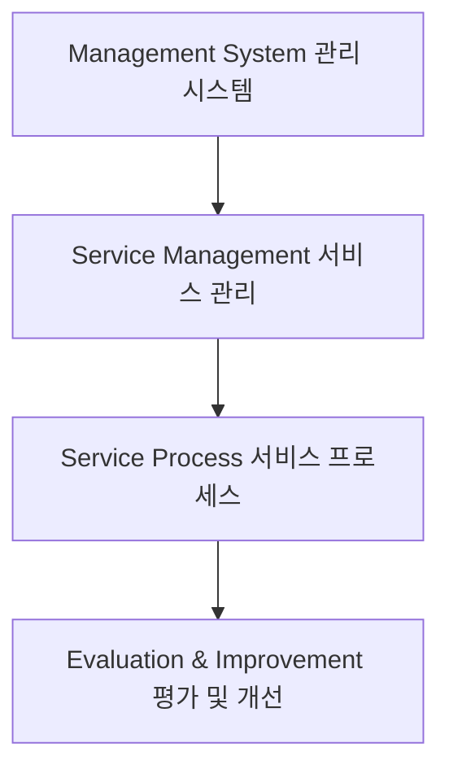

# ISO20000: ITSM 분야의 국제 표준 및 인증 규격

<!-- mtoc-start -->

- [정의 및 소개](#정의-및-소개)
- [ISO20000의 프로세스 (서통해관리)](#iso20000의-프로세스-서통해관리)
- [ISO20000 인증 절차 (사신문 예본인사)](#iso20000-인증-절차-사신문-예본인사)
- [ISO20000의 구성 요소](#iso20000의-구성-요소)
  - [ISO20000의 파트 구성](#iso20000의-파트-구성)
- [ISO20000의 목적](#iso20000의-목적)
- [핵심 요구 사항](#핵심-요구-사항)
- [구성도](#구성도)
- [마무리](#마무리)
- [키워드](#키워드)

<!-- mtoc-end -->

ISO20000은 IT 서비스 관리(ITSM) 분야의 국제 표준으로, ITIL을 기반으로 ITSM의 운영 체계와 관리 체계를 측정, 평가, 개선하기 위한 국제 인증 심사 표준입니다. ISO20000은 IT 서비스의 품질을 객관적으로 평가하고 개선하기 위한 체계적인 접근 방식을 제공합니다. 이를 통해 기업은 고객의 요구에 부합하는 안정적이고 효율적인 IT 서비스를 제공할 수 있습니다.

## 정의 및 소개

ISO20000은 ITSM의 운영 체계 및 관리 체계를 평가하고, 이를 바탕으로 품질을 개선하기 위한 국제 인증 표준. ISO20000은 ITIL의 베스트 프랙티스를 기반으로 하고 있으며, 서비스 관리의 품질을 지속적으로 유지하고 개선하기 위한 체계적인 방법을 제공합니다. ISO20000 인증은 조직의 IT 서비스 관리가 국제적으로 인정받는 수준임을 증명합니다.

- **목적**: IT 서비스의 수준을 객관적으로 평가하고, 지속적인 개선을 통한 품질 향상
- **특징**: ITIL 기반의 ITSM 운영 체계를 평가하고 인증하기 위한 국제 표준

## ISO20000의 프로세스 (서통해관리)

1. **서비스 제공 프로세스**: 서비스의 품질을 보장하기 위한 서비스 제공 절차 관리
2. **통제 프로세스**: 서비스 제공의 일관성과 품질 유지를 위한 통제 절차 관리
3. **해결 프로세스**: 인시던트와 문제를 효과적으로 해결하기 위한 절차 관리
4. **관계 프로세스**: 고객 및 서비스 공급자 간의 관계 관리를 통해 협력을 강화
5. **릴리즈 프로세스**: 새로운 IT 서비스나 기능의 배포 및 설치를 관리

## ISO20000 인증 절차 (사신문 예본인사)

6. **사전 질의**: 인증 필요성에 대해 사전 질의 및 요구 사항 검토
7. **신청 및 심사팀 배정**: 인증 신청 후 심사를 수행할 팀 배정
8. **문서 심사**: ITSM 문서 및 운영 체계에 대한 검토
9. **예비 심사(옵션)**: 본 심사 전 준비 상태를 점검하는 예비 심사
10. **본 심사**: ISO20000 요구 사항에 따라 정식 심사 수행
11. **인증**: 심사 통과 후 ISO20000 인증 획득
12. **사후 심사**: 인증 후 지속적인 품질 관리를 위한 사후 심사

## ISO20000의 구성 요소

ISO20000은 IT 서비스 관리의 품질과 일관성을 보장하기 위해 다음과 같은 구성 요소로 이루어져 있습니다:

13. **관리 시스템**: IT 서비스 관리를 위한 체계적인 관리 시스템 구축
14. **서비스 관리**: IT 서비스 제공 및 관리 절차에 대한 체계적인 접근
15. **서비스 프로세스**: 서비스 제공, 통제, 해결, 관계 관리 등을 포함한 프로세스

### ISO20000의 파트 구성

- **ISO20000-1 (Part 1)**: ITSM에 대한 규격 및 인증을 위한 기준 제공
- **ISO20000-2 (Part 2)**: 서비스 관리 실행 지침과 권고 사항 제공

## ISO20000의 목적

- **IT 서비스 수준 객관적 평가**: IT 서비스의 수준을 국제적으로 인정받는 기준에 따라 평가
- **고객 요구사항 신속 대응**: 고객의 요구에 신속히 대응하고, 만족을 높이기 위한 서비스 중심 프로세스 제공
- **견고한 프로세스 프레임워크 제공**: IT 조직 기능에 부합하는 견고하고 통합된 프로세스 프레임워크 제공을 통해 비용 효율성, 객관적 신뢰성, 프로세스 일관성, 관리 효과성을 보장

## 핵심 요구 사항

16. **Management Commitment (최고 경영자의 의지)**: 최고 경영자의 적극적인 지원과 참여
17. **Process Based System (프로세스 기반의 접근 방식)**: 모든 서비스 관리 활동이 프로세스 기반으로 이루어짐
18. **Performance Improvement & Effective Management (지속 개선)**: 성과 개선과 효과적인 관리 활동을 지속적으로 추진
19. **Customer Satisfaction (고객 만족 달성)**: 고객의 요구를 충족하고 기대를 초과하는 서비스 제공

## 구성도

- 관리 시스템, 서비스 관리, 서비스 프로세스는 IT 서비스 품질 유지 및 개선을 위한 체계적인 접근 방식을 설명.

## 마무리

ISO20000은 ITSM의 국제 표준으로, IT 서비스의 품질을 평가하고 지속적으로 개선하기 위한 체계적인 관리 체계를 제공합니다. 이를 통해 조직은 고객 요구에 신속히 대응하고, IT 서비스의 신뢰성과 효율성을 높일 수 있습니다. ISO20000 인증을 통해 기업은 IT 서비스 관리의 국제적 기준을 충족하며, 고객에게 높은 신뢰도를 제공할 수 있습니다.

## 키워드

ISO20000, ITSM, IT 서비스 관리, 국제 표준, ITIL, 서비스 수준 평가, 품질 개선, 관리 시스템, 서비스 프로세스, 인증 절차