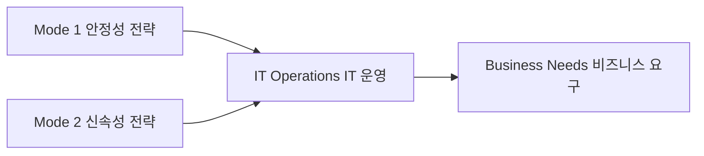

# 바이모달 IT: 안정성과 민첩성을 동시에 추구하는 IT 전략

<!-- mtoc-start -->

- [정의 및 소개](#정의-및-소개)
- [바이모달 IT의 전략 (Mode 1, Mode 2)](#바이모달-it의-전략-mode-1-mode-2)
- [바이모달 IT의 필요성](#바이모달-it의-필요성)
- [바이모달 IT의 기대효과](#바이모달-it의-기대효과)
- [구성도](#구성도)
- [마무리](#마무리)
- [키워드](#키워드)

<!-- mtoc-end -->

바이모달 IT(Bimodal IT)는 기업이 제품 및 서비스의 급격한 수요 변화에 효율적으로 대응하기 위해 두 가지 상이한 IT 전략을 동시에 운영하는 모델입니다. 이 전략은 안정성과 신속성을 동시에 추구하여 기업의 IT 환경에서 기존 시스템의 안정성을 유지하면서도, 새로운 요구에 빠르게 대응할 수 있는 민첩성을 제공합니다. 이를 통해 기업은 변화하는 시장 환경에서도 유연하게 대응할 수 있습니다.

## 정의 및 소개

바이모달 IT는 안정성 확보와 신속한 IT를 위해 서로 다른 두 가지 IT 전략을 동시에 운영하는 병행 전략 모델. 이를 통해 기업은 기존의 안정적 IT 운영과 더불어, 신속하고 민첩한 변화에도 대응할 수 있는 이중의 IT 체계를 갖추게 됩니다.

- **목적**: 기존 시스템의 안정성을 유지하면서 새로운 비즈니스 요구에 빠르게 대응
- **특징**: 안정성과 신속성을 동시에 추구하여 변화하는 비즈니스 환경에서 유연한 대응 제공

## 바이모달 IT의 전략 (Mode 1, Mode 2)

1. **Mode 1 (안정성 전략)**

   - **정의**: 기존의 IT 환경에서 안정성을 중시하는 전략으로, IT 시스템의 안정적 운영과 리스크 최소화를 목표로 함
   - **의미**: 주로 기존 인프라와 운영 프로세스를 유지하며 안정적인 서비스 제공을 보장

2. **Mode 2 (신속성 전략)**
   - **정의**: 변화하는 비즈니스 요구에 빠르게 대응하기 위한 신속하고 유연한 IT 전략으로, 혁신적 아이디어와 실험을 통해 빠르게 비즈니스 가치를 창출
   - **의미**: 민첩한 개발 방식과 최신 기술을 활용하여 변화와 혁신을 지원

## 바이모달 IT의 필요성

- **기존/신규 IT 공존**: 기존의 안정적인 IT 환경과 새로운 기술을 동시에 운영해야 할 필요성
- **신속/민첩한 변화 필요**: 변화하는 비즈니스 요구에 신속하고 민첩하게 대응
- **변화에도 안정성 중요**: 빠른 변화 속에서도 기존 IT 시스템의 안정성을 유지하는 것이 중요

## 바이모달 IT의 기대효과

- **신속한 비즈니스 대응**: 변화하는 시장의 요구에 신속하게 대응하여 비즈니스 기회를 포착
- **안정적인 IT 운영**: 기존 IT 환경의 안정성을 유지하면서 신기술 도입 및 혁신 가능
- **효율적인 IT 자원 관리**: 안정성과 신속성 간의 균형을 통해 IT 자원의 효율적 관리 가능

## 구성도

- 바이모달 IT의 두 가지 전략이 IT 운영을 지원하고, 이를 통해 비즈니스 요구에 대응하는 방식.
- Mode 1과 Mode 2는 각각 안정성과 민첩성을 중시하며, 서로 보완적인 역할을 수행.

## 마무리

바이모달 IT는 안정성과 민첩성을 동시에 추구하는 IT 전략으로, 기업이 변화하는 비즈니스 환경에서 경쟁력을 유지하기 위한 필수적인 접근 방식입니다. 안정적인 운영과 신속한 혁신을 동시에 달성하기 위해서는 두 가지 전략을 적절히 병행하고 균형 있게 운영하는 것이 중요합니다. 이를 통해 기업은 급격히 변화하는 시장에서도 유연하게 대응할 수 있으며, 경쟁 우위를 유지할 수 있습니다.

## 키워드

바이모달 IT, Bimodal IT, 안정성 전략, 신속성 전략, IT 운영, 민첩성, 안정성, ITSM, 비즈니스 혁신, IT 전략