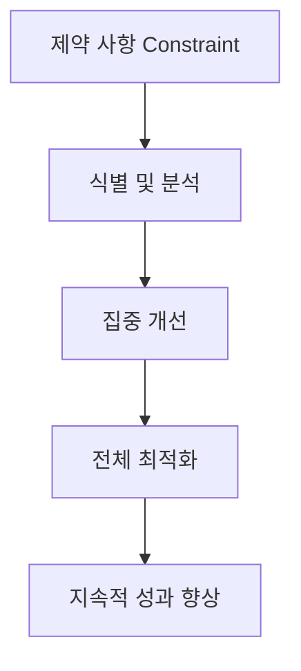

# Toc(제약이론): 시스템 성과를 극대화하는 경영 혁신 기법

<!-- mtoc-start -->

- [정의 및 소개](#정의-및-소개)
- [ToC의 주요 개념 및 도구](#toc의-주요-개념-및-도구)
- [ToC의 특징](#toc의-특징)
- [ToC의 극복 방법](#toc의-극복-방법)
- [구성도](#구성도)
- [마무리](#마무리)
- [키워드](#키워드)

<!-- mtoc-end -->

제약이론(ToC, Theory of Constraints)은 조직의 목표 달성에 방해가 되는 제약 요인을 집중 개선하여 지속적인 경영 개선을 이루는 경영 혁신 기법입니다. ToC는 시스템의 실적 관리를 위해 제약 사항을 극복하고, 전체 최적화를 달성하기 위해 고안된 프로세스 중심의 접근 방법입니다. 이를 통해 기업은 경영 효율성을 높이고, 제한된 자원을 최대한 활용하여 성과를 극대화할 수 있습니다.

## 정의 및 소개

ToC는 조직이 목표를 달성하는 데 있어서 방해가 되는 제약을 식별하고, 그 제약을 집중적으로 개선하는 경영 혁신 기법. 이 이론은 전체적인 최적화를 달성하기 위해 조직의 제약 요소를 제거하고, 시스템의 효율성을 극대화하는 것을 목표로 합니다. 제약이론을 활용한 혁신은 DBR(Drum-Buffer-Rope), Throughput Accounting, Critical Chain 등 다양한 도구와 기법을 포함합니다.

- **목적**: 제약 요인을 개선하여 조직의 성과를 지속적으로 향상
- **특징**: 제약 사항 식별, 집중 개선, 전체 최적화를 통한 성과 극대화

## ToC의 주요 개념 및 도구

1. **DBR (Drum-Buffer-Rope)**

   - **정의**: 생산 공정에서 자원의 흐름을 제어하기 위해 사용하는 기법, 시스템의 제약 자원(Drum)에 맞춰 생산 속도를 조절하고, 완충(Buffer)을 사용하여 안정성을 확보하며, 로프(Rope)를 통해 자원의 흐름을 조율함

2. **Throughput Accounting**

   - **정의**: 전통적인 원가 회계 대신, 수익성을 극대화하기 위해 시스템의 산출량(Throughput)을 중심으로 하는 회계 방식

3. **Critical Chain**

   - **정의**: 프로젝트 관리에서 자원의 제약을 고려하여 일정을 계획하고 관리하는 기법, 프로젝트의 완료 시간을 단축하고 리스크를 줄이는 것이 목표

4. **ToC Thinking Process**
   - **정의**: 문제를 식별하고 해결하기 위한 사고 프로세스, 제약을 극복하기 위해 조직 내에서 문제의 원인을 분석하고 해결책을 도출하는 일련의 절차

## ToC의 특징

- **제약 사항**: 조직의 성과를 저해하는 주요 제약을 식별하고 분석
- **집중 개선**: 제약 사항을 개선하는 데 조직의 자원을 집중하여 성과 극대화
- **전체 최적화**: 제약을 극복함으로써 시스템 전체의 성과를 최적화

## ToC의 극복 방법

ToC는 다음과 같은 방법을 통해 제약을 극복하고 전체적인 성과를 향상시킵니다:

1. **전체 최적화**: 조직의 모든 자원이 제약을 극복하는 데 집중되도록 조율
2. **집중 개선**: 제약을 식별한 후, 해당 제약을 집중적으로 개선하여 성과 극대화
3. **DBR (Drum-Buffer-Rope)**: 생산 흐름의 최적화를 위해 자원의 흐름을 제어
4. **ToC Thinking Process**: 문제의 원인을 파악하고 해결책을 도출하기 위한 사고 프로세스 활용
5. **Critical Chain**: 프로젝트 관리에서 자원의 제약을 고려하여 일정을 최적화
6. **Throughput Accounting**: 수익성을 높이기 위해 산출량 중심의 회계 방식 적용

## 구성도

- 제약 사항을 식별하고 개선하여 전체 최적화를 이루는 과정.
- 제약 사항의 식별부터 최적화 및 성과 향상까지의 단계적 접근을 통해 경영 성과를 극대화.

## 마무리

제약이론(ToC)은 조직의 목표 달성에 방해가 되는 제약 요인을 집중적으로 개선하여 경영 성과를 극대화하는 혁신 기법입니다. ToC는 DBR, Throughput Accounting, Critical Chain 등의 다양한 도구를 활용하여 전체 최적화를 달성하며, 이를 통해 조직은 지속적으로 성과를 향상시킬 수 있습니다. ToC는 특히 자원의 한계를 고려하여 경영의 효율성을 높이는 데 중요한 역할을 합니다.

## 키워드

ToC, 제약이론, DBR, Critical Chain, Throughput Accounting, 경영 혁신, 프로세스 최적화, 제약 극복, 집중 개선, 전체 최적화